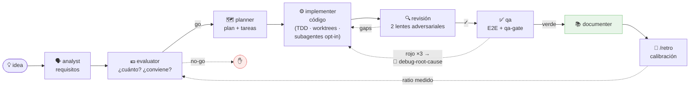
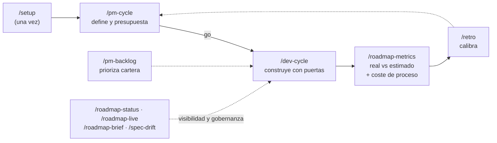

# custom-agents

[English](README.md) · **Español**

**El ciclo de vida completo de una iniciativa de software — con presupuesto, medición de coste real y trazabilidad en Jira/Confluence — dentro de Claude Code.**

[](https://github.com/daycry/custom-agents/actions/workflows/ci.yml)
[](CHANGELOG.es.md)
[](LICENSE)
[](docs/INSTALL.md)

[](https://github.com/daycry/custom-agents/stargazers)
[](https://github.com/daycry/custom-agents/forks)
[](https://github.com/daycry/custom-agents/issues)
[](https://github.com/daycry/custom-agents/commits/master)
[](https://github.com/daycry/custom-agents/pulse)

[](docs/INSTALL.md)
[](docs/FLOWS.md)
[](docs/README.md)
[](docs/README.md)
[](docs/README.md)

De la idea al código probado y documentado: `requisitos → presupuesto → plan → implementación → revisión adversarial → E2E → docs`, con **puertas de control** en cada paso, **coste real medido en tokens** y aprendizaje que calibra las siguientes estimaciones. Ocho agentes, once comandos, autosuficiente (sin dependencias de otros plugins).



## Qué te llevas

Casi todo el utillaje alrededor de los agentes de código responde a *cómo* escribir el código. Este plugin responde además a **cuánto cuesta, si merece la pena construirlo y cómo se demuestra que se hizo bien** — la capa de negocio alrededor del código, dentro del mismo ciclo.

| Capacidad | Cómo se garantiza |
|---|---|
| **Presupuesto por iniciativa** (horas · € · tokens) | El `evaluator` pone precio a la spec antes de construir nada, con el `rates.json` del proyecto |
| **Coste REAL medido** por artefacto y por tarea | `usage-meter.py` lee los tokens reales de la transcripción de la sesión — medición, no estimación a ojo |
| **Puerta económica go/no-go** | `/pm-cycle` cierra en la decisión: no se construye nada sin un *go* explícito |
| **Real vs estimado + calibración** | `/roadmap-metrics` los compara; `/retro` convierte cada cierre en un ratio tokens/hora medido en `CALIBRATION.md` que afina la siguiente estimación |
| **Jira sin fricción** (opt-in) | Un issue por tarea o por fase, tipo deducido de la jerarquía, worklog al completar con tope de jornada, resultado de la revisión publicado como comentario |
| **Confluence bidireccional** (opt-in) | `docs/` ⇄ Confluence, idempotente, para que un PM sin git vea siempre el estado actual |
| **Cadena spec → eval → plan → tasks** | Una carpeta por iniciativa, artefactos enlazados en ambos sentidos y `tasks.md` como **ledger canónico** validado por `ledger-lint.py` |
| **Constitución del proyecto con enforcement** | Principios permanentes que leen todos los agentes que escriben — y la revisión convierte una violación en un gap de corrección con cita de línea |
| **Deriva spec↔código** | `/spec-drift` reverifica las specs implementadas contra el código de hoy (`vigente` / `derivado` / no verificable, con evidencia) |
| **Disciplina de ingeniería, opt-in** | `.claude/dev.json`: TDD estricto con evidencia del rojo, worktrees aislados y subagentes de contexto fresco con personas de dominio |
| **Depuración a causa raíz** | Al tercer intento fallido de qa, `debug-root-cause` diagnostica con evidencia en 4 fases antes de preguntarte — nada de parches a ciegas |
| **Puertas deterministas** | Los veredictos salen de scripts con exit codes y tests propios (`qa-gate`, `ledger-lint`, `coverage-check`), nunca de la prosa del agente |

> Autosuficiente: sin dependencias de otros plugins. Si ya usas un motor SDD externo, `/dev-cycle` puede delegarle la ejecución manteniendo `tasks.md` como ledger canónico; y [convive](docs/observability.md) con monitores de sesión en vivo.

## Lo que lo hace distinto

**💶 Cada iniciativa nace presupuestada y muere medida.** El `evaluator` presupuesta (horas, €, tokens) ANTES de construir y una puerta go/no-go decide. Durante el ciclo, `usage-meter` mide los **tokens reales** consumidos por cada artefacto y cada tarea (frontmatter `generacion:`, horas-IA imputables a Jira). `/roadmap-metrics` enseña estimado vs real, y `/retro` convierte cada cierre en **calibración** para estimar mejor la siguiente.

**🔍 La calidad no es opinión: son puertas.** Revisión adversarial de **dos lentes en paralelo** con contexto fresco (conformidad con la spec + robustez del código), veredicto de qa por **script con exit code** (`qa-gate.py`), cobertura criterios↔tests verificada (`coverage-check.py`, con criterios `[GWT]` Given/When/Then traducibles 1:1 a E2E), ledger validado (`ledger-lint.py`) y bucles de corrección **acotados** (máx. 3 intentos — y al tercero, la skill `debug-root-cause` diagnostica la causa raíz con evidencia antes de preguntarte).

**⚖️ Disciplina de ingeniería opt-in (`.claude/dev.json`, defaults off).** Actívala por proyecto: **TDD** RED-GREEN-REFACTOR con evidencia del rojo en el ledger, **worktrees** de git aislados por iniciativa, y **subagentes de contexto fresco** — cada tarea la implementa un subagente con un brief determinista (`task-brief.py`) que solo contiene su tarea, sus criterios y la constitución: sin arrastrar el ruido de las tareas anteriores.

**📜 Constitución del proyecto.** Principios permanentes en `docs/CONSTITUTION.md` (los ofrece `/setup`) que **todos los agentes leen y la revisión hace cumplir**: violar un principio explícito es gap de corrección con cita de línea. Y `/spec-drift` re-verifica cuando quieras que el código siga cumpliendo lo que las specs `implementada` prometieron.

**🎫 Jira y Confluence sin fricción (opt-in).** El plan se vuelca a Jira (un issue por tarea o por fase, tipo descubierto por jerarquía), las horas se imputan al completar (con tope de jornada y banco), el resultado de la revisión se publica como comentario, y `docs/` se espeja en Confluence en ambos sentidos — pensado para que un PM sin git vea todo al día.

## Empezar en 2 minutos

```
/plugin marketplace add daycry/custom-agents
/plugin install custom-agents@daycry
```

> Los comandos `/plugin` funcionan en la **CLI de Claude Code**; en VS Code o la app de escritorio, instala desde el menú *Customize → Plugins* o a nivel usuario (ver [INSTALL](docs/INSTALL.md)).

Después, en tu proyecto:

```
/setup                          ← una pasada: tarifa, Jira, Confluence, constitución, disciplina
/pm-cycle añadir login con 2FA  ← define y presupuesta (cierra en go/no-go)
/dev-cycle                      ← construye: plan → código → revisión → E2E → docs
```

¿Cambio pequeño? `/dev-cycle arregla el typo del header, rápido` — la **vía rápida** salta el papeleo PM pero conserva la revisión y qa.



<details>
<summary><b>Los 8 agentes y los 11 comandos</b> (clic para desplegar)</summary>

| Agente | Qué hace |
|--------|----------|
| **analyst** | Toma de requerimientos: convierte una idea vaga en una `spec.md` aprobada (entrevista, ejemplos, user stories, contraejemplos). |
| **evaluator** | Presupuesta la spec: esfuerzo, coste €, tokens, riesgos, veredicto — calibrando con el histórico real. |
| **planner** | Plan ejecutable: fases y tareas `T-XX` con criterios de aceptación verificables y presupuesto por fase. |
| **implementer** | Escribe el código fase a fase sobre rama/worktree, con `tasks.md` como ledger canónico y coste medido por tarea. |
| **qa** | E2E con Playwright (solo hosts locales), veredicto por `qa-gate.py`, informe md+pdf con evidencias. |
| **documenter** | Documentación técnica y de producto derivada del propio proyecto, una vez al cierre del ciclo. |
| **nemesis** | Auditoría de ciberseguridad: SAST 8 dimensiones + pentest activo **solo local** (guardrail no negociable). |
| **pdfy** | Cualquier documento → PDF con aspecto moderno. |

| Comando | Qué hace |
|---------|----------|
| `/setup` | Onboarding en una pasada: `rates.json`, Jira, Confluence, constitución, `dev.json`. |
| `/pm-cycle` | Rol producto: spec → evaluación → puerta go/no-go. |
| `/dev-cycle` | Ciclo de desarrollo completo (o vía rápida), con todas las puertas. |
| `/pm-backlog` | Prioriza la cartera de iniciativas evaluadas. |
| `/roadmap-status` | Dashboard del roadmap (HTML + md para Confluence). |
| `/roadmap-metrics` | Real vs estimado + **coste de proceso** medido. |
| `/roadmap-live` | Estado en vivo leyendo Jira. |
| `/roadmap-brief` | One-pager PDF para dirección. |
| `/spec-drift` | ¿El código sigue cumpliendo las specs implementadas? |
| `/retro` | Cierra el bucle: desviaciones + causas → `CALIBRATION.md`. |
| `/confluence-pull` | Confluence → `docs/` local (PM sin git). |

Skills compartidas: `jira-sync` · `confluence-publish` / `confluence-pull` · `roadmap-dashboard` · `discovery` · `debug-root-cause` · `cybersecurity` · `to-pdf` · `rates-verify`. Scripts deterministas (todos con tests): `usage-meter` · `task-brief` · `worklog` · `qa-gate` · `ledger-lint` · `coverage-check` · `build_dashboard` · `lint_plugin`.

</details>

<details>
<summary><b>Cómo encaja todo</b> — la carpeta por iniciativa</summary>

```
docs/roadmap/<fecha>-<slug>/
├── spec.md              QUÉ se quiere (+ coste real de producirla, medido)
├── evaluation.md        CUÁNTO cuesta / si conviene
├── improvement-plan.md  CÓMO, paso a paso, presupuestado
├── tasks.md             ledger canónico (estados + horas medidas por tarea)
├── testing/             informe E2E de qa con evidencias
└── retro.md             real vs estimado + aprendizajes
```

Todos los artefactos se enlazan entre sí, llevan su coste de generación **medido** en el frontmatter (`generacion:`) y alimentan los dashboards y la calibración. Diagramas completos de cada flujo: [`docs/FLOWS.md`](docs/FLOWS.md).

</details>

<details>
<summary><b>Actualizar el plugin</b></summary>

Los plugins no se auto-actualizan; la actualización se detecta por versión.

1. **Publica**: `python scripts/release.py X.Y.Z` (deja coherentes `plugin.json` y `marketplace.json`, crea commit + tag) → `git push origin HEAD && git push origin vX.Y.Z`.
2. **Actualiza en tu cliente**: CLI → `/plugin marketplace update daycry` + `/plugin update custom-agents@daycry` + `/reload-plugins`. Desktop/Cowork → *Customize → Plugins → Actualizar* (si está deshabilitado: quita y re-añade el marketplace).
3. Si persiste la versión vieja: reinstala o borra `~/.claude/plugins/cache/`.

Detalle en [`docs/INSTALL.md`](docs/INSTALL.md).

</details>

## Documentación

| | |
|---|---|
| 📖 [Índice maestro](docs/README.md) | agentes, comandos y skills con sus dependencias |
| 🗺️ [FLOWS](docs/FLOWS.md) | **todos los flujos en diagramas Mermaid** |
| 📏 [CONVENTIONS](docs/CONVENTIONS.md) | dónde va cada cosa, estados, configs, ledger |
| 🔌 [INSTALL](docs/INSTALL.md) | instalación, conector Atlassian, actualización |
| 📡 [observability](docs/observability.md) | qué mide el plugin vs monitores de sesión |
| 📜 [CHANGELOG](CHANGELOG.es.md) | historia versión a versión |

## Calidad y CI

Cada push a `master` (y cada PR) pasa por [GitHub Actions](https://github.com/daycry/custom-agents/actions/workflows/ci.yml): linter del plugin (frontmatter, model tiering, grafo de dependencias sin ciclos, colisiones de nombres), las 6 suites deterministas del repo (dashboard, worklog, lint, qa-gate, ledger-lint, coverage-check), los 52 tests pytest de los scripts del kit shared (usage-meter, task-brief), la sintaxis de todos los scripts Python y la coherencia de versiones entre `plugin.json` y `marketplace.json`. El badge de arriba refleja el estado real de la última ejecución.

## Seguridad

`nemesis` hace pentest activo **solo contra hosts locales/privados** (`localhost`, `*.test`, redes privadas), impuesto por guardrail de script — nunca contra terceros. La explotación activa requiere opt-in explícito y los informes con hallazgos quedan gitignored.

## Licencia

[Apache-2.0](LICENSE) © 2026 daycry
