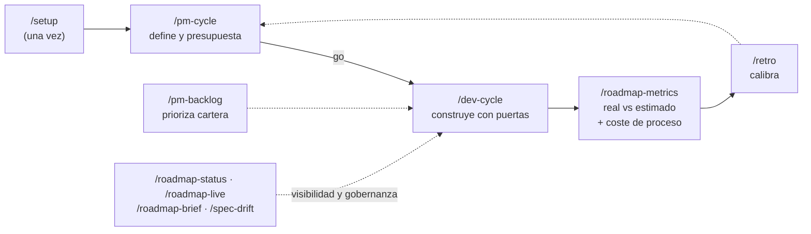

# custom-agents

[English](README.md) · **Español**

**El ciclo de vida completo de una iniciativa de software — con presupuesto, medición de coste real y trazabilidad en Jira/Confluence — dentro de Claude Code.**

[](https://github.com/daycry/custom-agents/actions/workflows/ci.yml)
[](CHANGELOG.es.md)
[](LICENSE)
[](docs/INSTALL.md)

[](https://github.com/daycry/custom-agents/stargazers)
[](https://github.com/daycry/custom-agents/forks)
[](https://github.com/daycry/custom-agents/issues)
[](https://github.com/daycry/custom-agents/commits/master)
[](https://github.com/daycry/custom-agents/pulse)

[](docs/INSTALL.md)
[](docs/FLOWS.md)
[](docs/README.md)
[](docs/README.md)
[](docs/README.md)
[](docs/INSTALL.md#usar-las-skills-fuera-de-claude-code-paquete-portable)

De la idea al código probado y documentado: `requisitos → presupuesto → plan → implementación → revisión adversarial → E2E → docs`, con **puertas de control** en cada paso, **coste real medido en tokens** y aprendizaje que calibra las siguientes estimaciones. Nueve agentes, doce comandos, autosuficiente (sin dependencias de otros plugins).


## Qué te llevas

Casi todo el utillaje alrededor de los agentes de código responde a *cómo* escribir el código. Este plugin responde además a **cuánto cuesta, si merece la pena construirlo y cómo se demuestra que se hizo bien** — la capa de negocio alrededor del código, dentro del mismo ciclo.

| Capacidad | Cómo se garantiza |
|---|---|
| **Presupuesto por iniciativa** (horas · € · tokens) | El `evaluator` pone precio a la spec antes de construir nada, con el `rates.json` del proyecto |
| **Coste REAL medido** por artefacto y por tarea | `usage-meter.py` lee los tokens reales de la transcripción de la sesión — medición, no estimación a ojo |
| **Puerta económica go/no-go** | `/pm-cycle` cierra en la decisión: no se construye nada sin un *go* explícito |
| **Real vs estimado + calibración** | `/roadmap-metrics` los compara; `/retro` convierte cada cierre en un ratio tokens/hora medido en `CALIBRATION.md` que afina la siguiente estimación |
| **Jira sin fricción** (opt-in) | Un issue por tarea o por fase, tipo deducido de la jerarquía, worklog al completar con tope de jornada, resultado de la revisión publicado como comentario |
| **Confluence bidireccional** (opt-in) | `docs/` ⇄ Confluence, idempotente, con **alcance de publicación curado** (`exclude` opt-out sobre `include: ["**/*.md"]`, `confluence-scope.py`) para que un PM sin git vea siempre el estado actual — nunca el tablero de ejecución del roadmap |
| **Cadena spec → eval → plan → tasks** | Una carpeta por iniciativa, artefactos enlazados en ambos sentidos y `tasks.md` como **ledger canónico** validado por `ledger-lint.py` |
| **Memoria técnica que sobrevive al chat** | `docs/knowledge/` (ADR/gotchas/lecciones, un fichero por entrada) recoge decisiones de diseño, trampas comprobadas y lecciones de proceso; la leen en su puerta `evaluator`/`planner`/`implementer`/`qa`, y la indexa `documenter` |
| **Journal de sesión (memoria episódica, sin MCP)** | Un hook `SessionEnd` deja una entrada determinista por sesión en `docs/knowledge/journal/` (iniciativa activa, ficheros tocados, tareas que cambiaron de estado, marcadores del meter; idempotente por `session_id`) y `SessionStart` reinyecta la última al arrancar/retomar — retomas con *qué pasó*, no solo con *qué tarea está abierta*. Excluido de Confluence; sin resumen por IA, con honestidad (el contrato oficial de hooks no lo permite) |
| **Salud del código medida** | `code-health.py` (skill `code-health`): duplicados por shingles de tokens con pares `fichero:línea`, funciones largas/anidamiento, hotspots (`git log` × tamaño) y TODO/FIXME envejecidos — Markdown o JSON, `--baseline` para ver si mejora; `evaluator` lo usa para fundamentar el riesgo, `planner` para abrir deuda medida |
| **Actualizar dependencias como spec, no como apuesta** | `deps-inventory.py` (skill `dependency-upgrade`): 7 manifiestos + lockfiles, declarada/bloqueada/latest (solo del `outdated` oficial, nunca inventado), saltos patch/minor/major; la skill lee el changelog upstream de cada major y redacta la spec `upgrade-<paquete>` para `evaluator` → `planner`. Las vulnerabilidades siguen siendo de `nemesis` |
| **Constitución del proyecto con enforcement** | Principios permanentes que leen todos los agentes que escriben — y la revisión convierte una violación en un gap de corrección con cita de línea |
| **Deriva spec↔código** | `/spec-drift` reverifica las specs implementadas contra el código de hoy (`vigente` / `derivado` / no verificable, con evidencia) |
| **Disciplina de ingeniería, opt-in** | `.claude/dev.json`: TDD estricto (skill `tdd`, fuente única de RED-GREEN-REFACTOR con evidencia del rojo), worktrees aislados y subagentes de contexto fresco con personas de dominio |
| **Diseño antes de planificar** (opt-in) | El agente `architect` convierte una spec aprobada en `design.md`: 2-3 opciones comparadas por complejidad, riesgo, coste relativo y reversibilidad, presentadas en trozos digestibles y **validadas contigo** antes del plan; la decisión queda como ADR |
| **Revisores de solo lectura** | Las lentes de la revisión corren en el agente `reviewer` (`tools: Read, Grep, Glob, Bash` — sin Write/Edit por construcción), con fallback a subagente genérico; contexto fresco y veredicto estructurado por criterio |
| **Tiering de modelos configurable** | Cada agente declara `model` + `effort` (lo valida el linter); `.claude/dev.json` `modelos` los sobreescribe por agente y `model-tier.py` resuelve el tier efectivo que los orquestadores pasan al Agent tool — documentado con honestidad: el `effort` de dev.json es informativo y `@agente` a mano sigue el frontmatter |
| **Depuración a causa raíz** | Al tercer intento fallido de qa, `debug-root-cause` diagnostica con evidencia en 4 fases antes de preguntarte — nada de parches a ciegas |
| **Puertas deterministas** | Los veredictos salen de scripts con exit codes y tests propios (`qa-gate`, `ledger-lint`, `coverage-check`), nunca de la prosa del agente |
| **Guardrails deterministas del implementer** | Un hook `PreToolUse` con alcance del agente (nunca global) deniega, con razón, escribir en `docs/roadmap/` fuera de `tasks.md`, editar en `main`/`master` y el git destructivo (`push --force`, `branch -D`, `rm -rf /`); `scope-check.py` condiciona la revisión a «ficheros cambiados ⊆ `Archivos` del ledger». Ambos son scripts con tests, desactivables por regla en `.claude/dev.json` |
| **Progreso en vivo mientras corren las tareas** | Hooks no bloqueantes leen el ledger canónico y muestran una línea de progreso por edición (`📋 slug · T-04/12 (33%) · en curso T-05`), el estado de las iniciativas activas al terminar un subagente y reinyectan el contexto de retoma al arrancar/retomar/compactar; una **statusline opt-in** añade modelo · coste de sesión · contexto · progreso del roadmap |
| **Activación fiable** | Un hook `SessionStart` inyecta un **índice compacto de todos los comandos, skills y agentes** (una línea por pieza, ≤ 3.500 caracteres, caché por hash) para que la pieza correcta se dispare aunque el usuario no la nombre; `evals/` guarda prompts positivos y negativos vecinos por pieza, validados en CI (`evals/check.py`) y ejecutables de verdad en local (`evals/run.py`) |

> **Skills portables:** las skills (no los agentes, comandos ni hooks) funcionan también **fuera de Claude Code** — Codex, Copilot, Cursor y cualquier lector de `AGENTS.md` — con `python3 scripts/export-skills.py` o el `custom-agents-skills-portable-<versión>.zip` que adjunta cada Release ([cómo](docs/INSTALL.md#usar-las-skills-fuera-de-claude-code-paquete-portable)).

> Autosuficiente: sin dependencias de otros plugins. Si ya usas un motor SDD externo, `/dev-cycle` puede delegarle la ejecución manteniendo `tasks.md` como ledger canónico; y [convive](docs/observability.md) con monitores de sesión en vivo.

## Lo que lo hace distinto

**💶 Cada iniciativa nace presupuestada y muere medida.** El `evaluator` presupuesta (horas, €, tokens) ANTES de construir y una puerta go/no-go decide. Durante el ciclo, `usage-meter` mide los **tokens reales** consumidos por cada artefacto y cada tarea (frontmatter `generacion:`, horas-IA imputables a Jira). `/roadmap-metrics` enseña estimado vs real, y `/retro` convierte cada cierre en **calibración** para estimar mejor la siguiente.

**🔍 La calidad no es opinión: son puertas.** Revisión adversarial (skill `adversarial-review`, reutilizable a demanda) de **dos lentes en paralelo** con contexto fresco (conformidad con la spec + robustez del código) más **lentes de seguridad y rendimiento condicionales** (Lente C/D) cuando el diff toca rutas/líneas sensibles o patrones de riesgo de rendimiento — consultas N+1, `await` o regex compilada dentro de un bucle, `sleep` bloqueante (`review-lens-select.py`), veredicto de qa por **script con exit code** (`qa-gate.py`), cobertura criterios↔tests verificada (`coverage-check.py`, con criterios `[GWT]` Given/When/Then traducibles 1:1 a E2E), ledger validado (`ledger-lint.py`) y bucles de corrección **acotados** (máx. 3 intentos — y al tercero, la skill `debug-root-cause` diagnostica la causa raíz con evidencia antes de preguntarte).

**⚖️ Disciplina de ingeniería opt-in (`.claude/dev.json`, defaults off).** Actívala por proyecto: **TDD** (skill `tdd`: RED-GREEN-REFACTOR con evidencia del rojo en el ledger), **worktrees** de git aislados por iniciativa, y **subagentes de contexto fresco** — cada tarea la implementa un subagente con un brief determinista (`task-brief.py`) que solo contiene su tarea, sus criterios y la constitución: sin arrastrar el ruido de las tareas anteriores.

**📜 Constitución del proyecto.** Principios permanentes en `docs/CONSTITUTION.md` (los ofrece `/setup`) que **todos los agentes leen y la revisión hace cumplir**: violar un principio explícito es gap de corrección con cita de línea. Y `/spec-drift` re-verifica cuando quieras que el código siga cumpliendo lo que las specs `implementada` prometieron.

**🎫 Jira y Confluence sin fricción (opt-in).** El plan se vuelca a Jira (un issue por tarea o por fase, tipo descubierto por jerarquía), las horas se imputan al completar (con tope de jornada y banco), el resultado de la revisión se publica como comentario, y `docs/` se espeja en Confluence en ambos sentidos — pensado para que un PM sin git vea todo al día.

## Empezar en 2 minutos

Cinco pasos copiables, de cero a tu primera iniciativa presupuestada:

**1. Añade el marketplace** (dentro de una sesión de Claude Code, `claude` en tu terminal):

```
/plugin marketplace add daycry/custom-agents
```

**2. Instala el plugin:**

```
/plugin install custom-agents@daycry
```

> Los comandos `/plugin` funcionan en la **CLI de Claude Code**; en VS Code o la app de escritorio, instala desde el menú *Customize → Plugins* o a nivel usuario (ver [INSTALL](docs/INSTALL.md)).

**3. Configúralo una vez por proyecto** (tarifa, opt-ins de Jira/Confluence, constitución, disciplina — toda pregunta tiene un valor por defecto):

```
/setup
```

**4. Define y presupuesta tu primera iniciativa** (cierra en la puerta go/no-go; aún no se construye nada):

```
/pm-cycle añadir login con 2FA
```

**5. Constrúyela con puertas** (plan → código → revisión adversarial → E2E → docs) y mira el resultado:

```
/dev-cycle
/roadmap-status
```

<details>
<summary><b>¿Qué verás?</b> (clic para desplegar)</summary>

<!-- TODO(gif): grabar el quickstart (pasos 3-5) como GIF y embeberlo aquí — pendiente del dueño del repo, no es deuda técnica. -->

Tras el paso 4 aparece una carpeta por iniciativa bajo `docs/roadmap/`:

```
docs/roadmap/2026-09-03-login-2fa/
├── spec.md          ← QUÉ (aprobada por ti; coste de generación medido en el frontmatter)
└── evaluation.md    ← CUÁNTO: horas · € · tokens · riesgos · veredicto → «go» o «no-go»
```

y el `evaluator` termina con una pregunta como *«Estimado 14 h · ≈730 € · 290k tokens. ¿Seguimos con /dev-cycle?»*. Tras el paso 5, la misma carpeta gana `improvement-plan.md` + `tasks.md` (el **ledger canónico**: cada `T-XX` con estado, horas medidas y su comando de `Verificación`) y `testing/`; mientras corren las tareas, un hook no bloqueante imprime una línea por edición del ledger:

```
📋 login-2fa · T-04/12 (33%) · fase 2/4 · en curso: T-05 …
```

`/roadmap-status` abre un dashboard HTML con todas las iniciativas, estado, prioridad y presupuesto; `/roadmap-metrics` muestra real vs estimado.

</details>

¿Cambio pequeño? `/dev-cycle arregla el typo del header, rápido` — la **vía rápida** salta el papeleo PM pero conserva la revisión y qa.



<details>
<summary><b>Los 10 agentes y los 12 comandos</b> (clic para desplegar)</summary>

| Agente | Qué hace |
|--------|----------|
| **analyst** | Toma de requerimientos: convierte una idea vaga en una `spec.md` aprobada (entrevista, ejemplos, user stories, contraejemplos). |
| **evaluator** | Presupuesta la spec: esfuerzo, coste €, tokens, riesgos, veredicto — calibrando con el histórico real. |
| **architect** | Diseño con opciones (opt-in): 2-3 alternativas con trade-offs → `design.md` validado contigo por trozos, más el ADR. No estima ni planifica. |
| **planner** | Plan ejecutable: fases y tareas `T-XX` con criterios de aceptación verificables y presupuesto por fase. |
| **implementer** | Escribe el código fase a fase sobre rama/worktree, con `tasks.md` como ledger canónico y coste medido por tarea. |
| **reviewer** | Una lente de revisión (A/B/C) en contexto fresco, solo lectura por construcción; salida estructurada que `adversarial-review` fusiona. |
| **qa** | E2E con Playwright (solo hosts locales), veredicto por `qa-gate.py`, informe md+pdf con evidencias. |
| **documenter** | Documentación técnica y de producto derivada del propio proyecto, una vez al cierre del ciclo. |
| **nemesis** | Auditoría de ciberseguridad: SAST 8 dimensiones + pentest activo **solo local** (guardrail no negociable). |

| Comando | Qué hace |
|---------|----------|
| `/setup` | Onboarding en una pasada: `rates.json`, Jira, Confluence, constitución, `dev.json` (disciplina, statusline, lentes de seguridad/rendimiento de la revisión y cobertura mínima: `auto`/`siempre`/`nunca`). |
| `/pm-cycle` | Rol producto: spec → evaluación → puerta go/no-go. |
| `/dev-cycle` | Ciclo de desarrollo completo (o vía rápida), con todas las puertas. |
| `/pm-backlog` | Prioriza la cartera de iniciativas evaluadas. |
| `/roadmap-status` | Dashboard del roadmap (HTML + md para Confluence). |
| `/roadmap-metrics` | Real vs estimado + **coste de proceso** medido. |
| `/roadmap-live` | Estado en vivo leyendo Jira. |
| `/roadmap-brief` | One-pager PDF para dirección. |
| `/spec-drift` | ¿El código sigue cumpliendo las specs implementadas? |
| `/retro` | Cierra el bucle: desviaciones + causas → `CALIBRATION.md`. |
| `/confluence-pull` | Confluence → `docs/` local (PM sin git). |
| `/doctor` | Diagnóstico determinista de la instalación: herramientas, plugin/hooks, statusline, configs de `.claude/`, estado del trabajo — veredicto ✅/⚠️/❌ con el arreglo por línea, solo lectura, sin red. |

Skills compartidas: `jira-sync` · `confluence-publish` / `confluence-pull` · `roadmap-dashboard` · `debug-root-cause` · `adversarial-review` · `cybersecurity` · `to-pdf` · `rates-verify` · `plugin-dev` · `quick-implement` · `tdd` · `code-health` · `dependency-upgrade` · `changelog-sync` · `unit-tests` · `api-contract`. Scripts deterministas (todos con tests): `usage-meter` · `task-brief` · `model-tier` · `journal` · `code-health` · `deps-inventory` · `worklog` · `qa-gate` · `ledger-lint` · `coverage-check` · `build_dashboard` · `lint_plugin`.

</details>

<details>
<summary><b>Cómo encaja todo</b> — la carpeta por iniciativa</summary>

```
docs/roadmap/<fecha>-<slug>/
├── spec.md              QUÉ se quiere (+ coste real de producirla, medido)
├── evaluation.md        CUÁNTO cuesta / si conviene
├── improvement-plan.md  CÓMO, paso a paso, presupuestado
├── tasks.md             ledger canónico (estados + horas medidas por tarea)
├── testing/             informe E2E de qa con evidencias
└── retro.md             real vs estimado + aprendizajes
```

Todos los artefactos se enlazan entre sí, llevan su coste de generación **medido** en el frontmatter (`generacion:`) y alimentan los dashboards y la calibración. Diagramas completos de cada flujo: [`docs/FLOWS.md`](docs/FLOWS.md).

</details>

<details>
<summary><b>Actualizar el plugin</b></summary>

Los plugins no se auto-actualizan; la actualización se detecta por versión.

1. **Publica**: `python scripts/release.py X.Y.Z` (deja coherentes `plugin.json` y `marketplace.json`, crea commit + tag) → `git push origin HEAD && git push origin vX.Y.Z`.
2. **Actualiza en tu cliente**: CLI → `/plugin marketplace update daycry` + `/plugin update custom-agents@daycry` + `/reload-plugins`. Desktop/Cowork → *Customize → Plugins → Actualizar* (si está deshabilitado: quita y re-añade el marketplace).
3. Si persiste la versión vieja: reinstala o borra `~/.claude/plugins/cache/`.

Detalle en [`docs/INSTALL.md`](docs/INSTALL.md).

</details>

## Documentación

| | |
|---|---|
| 📖 [Índice maestro](docs/README.md) | agentes, comandos y skills con sus dependencias |
| 🗺️ [FLOWS](docs/FLOWS.md) | **todos los flujos en diagramas Mermaid** |
| 📏 [CONVENTIONS](docs/CONVENTIONS.md) | dónde va cada cosa, estados, configs, ledger |
| 🔌 [INSTALL](docs/INSTALL.md) | instalación, conector Atlassian, actualización |
| 📡 [observability](docs/observability.md) | qué mide el plugin vs monitores de sesión |
| 📜 [CHANGELOG](CHANGELOG.es.md) | historia versión a versión |

## Calidad y CI

Cada push a `master` (y cada PR) pasa por [GitHub Actions](https://github.com/daycry/custom-agents/actions/workflows/ci.yml): linter del plugin (frontmatter, model tiering, grafo de dependencias sin ciclos, colisiones de nombres), las 6 suites deterministas del repo (dashboard, worklog, lint, qa-gate, ledger-lint, coverage-check), los 52 tests pytest de los scripts del kit shared (usage-meter, task-brief), la sintaxis de todos los scripts Python y la coherencia de versiones entre `plugin.json` y `marketplace.json`. El badge de arriba refleja el estado real de la última ejecución.

## Seguridad

`nemesis` hace pentest activo **solo contra hosts locales/privados** (`localhost`, `*.test`, redes privadas), impuesto por guardrail de script — nunca contra terceros. La explotación activa requiere opt-in explícito y los informes con hallazgos quedan gitignored.

## Comparado con superpowers

Una nota honesta, porque lo vas a preguntar. [superpowers](https://github.com/obra/superpowers) es un gran plugin de disciplina de ingeniería y este **toma prestados** varios de sus patrones abiertamente: TDD con evidencia del rojo, subagentes de contexto fresco con brief, revisión obligatoria antes de fusionar, skills cortas con referencias bajo demanda, evals de activación e índice de skills inyectado al arrancar. Lo que este plugin **aporta** es la capa de negocio alrededor del código: **presupuesto** (horas · € · tokens) antes de construir y puerta go/no-go, **ledger canónico** con coste medido por tarea, trazabilidad **Jira/Confluence**, **memoria técnica** (`docs/knowledge/`) y **guardrails deterministas** (scripts con exit codes, no prosa). Conviven: `/dev-cycle --superpowers` delega el esqueleto de ejecución en superpowers mientras `tasks.md` sigue siendo el ledger, y las [skills portables](docs/INSTALL.md#usar-las-skills-fuera-de-claude-code-paquete-portable) siguen su idea multi-entorno.

## Licencia

[Apache-2.0](LICENSE) © 2026 daycry
