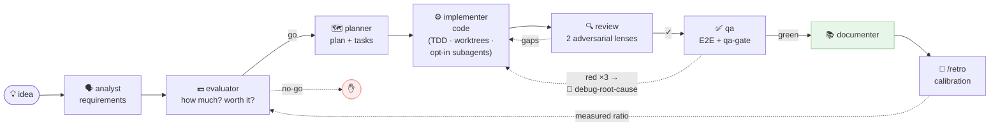
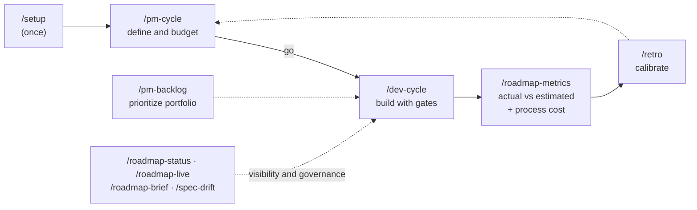

# custom-agents

**English** · [Español](README.es.md)

**The complete lifecycle of a software initiative — with budgeting, real cost measurement and Jira/Confluence traceability — inside Claude Code.**

[](https://github.com/daycry/custom-agents/actions/workflows/ci.yml)
[](CHANGELOG.md)
[](LICENSE)
[](docs/en/INSTALL.md)

[](https://github.com/daycry/custom-agents/stargazers)
[](https://github.com/daycry/custom-agents/forks)
[](https://github.com/daycry/custom-agents/issues)
[](https://github.com/daycry/custom-agents/commits/master)
[](https://github.com/daycry/custom-agents/pulse)

[](docs/en/INSTALL.md)
[](docs/en/FLOWS.md)
[](docs/en/README.md)
[](docs/en/README.md)
[](docs/en/README.md)
[](docs/en/INSTALL.md#using-the-skills-outside-claude-code-portable-package)

From idea to tested, documented code: `requirements → budget → plan → implementation → adversarial review → E2E → docs`, with **control gates** at every step, **real cost measured in tokens**, and learning that calibrates the next estimates. Nine agents, twelve commands, self-contained (no dependencies on other plugins).



## What you get

Most tooling around coding agents answers *how* to write the code. This plugin also answers **what it costs, whether it's worth building, and how you prove it was done right** — the business layer around the code, wired into the same cycle.

| Capability | How it's guaranteed |
|---|---|
| **Per-initiative budget** (hours · € · tokens) | The `evaluator` prices the spec before anything gets built, using the project's `rates.json` |
| **REAL measured cost** per artifact and per task | `usage-meter.py` reads the actual tokens from the session transcript — measurement, not guesswork |
| **Economic go/no-go gate** | `/pm-cycle` closes at the decision: nothing is built without an explicit *go* |
| **Estimated vs actual + calibration** | `/roadmap-metrics` compares them; `/retro` turns each closure into a measured tokens/hour ratio in `CALIBRATION.md` that sharpens the next estimate |
| **Jira without friction** (opt-in) | One issue per task or per phase, issue type inferred from the hierarchy, worklog on completion with a daily cap, review outcome posted as a comment |
| **Bidirectional Confluence** (opt-in) | `docs/` ⇄ Confluence, idempotent, with a **curated publish scope** (opt-out `exclude` over `include: ["**/*.md"]`, `confluence-scope.py`) so a PM without git always sees the current state — never the roadmap's execution board |
| **spec → eval → plan → tasks chain** | One folder per initiative, artifacts linked both ways, `tasks.md` as the **canonical ledger** validated by `ledger-lint.py` |
| **Technical memory that outlives a chat** | `docs/knowledge/` (ADR/gotchas/lessons, one file per entry) captures design decisions, proven traps and process lessons; read at the right gate by `evaluator`/`planner`/`implementer`/`qa`, indexed by `documenter` |
| **Session journal (episodic memory, no MCP)** | A `SessionEnd` hook leaves one deterministic entry per session under `docs/knowledge/journal/` (active initiative, files touched, tasks whose state changed, meter markers; idempotent by `session_id`) and `SessionStart` re-injects the latest one on startup/resume — you resume with *what happened*, not only *which task is open*. Excluded from Confluence; honestly no AI summary (the official hooks contract does not allow it) |
| **Measured code health** | `code-health.py` (skill `code-health`): duplicates by token shingles with `file:line` pairs, long functions/nesting, hotspots (`git log` × size) and aged TODO/FIXME — Markdown or JSON, `--baseline` to see better/worse; `evaluator` uses it to ground risk, `planner` to open measured debt |
| **Dependency upgrades as a spec, not a gamble** | `deps-inventory.py` (skill `dependency-upgrade`): 7 manifests + lockfiles, declared/locked/latest (only from the official `outdated`, never invented), patch/minor/major jumps; the skill reads each major's upstream changelog and writes the `upgrade-<package>` spec for `evaluator` → `planner`. Vulnerabilities stay with `nemesis` |
| **Project constitution with enforcement** | Permanent principles that every writing agent reads — and the review turns a violation into a correction gap with a line citation |
| **Spec↔code drift** | `/spec-drift` re-verifies implemented specs against today's code (`vigente` / `derivado` / not verifiable, with evidence) |
| **Engineering discipline, opt-in** | `.claude/dev.json`: strict TDD (skill `tdd`, single source of RED-GREEN-REFACTOR with red-phase evidence), isolated worktrees, and fresh-context subagents with domain personas |
| **Design before planning** (opt-in) | The `architect` agent turns an approved spec into `design.md`: 2-3 options compared on complexity, risk, relative cost and reversibility, presented in digestible chunks and **validated with you** before the plan; the decision lands as an ADR |
| **Read-only reviewers** | The review lenses run on the `reviewer` agent (`tools: Read, Grep, Glob, Bash` — no Write/Edit by construction), with a generic-subagent fallback; fresh context, structured verdict per criterion |
| **Configurable model tiering** | Every agent declares `model` + `effort` (linted); `.claude/dev.json` `modelos` overrides them per agent and `model-tier.py` resolves the effective tier that orchestrators pass to the Agent tool — honestly documented: `effort` overrides are informative, manual `@agent` follows the frontmatter |
| **Root-cause debugging** | On the third failed qa attempt, `debug-root-cause` diagnoses with evidence in 4 phases before asking you — no blind fixes |
| **Deterministic gates** | Verdicts come from scripts with exit codes and their own tests (`qa-gate`, `ledger-lint`, `coverage-check`), never from agent prose |
| **Deterministic guardrails for the implementer** | An agent-scoped `PreToolUse` hook (never global) denies, with a reason, writes to `docs/roadmap/` other than `tasks.md`, edits on `main`/`master` and destructive git (`push --force`, `branch -D`, `rm -rf /`); `scope-check.py` gates the review on "changed files ⊆ the ledger's `Archivos`". Both are scripts with tests, opt-out per rule in `.claude/dev.json` |
| **Live progress while tasks run** | Non-blocking hooks read the canonical ledger and show one progress line per edit (`📋 slug · T-04/12 (33%) · en curso T-05`), the state of active initiatives when a subagent finishes, and re-inject the resume context on startup/resume/compaction; an **opt-in status line** adds model · session cost · context · roadmap progress |
| **Reliable activation** | A `SessionStart` hook injects a compact **index of every command, skill and agent** (one line each, ≤ 3,500 chars, hash-cached) so the right piece fires even when the user does not name it; `evals/` holds positive and neighbouring-negative prompts per piece, checked statically in CI (`evals/check.py`) and runnable for real locally (`evals/run.py`) |

> **Portable skills:** the skills (not the agents, commands or hooks) also work **outside Claude Code** — Codex, Copilot, Cursor and any `AGENTS.md` reader — via `python3 scripts/export-skills.py` or the `custom-agents-skills-portable-<version>.zip` attached to every Release ([how](docs/en/INSTALL.md#using-the-skills-outside-claude-code-portable-package)).

> Self-contained: no dependency on other plugins. If you already use an external SDD engine, `/dev-cycle` can delegate execution to it while `tasks.md` remains the canonical ledger; and it [coexists](docs/en/observability.md) with live session monitors.

## What makes it different

**💶 Every initiative is born budgeted and dies measured.** The `evaluator` budgets (hours, €, tokens) BEFORE building and a go/no-go gate decides. During the cycle, `usage-meter` measures the **real tokens** consumed by each artifact and each task (`generacion:` frontmatter, AI hours billable to Jira). `/roadmap-metrics` shows estimated vs actual, and `/retro` turns every closure into **calibration** for better estimates next time.

**🔍 Quality is not an opinion: it's gates.** Adversarial review (skill `adversarial-review`, reusable on demand) with **two parallel lenses** on fresh context (spec conformance + code robustness) plus **conditional security and performance lenses** (Lens C/D) when the diff touches sensitive paths/lines or performance-risk patterns — N+1 queries, awaits or regex compiled inside a loop, blocking `sleep` (`review-lens-select.py`), a qa verdict issued by **script with exit code** (`qa-gate.py`), criteria↔tests coverage verified (`coverage-check.py`, with `[GWT]` Given/When/Then criteria that translate 1:1 to E2E), a validated ledger (`ledger-lint.py`) and **bounded** correction loops (max 3 attempts — and on the third one, the `debug-root-cause` skill diagnoses the root cause with evidence before asking you).

**⚖️ Opt-in engineering discipline (`.claude/dev.json`, defaults off).** Turn it on per project: **TDD** (skill `tdd`: RED-GREEN-REFACTOR with red-phase evidence in the ledger), isolated git **worktrees** per initiative, and **fresh-context subagents** — each task is implemented by a subagent with a deterministic brief (`task-brief.py`) containing only its task, its criteria and the constitution: no noise carried over from previous tasks.

**📜 Project constitution.** Permanent principles in `docs/CONSTITUTION.md` (offered by `/setup`) that **every agent reads and the review enforces**: violating an explicit principle is a correction gap with a line citation. And `/spec-drift` re-verifies, whenever you want, that the code still honors what the `implementada` (implemented) specs promised.

**🎫 Frictionless Jira and Confluence (opt-in).** The plan is pushed to Jira (one issue per task or per phase, issue type discovered from the hierarchy), hours are logged on completion (with a daily cap and a bank), the review outcome is posted as a comment, and `docs/` is mirrored to Confluence in both directions — designed so a PM without git sees everything up to date.

## Get started in 2 minutes

Five copy-paste steps, from zero to your first budgeted initiative:

**1. Add the marketplace** (inside a Claude Code session, `claude` in your terminal):

```
/plugin marketplace add daycry/custom-agents
```

**2. Install the plugin:**

```
/plugin install custom-agents@daycry
```

> The `/plugin` commands work in the **Claude Code CLI**; in VS Code or the desktop app, install from the *Customize → Plugins* menu or at user level (see [INSTALL](docs/en/INSTALL.md)).

**3. Set it up once per project** (rates, Jira/Confluence opt-ins, constitution, discipline — every question has a default):

```
/setup
```

**4. Define and budget your first initiative** (closes at the go/no-go gate; nothing gets built yet):

```
/pm-cycle add login with 2FA
```

**5. Build it with gates** (plan → code → adversarial review → E2E → docs) and look at the result:

```
/dev-cycle
/roadmap-status
```

<details>
<summary><b>What you'll see</b> (click to expand)</summary>

<!-- TODO(gif): record the quickstart (steps 3-5) as a GIF and embed it here — pending on the repo owner, not a technical debt. -->

After step 4, one folder per initiative appears under `docs/roadmap/`:

```
docs/roadmap/2026-09-03-login-2fa/
├── spec.md          ← WHAT (approved by you; measured generation cost in the frontmatter)
└── evaluation.md    ← HOW MUCH: hours · € · tokens · risks · verdict → "go" or "no-go"
```

and the `evaluator` ends with a question like *"Estimated 14 h · ≈730 € · 290k tokens. Go ahead with /dev-cycle?"*. After step 5, the same folder gains `improvement-plan.md` + `tasks.md` (the **canonical ledger**: every `T-XX` with state, measured hours and its `Verificación` command) and `testing/`; while tasks run, a non-blocking hook prints one line per edit of the ledger:

```
📋 login-2fa · T-04/12 (33%) · phase 2/4 · in progress: T-05 …
```

`/roadmap-status` opens an HTML dashboard with every initiative, state, priority and budget; `/roadmap-metrics` shows actual vs estimated.

</details>

Small change? `/dev-cycle fix the header typo, quick` — the **fast track** skips the PM paperwork but keeps the review and qa.



<details>
<summary><b>The 10 agents and the 12 commands</b> (click to expand)</summary>

| Agent | What it does |
|--------|----------|
| **analyst** | Requirements gathering: turns a vague idea into an approved `spec.md` (interview, examples, user stories, counterexamples). |
| **evaluator** | Budgets the spec: effort, € cost, tokens, risks, verdict — calibrating against the real track record. |
| **architect** | Design with options (opt-in): 2-3 alternatives with trade-offs → `design.md` validated in chunks with you, plus the ADR. Does not estimate or plan. |
| **planner** | Executable plan: phases and `T-XX` tasks with verifiable acceptance criteria and a per-phase budget. |
| **implementer** | Writes the code phase by phase on a branch/worktree, with `tasks.md` as the canonical ledger and per-task measured cost. |
| **reviewer** | One review lens (A/B/C) on fresh context, read-only by construction; structured output that `adversarial-review` merges. |
| **qa** | E2E with Playwright (local hosts only), verdict via `qa-gate.py`, md+pdf report with evidence. |
| **documenter** | Technical and product documentation derived from the project itself, once at cycle close. |
| **nemesis** | Cybersecurity audit: 8-dimension SAST + active pentest **local only** (non-negotiable guardrail). |

| Command | What it does |
|---------|----------|
| `/setup` | One-pass onboarding: `rates.json`, Jira, Confluence, constitution, `dev.json` (discipline, status line, review's security/performance lenses and min. coverage gate: `auto`/`siempre`/`nunca`). |
| `/pm-cycle` | Product role: spec → evaluation → go/no-go gate. |
| `/dev-cycle` | Full development cycle (or fast track), with every gate. |
| `/pm-backlog` | Prioritizes the portfolio of evaluated initiatives. |
| `/roadmap-status` | Roadmap dashboard (HTML + md for Confluence). |
| `/roadmap-metrics` | Actual vs estimated + measured **process cost**. |
| `/roadmap-live` | Live status reading from Jira. |
| `/roadmap-brief` | One-pager PDF for leadership. |
| `/spec-drift` | Does the code still honor the implemented specs? |
| `/retro` | Closes the loop: deviations + causes → `CALIBRATION.md`. |
| `/confluence-pull` | Confluence → local `docs/` (PM without git). |
| `/doctor` | Deterministic install diagnosis: tools, plugin/hooks, statusline, `.claude/` configs, work state — ✅/⚠️/❌ verdict with the fix per line, read-only, no network. |

Shared skills: `jira-sync` · `confluence-publish` / `confluence-pull` · `roadmap-dashboard` · `debug-root-cause` · `adversarial-review` · `cybersecurity` · `to-pdf` · `rates-verify` · `plugin-dev` · `quick-implement` · `tdd` · `code-health` · `dependency-upgrade` · `changelog-sync` · `unit-tests` · `api-contract`. Deterministic scripts (all with tests): `usage-meter` · `task-brief` · `model-tier` · `journal` · `code-health` · `deps-inventory` · `worklog` · `qa-gate` · `ledger-lint` · `coverage-check` · `build_dashboard` · `lint_plugin`.

</details>

<details>
<summary><b>How it all fits together</b> — the per-initiative folder</summary>

```
docs/roadmap/<fecha>-<slug>/
├── spec.md              WHAT is wanted (+ real, measured cost of producing it)
├── evaluation.md        HOW MUCH it costs / whether it's worth it
├── improvement-plan.md  HOW, step by step, budgeted
├── tasks.md             canonical ledger (states + measured hours per task)
├── testing/             qa E2E report with evidence
└── retro.md             actual vs estimated + lessons learned
```

All artifacts link to each other, carry their **measured** generation cost in the frontmatter (`generacion:`) and feed the dashboards and the calibration. Full diagrams of every flow: [`docs/FLOWS.md`](docs/en/FLOWS.md).

</details>

<details>
<summary><b>Updating the plugin</b></summary>

Plugins do not auto-update; updates are detected by version.

1. **Publish**: `python scripts/release.py X.Y.Z` (keeps `plugin.json` and `marketplace.json` consistent, creates commit + tag) → `git push origin HEAD && git push origin vX.Y.Z`.
2. **Update in your client**: CLI → `/plugin marketplace update daycry` + `/plugin update custom-agents@daycry` + `/reload-plugins`. Desktop/Cowork → *Customize → Plugins → Update* (if disabled: remove and re-add the marketplace).
3. If the old version persists: reinstall or delete `~/.claude/plugins/cache/`.

Details in [`docs/INSTALL.md`](docs/en/INSTALL.md).

</details>

## Documentation

| | |
|---|---|
| 📖 [Master index](docs/en/README.md) | agents, commands and skills with their dependencies |
| 🗺️ [FLOWS](docs/en/FLOWS.md) | **every flow as Mermaid diagrams** |
| 📏 [CONVENTIONS](docs/en/CONVENTIONS.md) | where everything goes, states, configs, ledger |
| 🔌 [INSTALL](docs/en/INSTALL.md) | installation, Atlassian connector, updating |
| 📡 [observability](docs/en/observability.md) | what the plugin measures vs session monitors |
| 📜 [CHANGELOG](CHANGELOG.md) | version-by-version history |

## Quality and CI

Every push to `master` (and every PR) goes through [GitHub Actions](https://github.com/daycry/custom-agents/actions/workflows/ci.yml): the plugin linter (frontmatter, model tiering, dependency graph with no cycles, name collisions), the repo's 6 deterministic suites (dashboard, worklog, lint, qa-gate, ledger-lint, coverage-check), the 52 pytest tests for the shared kit's scripts (usage-meter, task-brief), the syntax of every Python script, and version consistency between `plugin.json` and `marketplace.json`. The badge above reflects the actual state of the latest run.

## Security

`nemesis` runs active pentests **only against local/private hosts** (`localhost`, `*.test`, private networks), enforced by a script guardrail — never against third parties. Active exploitation requires explicit opt-in and reports with findings stay gitignored.

## Compared with superpowers

An honest note, because you will ask. [superpowers](https://github.com/obra/superpowers) is a great engineering-discipline plugin, and this one **borrows** several of its patterns openly: TDD with red-phase evidence, fresh-context subagents with a brief, mandatory review before merging, short skills with on-demand references, activation evals and a skill index injected at session start. What this plugin **adds** is the business layer around the code: a **budget** (hours · € · tokens) before building and a go/no-go gate, a **canonical ledger** with measured cost per task, **Jira/Confluence** traceability, a **technical memory** (`docs/knowledge/`) and **deterministic guardrails** (scripts with exit codes, not prose). They coexist: `/dev-cycle --superpowers` delegates the execution backbone to superpowers while `tasks.md` stays the ledger, and the [portable skills](docs/en/INSTALL.md#using-the-skills-outside-claude-code-portable-package) follow its multi-environment idea.

## License

[Apache-2.0](LICENSE) © 2026 daycry
