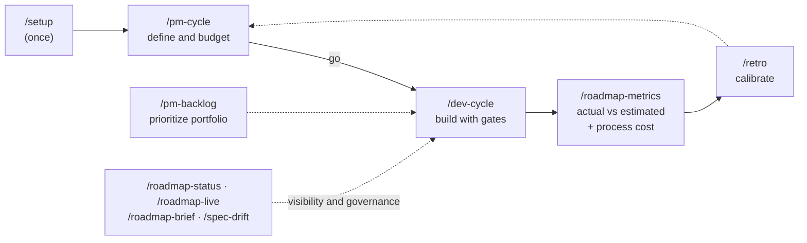

# custom-agents

**English** · [Español](README.es.md)

**The complete lifecycle of a software initiative — with budgeting, real cost measurement and Jira/Confluence traceability — inside Claude Code.**

[](https://github.com/daycry/custom-agents/actions/workflows/ci.yml)
[](CHANGELOG.md)
[](LICENSE)
[](docs/en/INSTALL.md)

[](https://github.com/daycry/custom-agents/stargazers)
[](https://github.com/daycry/custom-agents/forks)
[](https://github.com/daycry/custom-agents/issues)
[](https://github.com/daycry/custom-agents/commits/master)
[](https://github.com/daycry/custom-agents/pulse)

[](docs/en/INSTALL.md)
[](docs/en/FLOWS.md)
[](docs/en/README.md)
[](docs/en/README.md)
[](docs/en/README.md)

From idea to tested, documented code: `requirements → budget → plan → implementation → adversarial review → E2E → docs`, with **control gates** at every step, **real cost measured in tokens**, and learning that calibrates the next estimates. Eight agents, eleven commands, self-contained (no dependencies on other plugins).


## What you get

Most tooling around coding agents answers *how* to write the code. This plugin also answers **what it costs, whether it's worth building, and how you prove it was done right** — the business layer around the code, wired into the same cycle.

| Capability | How it's guaranteed |
|---|---|
| **Per-initiative budget** (hours · € · tokens) | The `evaluator` prices the spec before anything gets built, using the project's `rates.json` |
| **REAL measured cost** per artifact and per task | `usage-meter.py` reads the actual tokens from the session transcript — measurement, not guesswork |
| **Economic go/no-go gate** | `/pm-cycle` closes at the decision: nothing is built without an explicit *go* |
| **Estimated vs actual + calibration** | `/roadmap-metrics` compares them; `/retro` turns each closure into a measured tokens/hour ratio in `CALIBRATION.md` that sharpens the next estimate |
| **Jira without friction** (opt-in) | One issue per task or per phase, issue type inferred from the hierarchy, worklog on completion with a daily cap, review outcome posted as a comment |
| **Bidirectional Confluence** (opt-in) | `docs/` ⇄ Confluence, idempotent, so a PM without git always sees the current state |
| **spec → eval → plan → tasks chain** | One folder per initiative, artifacts linked both ways, `tasks.md` as the **canonical ledger** validated by `ledger-lint.py` |
| **Project constitution with enforcement** | Permanent principles that every writing agent reads — and the review turns a violation into a correction gap with a line citation |
| **Spec↔code drift** | `/spec-drift` re-verifies implemented specs against today's code (`vigente` / `derivado` / not verifiable, with evidence) |
| **Engineering discipline, opt-in** | `.claude/dev.json`: strict TDD with red-phase evidence, isolated worktrees, and fresh-context subagents with domain personas |
| **Root-cause debugging** | On the third failed qa attempt, `debug-root-cause` diagnoses with evidence in 4 phases before asking you — no blind fixes |
| **Deterministic gates** | Verdicts come from scripts with exit codes and their own tests (`qa-gate`, `ledger-lint`, `coverage-check`), never from agent prose |

> Self-contained: no dependency on other plugins. If you already use an external SDD engine, `/dev-cycle` can delegate execution to it while `tasks.md` remains the canonical ledger; and it [coexists](docs/en/observability.md) with live session monitors.

## What makes it different

**💶 Every initiative is born budgeted and dies measured.** The `evaluator` budgets (hours, €, tokens) BEFORE building and a go/no-go gate decides. During the cycle, `usage-meter` measures the **real tokens** consumed by each artifact and each task (`generacion:` frontmatter, AI hours billable to Jira). `/roadmap-metrics` shows estimated vs actual, and `/retro` turns every closure into **calibration** for better estimates next time.

**🔍 Quality is not an opinion: it's gates.** Adversarial review with **two parallel lenses** on fresh context (spec conformance + code robustness), a qa verdict issued by **script with exit code** (`qa-gate.py`), criteria↔tests coverage verified (`coverage-check.py`, with `[GWT]` Given/When/Then criteria that translate 1:1 to E2E), a validated ledger (`ledger-lint.py`) and **bounded** correction loops (max 3 attempts — and on the third one, the `debug-root-cause` skill diagnoses the root cause with evidence before asking you).

**⚖️ Opt-in engineering discipline (`.claude/dev.json`, defaults off).** Turn it on per project: **TDD** RED-GREEN-REFACTOR with red-phase evidence in the ledger, isolated git **worktrees** per initiative, and **fresh-context subagents** — each task is implemented by a subagent with a deterministic brief (`task-brief.py`) containing only its task, its criteria and the constitution: no noise carried over from previous tasks.

**📜 Project constitution.** Permanent principles in `docs/CONSTITUTION.md` (offered by `/setup`) that **every agent reads and the review enforces**: violating an explicit principle is a correction gap with a line citation. And `/spec-drift` re-verifies, whenever you want, that the code still honors what the `implementada` (implemented) specs promised.

**🎫 Frictionless Jira and Confluence (opt-in).** The plan is pushed to Jira (one issue per task or per phase, issue type discovered from the hierarchy), hours are logged on completion (with a daily cap and a bank), the review outcome is posted as a comment, and `docs/` is mirrored to Confluence in both directions — designed so a PM without git sees everything up to date.

## Get started in 2 minutes

```
/plugin marketplace add daycry/custom-agents
/plugin install custom-agents@daycry
```

> The `/plugin` commands work in the **Claude Code CLI**; in VS Code or the desktop app, install from the *Customize → Plugins* menu or at user level (see [INSTALL](docs/en/INSTALL.md)).

Then, in your project:

```
/setup                          ← one pass: rates, Jira, Confluence, constitution, discipline
/pm-cycle add login with 2FA    ← define and budget (closes at go/no-go)
/dev-cycle                      ← build: plan → code → review → E2E → docs
```

Small change? `/dev-cycle fix the header typo, quick` — the **fast track** skips the PM paperwork but keeps the review and qa.



<details>
<summary><b>The 8 agents and the 11 commands</b> (click to expand)</summary>

| Agent | What it does |
|--------|----------|
| **analyst** | Requirements gathering: turns a vague idea into an approved `spec.md` (interview, examples, user stories, counterexamples). |
| **evaluator** | Budgets the spec: effort, € cost, tokens, risks, verdict — calibrating against the real track record. |
| **planner** | Executable plan: phases and `T-XX` tasks with verifiable acceptance criteria and a per-phase budget. |
| **implementer** | Writes the code phase by phase on a branch/worktree, with `tasks.md` as the canonical ledger and per-task measured cost. |
| **qa** | E2E with Playwright (local hosts only), verdict via `qa-gate.py`, md+pdf report with evidence. |
| **documenter** | Technical and product documentation derived from the project itself, once at cycle close. |
| **nemesis** | Cybersecurity audit: 8-dimension SAST + active pentest **local only** (non-negotiable guardrail). |
| **pdfy** | Any document → modern-looking PDF. |

| Command | What it does |
|---------|----------|
| `/setup` | One-pass onboarding: `rates.json`, Jira, Confluence, constitution, `dev.json`. |
| `/pm-cycle` | Product role: spec → evaluation → go/no-go gate. |
| `/dev-cycle` | Full development cycle (or fast track), with every gate. |
| `/pm-backlog` | Prioritizes the portfolio of evaluated initiatives. |
| `/roadmap-status` | Roadmap dashboard (HTML + md for Confluence). |
| `/roadmap-metrics` | Actual vs estimated + measured **process cost**. |
| `/roadmap-live` | Live status reading from Jira. |
| `/roadmap-brief` | One-pager PDF for leadership. |
| `/spec-drift` | Does the code still honor the implemented specs? |
| `/retro` | Closes the loop: deviations + causes → `CALIBRATION.md`. |
| `/confluence-pull` | Confluence → local `docs/` (PM without git). |

Shared skills: `jira-sync` · `confluence-publish` / `confluence-pull` · `roadmap-dashboard` · `discovery` · `debug-root-cause` · `cybersecurity` · `to-pdf` · `rates-verify`. Deterministic scripts (all with tests): `usage-meter` · `task-brief` · `worklog` · `qa-gate` · `ledger-lint` · `coverage-check` · `build_dashboard` · `lint_plugin`.

</details>

<details>
<summary><b>How it all fits together</b> — the per-initiative folder</summary>

```
docs/roadmap/<fecha>-<slug>/
├── spec.md              WHAT is wanted (+ real, measured cost of producing it)
├── evaluation.md        HOW MUCH it costs / whether it's worth it
├── improvement-plan.md  HOW, step by step, budgeted
├── tasks.md             canonical ledger (states + measured hours per task)
├── testing/             qa E2E report with evidence
└── retro.md             actual vs estimated + lessons learned
```

All artifacts link to each other, carry their **measured** generation cost in the frontmatter (`generacion:`) and feed the dashboards and the calibration. Full diagrams of every flow: [`docs/FLOWS.md`](docs/en/FLOWS.md).

</details>

<details>
<summary><b>Updating the plugin</b></summary>

Plugins do not auto-update; updates are detected by version.

1. **Publish**: `python scripts/release.py X.Y.Z` (keeps `plugin.json` and `marketplace.json` consistent, creates commit + tag) → `git push origin HEAD && git push origin vX.Y.Z`.
2. **Update in your client**: CLI → `/plugin marketplace update daycry` + `/plugin update custom-agents@daycry` + `/reload-plugins`. Desktop/Cowork → *Customize → Plugins → Update* (if disabled: remove and re-add the marketplace).
3. If the old version persists: reinstall or delete `~/.claude/plugins/cache/`.

Details in [`docs/INSTALL.md`](docs/en/INSTALL.md).

</details>

## Documentation

| | |
|---|---|
| 📖 [Master index](docs/en/README.md) | agents, commands and skills with their dependencies |
| 🗺️ [FLOWS](docs/en/FLOWS.md) | **every flow as Mermaid diagrams** |
| 📏 [CONVENTIONS](docs/en/CONVENTIONS.md) | where everything goes, states, configs, ledger |
| 🔌 [INSTALL](docs/en/INSTALL.md) | installation, Atlassian connector, updating |
| 📡 [observability](docs/en/observability.md) | what the plugin measures vs session monitors |
| 📜 [CHANGELOG](CHANGELOG.md) | version-by-version history |

## Quality and CI

Every push to `master` (and every PR) goes through [GitHub Actions](https://github.com/daycry/custom-agents/actions/workflows/ci.yml): the plugin linter (frontmatter, model tiering, dependency graph with no cycles, name collisions), the repo's 6 deterministic suites (dashboard, worklog, lint, qa-gate, ledger-lint, coverage-check), the 52 pytest tests for the shared kit's scripts (usage-meter, task-brief), the syntax of every Python script, and version consistency between `plugin.json` and `marketplace.json`. The badge above reflects the actual state of the latest run.

## Security

`nemesis` runs active pentests **only against local/private hosts** (`localhost`, `*.test`, private networks), enforced by a script guardrail — never against third parties. Active exploitation requires explicit opt-in and reports with findings stay gitignored.

## License

[Apache-2.0](LICENSE) © 2026 daycry
