# Flujos del plugin — diagramas

[English](en/FLOWS.md) · **Español**

Visión visual de cómo encajan agentes, comandos y skills. Los diagramas son Mermaid
(se renderizan en GitHub y editores compatibles).

**Leyenda:** flecha **continua** = flujo principal · flecha **punteada** = opcional, retorno o feedback · rombo = decisión/puerta · verde = camino de avance (*go*/verde) · rojo = rechazo o vuelta atrás (*no-go*/rojo).

## 0 · Mapa general — quién usa qué

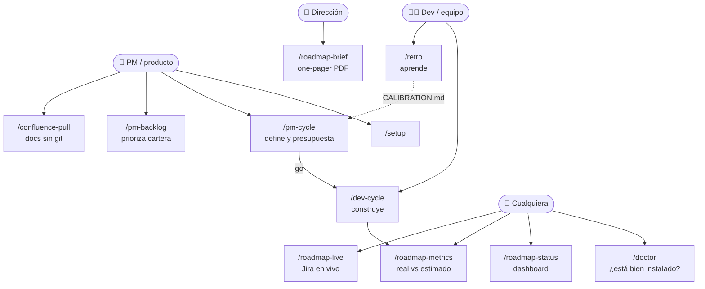

## 1 · La cadena completa de una iniciativa

Fase de **producto**: `analyst → evaluator` (+ `architect` opcional tras el go). Fase de **desarrollo**: `planner → implementer → qa`. La revisión adversarial despacha sus lentes al agente de solo lectura `reviewer`.

```mermaid
flowchart LR
    idea(["💡 Idea / petición"]) --> analyst["🗣️ analyst<br/>toma de requerimientos"]
    analyst -->|spec aprobada| evaluator["💶 evaluator<br/>presupuesta<br/>(+ code-health opt-in: riesgo medido)"]
    evaluator -->|go| planner["🗺️ planner<br/>plan + tasks"]
    evaluator -.->|"go + complejidad Alta<br/>(opt-in)"| architect["🏗️ architect<br/>2-3 opciones → design.md<br/>2 pasadas: opciones → elección del usuario → ADR"]
    architect -->|design aprobado| planner
    evaluator -.->|no-go| fin1(["✋ se descarta"])
    planner --> implementer["⚙️ implementer<br/>código + ledger"]
    implementer --> scope{"scope-check.py<br/>diff ⊆ Archivos?"}
    scope -.->|fuera de alcance| implementer
    scope -->|exit 0| review["🔍 skill adversarial-review<br/>lentes A+B → agente reviewer (solo lectura)<br/>en paralelo, contexto fresco<br/>(+ lente C seguridad si el diff lo amerita)"]
    review -->|sin gaps| qa["✅ qa<br/>E2E Playwright"]
    review -.->|gaps de corrección| implementer
    qa -->|verde| documenter["📚 documenter<br/>docs del proyecto"]
    qa -.->|rojo| implementer
    documenter --> retro["🔁 /retro<br/>calibración"]
    nemesis["🛡️ nemesis<br/>auditoría"] -.->|hallazgos críticos| analyst
    retro -.->|CALIBRATION.md| evaluator
    style fin1 fill:#fdecea,stroke:#ef9a9a
    style documenter fill:#e8f5e9,stroke:#81c784
```

Todo vive en **una carpeta por iniciativa**: `docs/roadmap/<fecha>-<slug>/`
(`spec.md → evaluation.md → [design.md] → improvement-plan.md + tasks.md → testing/ → retro.md`).

## 2 · `/pm-cycle` — rol producto (define y presupuesta, cierra en la puerta)

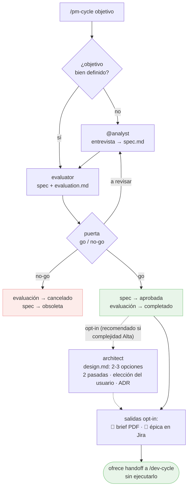

## 3 · `/dev-cycle` — ciclo de desarrollo (con puertas)

> **Puerta de entrada (Fase 0-bis):** `/dev-cycle` pregunta primero **flujo completo** vs **vía rápida**. La vía rápida salta evaluator+architect+planner (crea un `tasks.md` ligero) y entra directa en implementación, pero mantiene revisión de dos lentes + qa. **La revisión es la skill `adversarial-review`** (fuente única del método: puerta `scope-check.py`, lentes A/B despachadas al agente de solo lectura **`reviewer`** —fallback a subagente genérico—, lentes **condicionales** C de seguridad y **D de rendimiento** decididas por `review-lens-select.py` (rutas/líneas sensibles · patrones N+1, `await`/regex en bucle, `sleep` bloqueante; `dev.json` `revision.lenteSeguridad`/`revision.lenteRendimiento`), bucle acotado a 3); `/dev-cycle` solo la invoca, lleva el contador de intentos e imputa el worklog `[revisión]`. También se usa a demanda («revísame este diff») sin ledger. **Fase 2-a (opcional):** `architect` antes de `planner` cuando hay `design.md` o el usuario lo pide. **Modelo por agente:** antes de cada despacho, `model-tier.py <agente>` (frontmatter + `dev.json` `modelos`) → parámetro `model` del Agent tool.
>
> **Dos puertas de entrada al mismo gate:** el command `/dev-cycle` (explícito, con la barra) y la skill `quick-implement`, que se auto-invoca por lenguaje natural («implementa X rápido») y entra por la rama de vía rápida tras su filtro de idoneidad. La skill no define método propio: delega en esta misma Fase 0-bis.

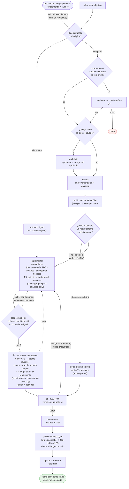

`tasks.md` es el **ledger canónico** de progreso en los dos modos.

## 4 · Jira (opt-in) — volcado del plan al crearlo

> **Granularidad** (`.claude/jira.json` → `granularidad`): **tarea** = un issue por `T-XX` (defecto); **fase** = un issue por Fase con sus tareas como checklist. En modo fase, comentarios/worklog/Done van al issue de la fase; el issue cierra cuando todas sus tareas están `completado`. Además, el **resultado del revisor** (Modo B) se publica como comentario (por criterio ✓/✗ + nº intentos) y su tiempo se imputa como worklog `[revisión]` aparte — con la granularidad elegida.

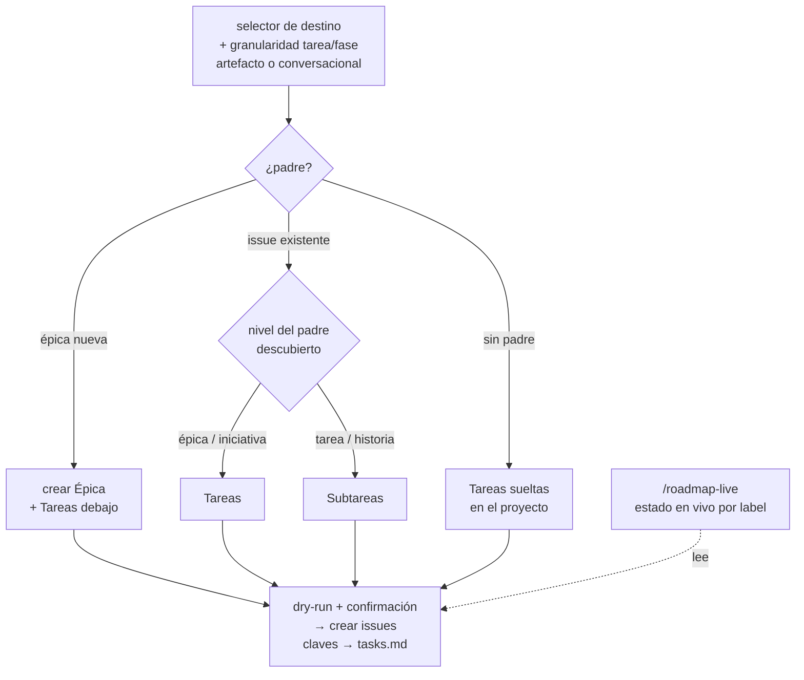

## 4b · Jira (opt-in) — imputación al completar cada tarea

> **Ojo: completar una tarea NO la pasa a Done.** El worklog se imputa al cerrar la tarea; el issue
> solo llega a *Done* con el evento `aprobado` del ciclo de abajo (4c), tras revisión y `qa`.

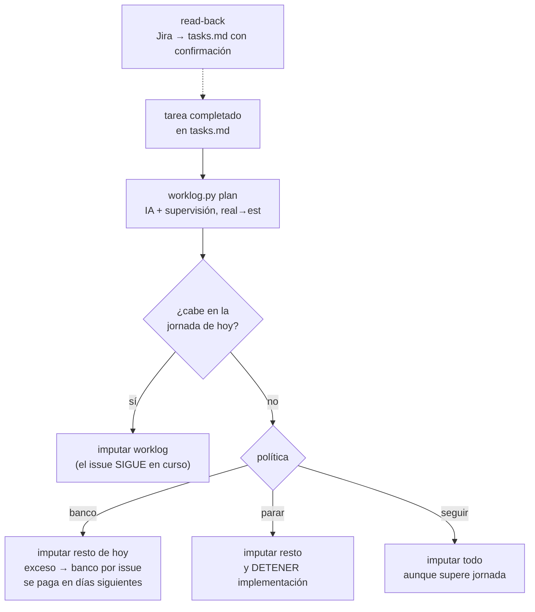

## 4c · Jira (opt-in) — el ciclo de eventos de la Fase 3 (quién dispara qué)

Los 7 eventos los genera `skills/jira-sync/scripts/jira-flow.py` (`ops` deterministas: etiqueta →
transición → comentario firmado → worklog); el agente solo las **ejecuta** vía el conector. El
`--actor` de cada evento es fijo: si no casa, exit 2. Detalle operativo en la tabla «Ciclo Jira de la
Fase 3» de `commands/dev-cycle.md` (fuente única).

| Evento | Quién lo dispara | Transición del issue | Comentario (etiqueta) |
|---|---|---|---|
| `arrancar` | `implementer` | → *En curso* (`en-curso`) | — |
| `implementado` | `implementer` | — (sigue En curso) | `ca-implementer` |
| `revision` (intento sin gaps) | `reviewer` | — | `ca-reviewer` |
| `gaps` (intento con gaps) | `reviewer` | → *En curso* (`reabrir`) | `ca-reviewer` |
| `qa-verde` / `qa-rojo` | `qa` | — | `ca-qa` |
| `aprobado` | **el orquestador** (`/dev-cycle`) | → *Done* (`done`) | `ca-orquestador` |

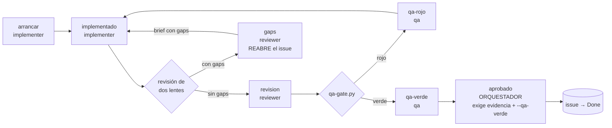

> **Done es una puerta, no un efecto colateral.** `aprobado` es el ÚNICO evento que mueve el issue a
> *Done*, lo dispara solo el orquestador y `jira-flow.py` lo rechaza (exit 2, `ops: []`) si el ledger
> no trae una última sección de revisión sin gaps pendientes o si falta `--qa-verde` (el exit 0 de
> `qa-gate.py`). Con `.claude/jira.json` `enabled` ≠ `true` todo el ciclo devuelve `ops: []` sin
> ruido, y cada evento ya publicado queda anotado (`flow` en `jira-state.json`) para no repetirse.

## 5 · Confluence — bidireccional (opt-in)

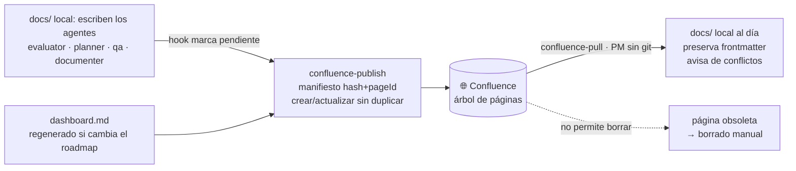

> **Política de publicación (2026-08-20-confluence-policy):** opt-out sobre `include: ["**/*.md"]`
> — un documento nuevo se publica salvo que caiga en una exclusión conocida. Detalle normativo y
> tabla completa de exclusiones: `skills/confluence-publish/SKILL.md`, sección "qué sube y qué no".

**Matriz disparador → artefacto → ¿se publica?** (los 11 disparadores conocidos que aplican, o
declaran que no aplican, el paso `agent-kits/shared/confluence-optin.md`):

| Disparador | Artefacto(s) que produce | ¿Se publica? |
|---|---|---|
| `analyst` | `spec.md` | ✅ Sí |
| `evaluator` | `evaluation.md` (+ `spec.md` si lo crea) | ✅ Sí |
| `architect` | `design.md` (+ ADR en `docs/knowledge/adr/`) | ✅ Sí — decisión de arquitectura, como `spec.md` y los ADR (no es tablero de ejecución) |
| `planner` | `improvement-plan.md`, `tasks.md` | ❌ No — plan y ledger (D1): su sitio es el repo y Jira, no Confluence |
| `implementer` | actualiza `tasks.md` por tarea; dispara la sincronización **al cerrar cada fase** (D3) | ⚠️ El disparo sí ocurre, pero `tasks.md` en sí **no** sube (D1) — refresca lo demás que haya cambiado bajo `docs/` (típicamente `dashboard.md`) |
| `qa` | `testing/report.md` + `report.pdf`, `screenshots/`, `raw/` | ❌ No — `**/testing/**` (D4): el informe embebe capturas que el conector no puede adjuntar; queda solo-local |
| `documenter` | documentación de referencia bajo `docs/` (arquitectura, stack, guías, producto…) | ✅ Sí |
| `/pm-backlog` | `docs/roadmap/BACKLOG.md` | ✅ Sí |
| `/retro` | `retro.md` + `docs/roadmap/CALIBRATION.md` | ✅ Sí |
| `/spec-drift` | `docs/roadmap/DRIFT.md` | ✅ Sí |
| `/roadmap-brief` | `docs/roadmap/brief.md` + `brief.pdf` | ⚠️ El `.md` sí; el `.pdf` no entra en el espejo (no es `.md`) |

**"No" estructurales** (no dependen de un disparador concreto — son exclusiones de la política que
aplican siempre, escriba quien escriba): `docs/en/**` (árbol EN duplicado, para lectores de
GitHub), `docs/examples/**` y `docs/agents/**` (documentación interna del plugin, no del producto
del proyecto consumidor), `docs/**/atlassian-connector-notes.md` y, como siempre,
`docs/security-scan/**` (invariante no negociable de `nemesis`). Verificable con
`confluence-scope.py --status` / `--check` (`skills/confluence-publish/scripts/`).

**Puntos de nacimiento de `docs/knowledge/`** (memoria técnica, `2026-08-20-knowledge-capture`) —
**sí entra en el espejo por defecto**, no está en el `exclude` (a diferencia del plan/ledger de la
fila `planner` de arriba): `planner`/`implementer` escriben un ADR en `docs/knowledge/adr/` cuando
una decisión de diseño cruza el umbral (ver regla 10 de `CONVENTIONS.md`); `debug-root-cause`
escribe un gotcha en `docs/knowledge/gotchas/GOT-NNN-<slug>.md` (fichero nuevo) al cerrar su Fase 4
(causa raíz confirmada); `qa` escribe un gotcha cuando un flaky justificado resulta ser un patrón,
no un accidente; `/retro` produce una segunda salida con lecciones de proceso en
`docs/knowledge/lessons/LES-NNN-<agente>-<slug>.md` (fichero nuevo), además de su
fila numérica en `CALIBRATION.md`. Los cinco agentes lectores (`evaluator`, `planner`,
`implementer`, `qa`, `documenter`) aplican `agent-kits/shared/knowledge-check.md` antes de
trabajar (progressive disclosure: solo el índice + su área). El **journal de sesión**
(`docs/knowledge/journal/`, bitácora generada por el hook `SessionEnd`) es memoria episódica, no
curada: `evaluator`/`planner`/`architect` leen solo la última entrada de su iniciativa, `/retro` la
usa como fuente de causas de desviación y lo que merezca doctrina se promueve a ADR/gotcha/lección.
Detalle completo: regla 10 de [`CONVENTIONS.md`](CONVENTIONS.md).

## 6 · Visibilidad y aprendizaje (todo solo-lectura)

> **Coste de generación (usage-meter):** cada artefacto del ciclo (y cada tarea en Modo B) se **mide** con tokens reales de la transcripción (`agent-kits/shared/usage-meter.py`); el bloque `generacion:` de su frontmatter alimenta la sección **coste de proceso** de `/roadmap-metrics`, y `/retro` calibra con ello el **ratio tokens→hora** que usan el evaluator y el propio meter. Fechas = contexto · tokens = medida · horas = derivadas.

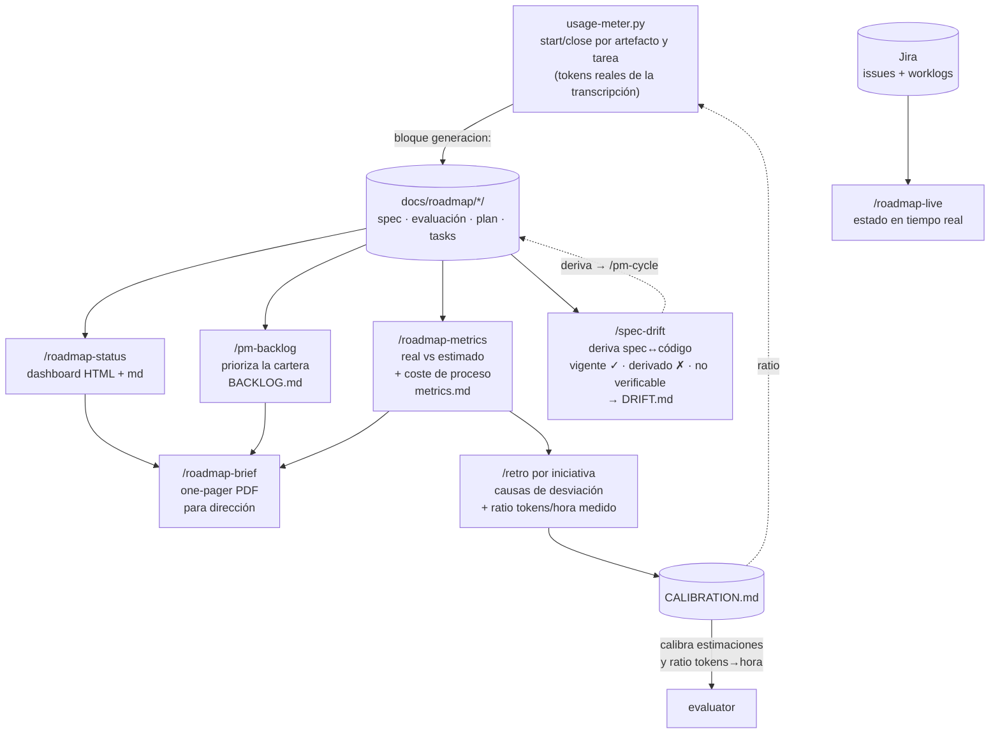

## 6b · Visibilidad en vivo (hooks deterministas + statusline opt-in)

> Mientras `implementer`/subagentes trabajan, el usuario ve el avance sin que nadie lo redacte:
> todo sale de `progress-report.py` sobre el **ledger canónico** (`tasks.md`). Los hooks
> **informan, no deciden** (siempre exit 0). Detalle: [`observability.md`](observability.md).
> **Journal de sesión** (memory-health): al terminar la sesión, `SessionEnd` deja una entrada
> determinista en `docs/knowledge/journal/` (iniciativa activa, ficheros tocados, tareas que cambiaron
> de estado, marcadores del meter); al arrancar/retomar, `SessionStart` la reinyecta compactada. Sin
> resumen por IA: la salida de los hooks en `SessionEnd` se ignora por contrato (ADR-010).

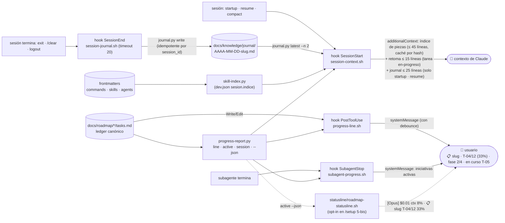

## 6c · Guardrails deterministas del `implementer` (hook de guardia con alcance de agente)

> Las reglas duras del `implementer` no dependen de que el modelo las recuerde: un hook
> `PreToolUse` registrado **solo en su frontmatter** (`agents/implementer.md`) las impone con
> `guardrail-check.py` (script con tests). Los demás agentes no lo llevan: `planner`/`evaluator`
> escriben en `docs/roadmap/` legítimamente (ADR-007). Desactivable en `.claude/dev.json`.

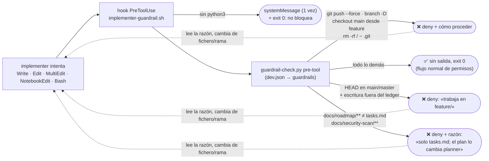

## 7 · Configuración (una pasada con `/setup`)

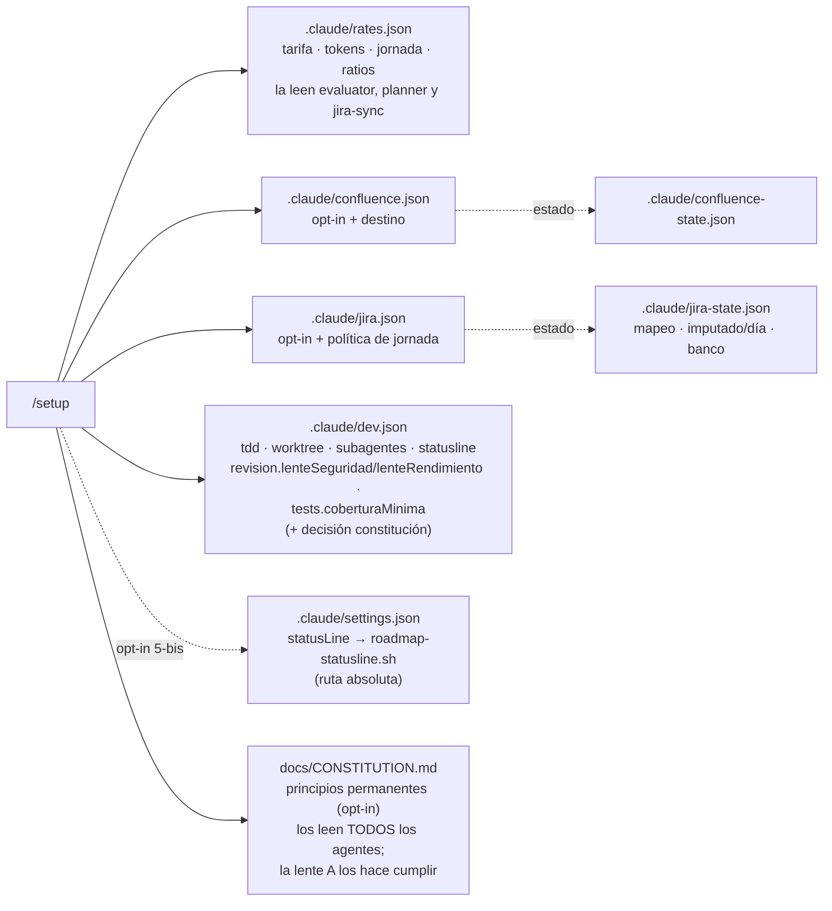

> **Comprobar la instalación:** `/doctor` lee todo esto (y los hooks, la statusline y el estado del trabajo) sin
> escribir nada y da un veredicto ✅/⚠️/❌ por línea con el arreglo al lado. Es la primera parada cuando un hook
> «no salta» o una skill no se activa; `/setup` la ofrece si ya hay config en `.claude/`.

Detalle de cada fichero: regla 9 de [`CONVENTIONS.md`](CONVENTIONS.md). Comportamientos del
conector Atlassian: [`atlassian-connector-notes.md`](atlassian-connector-notes.md).

> **Nota (Confluence):** si esta página se publica en Confluence vía `confluence-publish`, los
> diagramas Mermaid solo se dibujan si el espacio tiene una app/macro de Mermaid instalada; si no,
> se verá el código fuente del diagrama. En GitHub y editores compatibles se renderizan siempre.

> **Mantenimiento:** al añadir o cambiar un agente, comando o skill, actualiza el diagrama
> correspondiente de este documento (ver checklist de `CONVENTIONS.md`).
