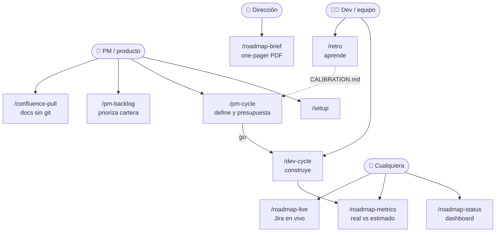
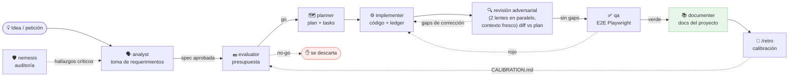
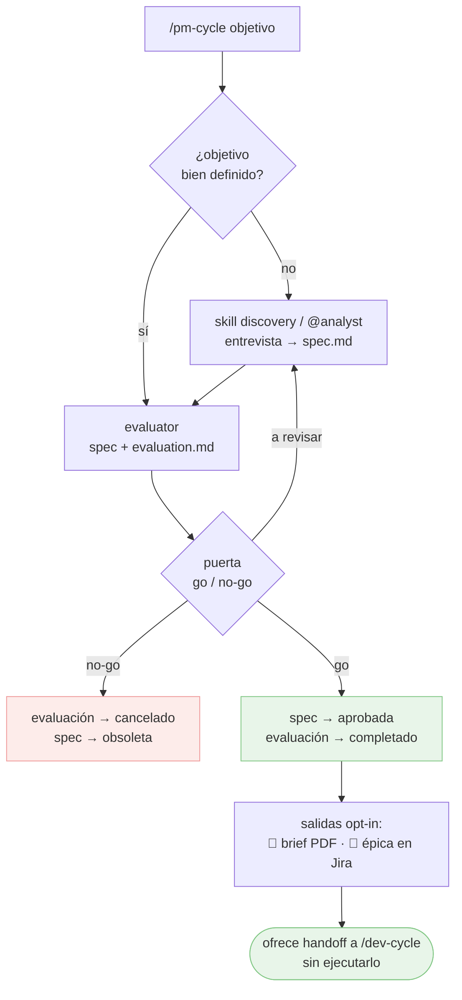
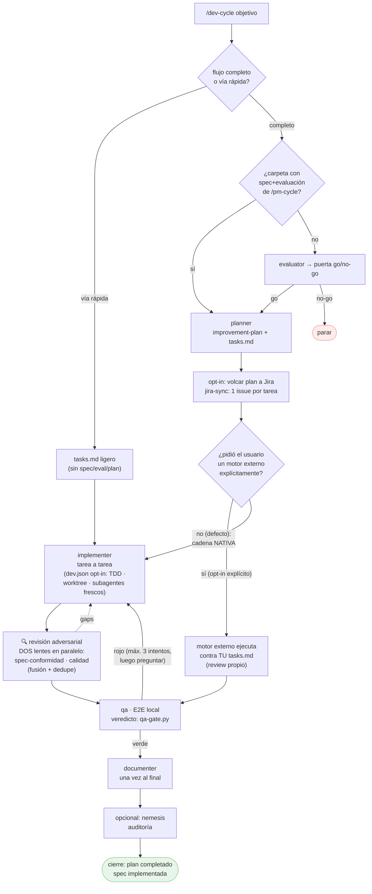
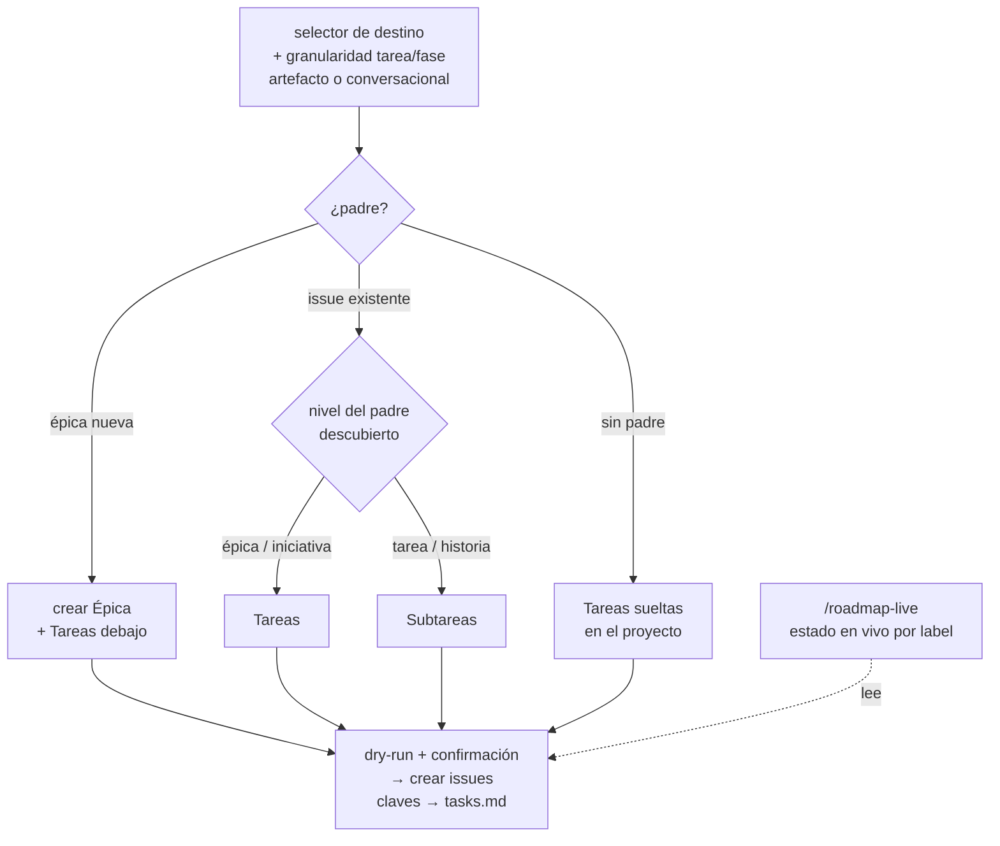
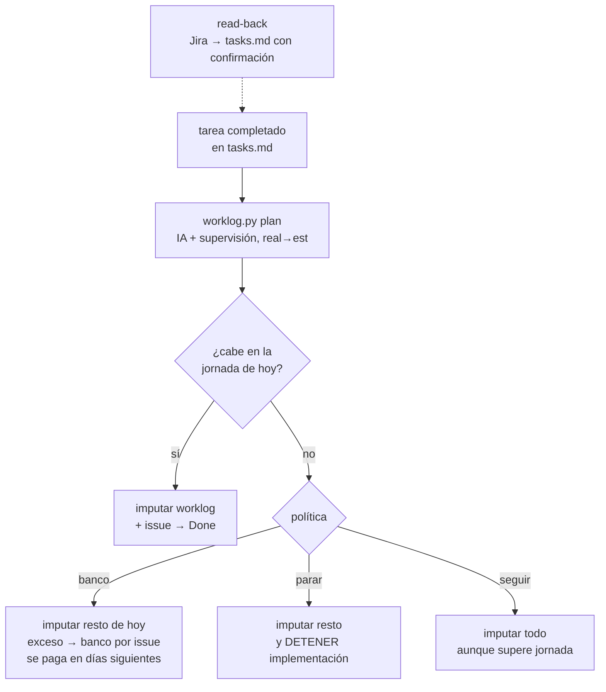
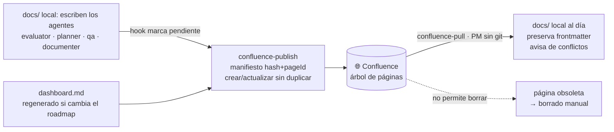
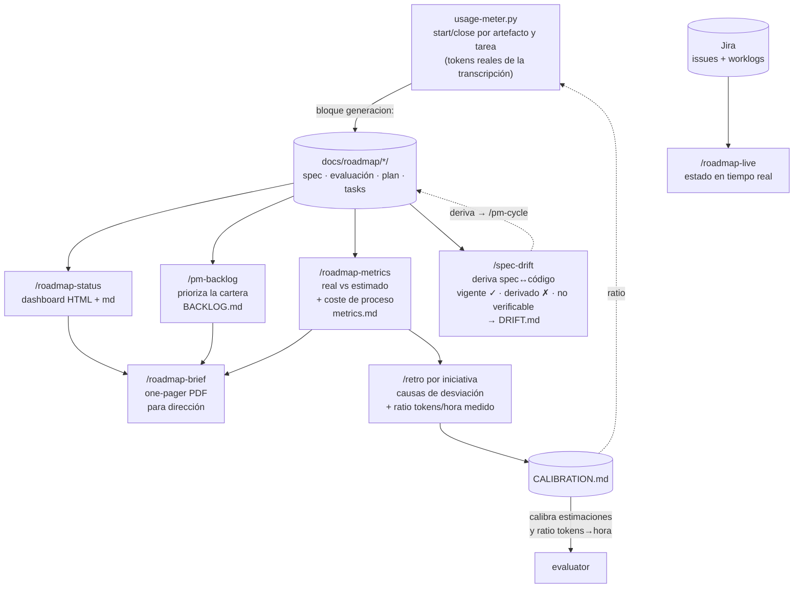
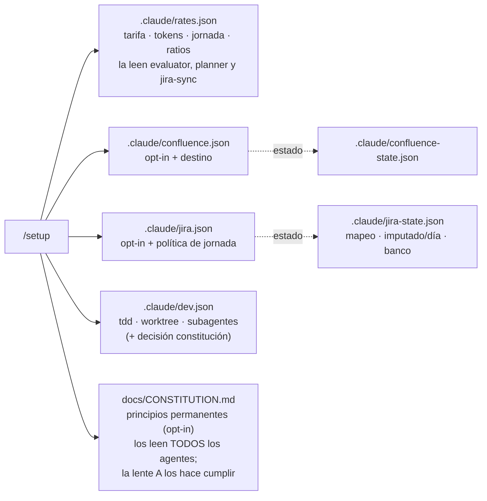

# Flujos del plugin — diagramas

[English](en/FLOWS.md) · **Español**

Visión visual de cómo encajan agentes, comandos y skills. Los diagramas son Mermaid
(se renderizan en GitHub y editores compatibles).

**Leyenda:** flecha **continua** = flujo principal · flecha **punteada** = opcional, retorno o feedback · rombo = decisión/puerta · verde = camino de avance (*go*/verde) · rojo = rechazo o vuelta atrás (*no-go*/rojo).

## 0 · Mapa general — quién usa qué

## 1 · La cadena completa de una iniciativa

Fase de **producto**: `analyst → evaluator`. Fase de **desarrollo**: `planner → implementer → qa`.

Todo vive en **una carpeta por iniciativa**: `docs/roadmap/<fecha>-<slug>/`
(`spec.md → evaluation.md → improvement-plan.md + tasks.md → testing/ → retro.md`).

## 2 · `/pm-cycle` — rol producto (define y presupuesta, cierra en la puerta)

## 3 · `/dev-cycle` — ciclo de desarrollo (con puertas)

> **Puerta de entrada (Fase 0-bis):** `/dev-cycle` pregunta primero **flujo completo** vs **vía rápida**. La vía rápida salta evaluator+planner (crea un `tasks.md` ligero) y entra directa en implementación, pero mantiene revisión de dos lentes + qa.

`tasks.md` es el **ledger canónico** de progreso en los dos modos.

## 4 · Jira (opt-in) — volcado del plan al crearlo

> **Granularidad** (`.claude/jira.json` → `granularidad`): **tarea** = un issue por `T-XX` (defecto); **fase** = un issue por Fase con sus tareas como checklist. En modo fase, comentarios/worklog/Done van al issue de la fase; el issue cierra cuando todas sus tareas están `completado`. Además, el **resultado del revisor** (Modo B) se publica como comentario (por criterio ✓/✗ + nº intentos) y su tiempo se imputa como worklog `[revisión]` aparte — con la granularidad elegida.

## 4b · Jira (opt-in) — imputación al completar cada tarea

## 5 · Confluence — bidireccional (opt-in)

## 6 · Visibilidad y aprendizaje (todo solo-lectura)

> **Coste de generación (usage-meter):** cada artefacto del ciclo (y cada tarea en Modo B) se **mide** con tokens reales de la transcripción (`agent-kits/shared/usage-meter.py`); el bloque `generacion:` de su frontmatter alimenta la sección **coste de proceso** de `/roadmap-metrics`, y `/retro` calibra con ello el **ratio tokens→hora** que usan el evaluator y el propio meter. Fechas = contexto · tokens = medida · horas = derivadas.

## 7 · Configuración (una pasada con `/setup`)

Detalle de cada fichero: regla 9 de [`CONVENTIONS.md`](CONVENTIONS.md). Comportamientos del
conector Atlassian: [`atlassian-connector-notes.md`](atlassian-connector-notes.md).

> **Nota (Confluence):** si esta página se publica en Confluence vía `confluence-publish`, los
> diagramas Mermaid solo se dibujan si el espacio tiene una app/macro de Mermaid instalada; si no,
> se verá el código fuente del diagrama. En GitHub y editores compatibles se renderizan siempre.

> **Mantenimiento:** al añadir o cambiar un agente, comando o skill, actualiza el diagrama
> correspondiente de este documento (ver checklist de `CONVENTIONS.md`).
