# Flujos del plugin — diagramas

[English](en/FLOWS.md) · **Español**

Visión visual de cómo encajan agentes, comandos y skills. Los diagramas son Mermaid
(se renderizan en GitHub y editores compatibles).

**Leyenda:** flecha **continua** = flujo principal · flecha **punteada** = opcional, retorno o feedback · rombo = decisión/puerta · verde = camino de avance (*go*/verde) · rojo = rechazo o vuelta atrás (*no-go*/rojo).

## 0 · Mapa general — quién usa qué

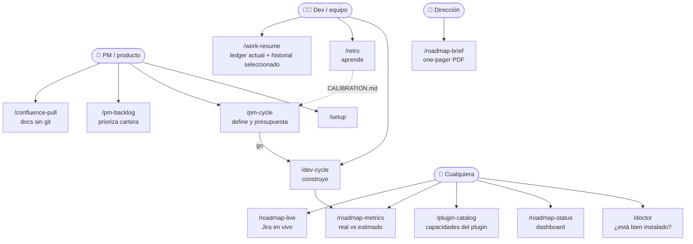
```mermaid
flowchart TD
    PM(["👤 PM / producto"]) --> S0["/setup"]
    PM --> P1["/pm-cycle<br/>define y presupuesta"]
    PM --> P2["/pm-backlog<br/>prioriza cartera"]
    PM --> P3["/confluence-pull<br/>docs sin git"]
    DEV(["👩‍💻 Dev / equipo"]) --> D1["/dev-cycle<br/>construye"]
    DEV --> D2["/retro<br/>aprende"]
    DEV --> D3["/work-resume<br/>ledger actual + historial seleccionado"]
    DIR(["👔 Dirección"]) --> V1["/roadmap-brief<br/>one-pager PDF"]
    TODOS(["👀 Cualquiera"]) --> V0["/doctor<br/>¿está bien instalado?"]
    TODOS --> V2["/roadmap-status<br/>dashboard"]
    TODOS --> V5["/plugin-catalog<br/>capacidades del plugin"]
    TODOS --> V3["/roadmap-metrics<br/>real vs estimado"]
    TODOS --> V4["/roadmap-live<br/>Jira en vivo"]
    P1 -->|go| D1
    D1 --> V3
    D2 -.->|CALIBRATION.md| P1
```

## Contexto técnico común

`/work-context` y `agent-kits/shared/capability-check.md` usan el mismo registro
del bundle. Planner registra IDs y escenarios en cada tarea; los roles siguientes
comparten esos criterios. Los manifiestos seleccionan guías: no ejecutan código,
otorgan permisos ni demuestran tools disponibles. La instalación parcial avisa y
continúa. TDD, revisión independiente, qa-gate y Knowledge Gate conservan dueño.

El mismo fragmento usa `project-pieces.py` para reconocer extensiones de proyecto
y usuario. Planner registra IDs y fuentes en `Extensiones` y `Procedencia de
extensiones`. El brief refresca esa selección y transfiere referencias acotadas;
las personas mantienen `Tipo`. Los roles contrastan disponibilidad con la sesión
antes de invocar. [Carpetas y contratos](PROJECT-EXTENSIONS.md).

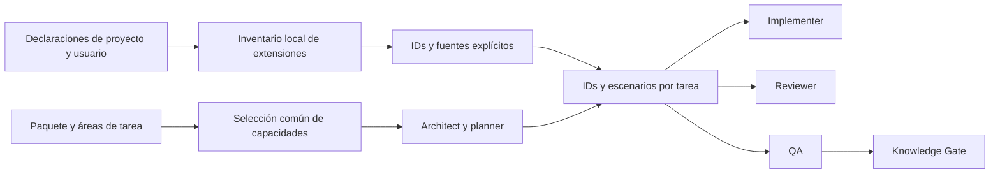
```mermaid
flowchart LR
  Paquete[Paquete y áreas de tarea] --> Seleccion[Selección común de capacidades]
  Propias[Declaraciones de proyecto y usuario] --> Lector[Inventario local de extensiones]
  Lector --> Eleccion[IDs y fuentes explícitos]
  Eleccion --> Ledger
  Seleccion --> Diseno[Architect y planner]
  Diseno --> Ledger[IDs y escenarios por tarea]
  Ledger --> Implementacion[Implementer]
  Ledger --> Revision[Reviewer]
  Ledger --> Pruebas[QA]
  Pruebas --> Memoria[Knowledge Gate]
```

## Memoria local, lectura documental y contexto AST

`knowledge-find.py` recupera memoria local sin Docker. Un `--intent` explícito
puede solicitar lectura documental autorizada de `markdown-export`.
El router exige backend, `read.enabled`, intent, canon completo, routing y filtros
de todo el conjunto publicado antes de importar el adaptador o transmitir la pregunta.

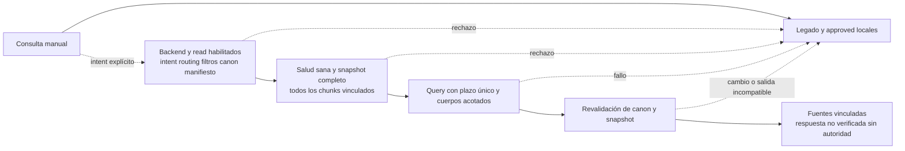
```mermaid
flowchart LR
    Peticion[Consulta manual] --> Local[Legado y approved locales]
    Peticion -.->|intent explícito| Canon[Backend y read habilitados<br/>intent routing filtros canon manifiesto]
    Canon --> Binding[Salud sana y snapshot completo<br/>todos los chunks vinculados]
    Binding --> Consulta[Query con plazo único y cuerpos acotados]
    Consulta --> Refresh[Revalidación de canon y snapshot]
    Refresh --> Generada[Fuentes vinculadas<br/>respuesta no verificada sin autoridad]
    Canon -.->|rechazo| Local
    Binding -.->|rechazo| Local
    Consulta -.->|fallo| Local
    Refresh -.->|cambio o salida incompatible| Local
```

El binding exige ID, versión, hash, proyecto y scope del chunk contra canon,
proyección y manifiesto propios. `source_nodes` son fuentes recuperadas, sin citas
por afirmación. La estabilidad observada no garantiza atomicidad ni detecta ABA.
Detalle y opt-in: [adaptador Kwipu](../skills/knowledge-services/references/kwipu-adapter.md#cómo-habilitar-la-lectura-documental).

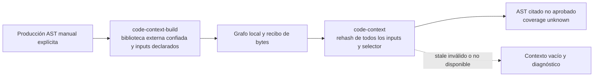
```mermaid
flowchart LR
    Manual[Producción AST manual explícita] --> Producer[code-context-build<br/>biblioteca externa confiada y inputs declarados]
    Producer --> Par[Grafo local y recibo de bytes]
    Par --> Reader[code-context<br/>rehash de todos los inputs y selector]
    Reader --> Contexto[AST citado no aprobado<br/>coverage unknown]
    Reader -.->|stale inválido o no disponible| Vacio[Contexto vacío y diagnóstico]
```

La consulta AST no importa al productor ni instala Graphify. Un recibo válido
solo acredita `verified-declared-inputs`, sin autenticación de productor ni cobertura
global o semántica. El productor exige destinos nuevos para artefacto y recibo antes
de importar el extractor. Los crea exclusivamente, sin sobrescribir; el par no es atómico.
Si falla el recibo, puede quedar el artefacto sin él: no borra destinos finales al fallar
y la siguiente build requiere otro destino. No garantiza detección de cambios ABA.
Selectores, CLI y dependencias: [CODE_CONTEXT](CODE_CONTEXT.md).

El panel y los hooks mantienen su lectura local. Abrirlos no activa estas consultas,
no inicia servicios y no añade polling de backends.

## Retoma dirigida sobre registros existentes

`/work-resume` llama a `progress-report.py resume` y muestra primero el ledger
actual. El selector de `journal.py` aporta después el historial de la identidad
solicitada. Una selección explícita fallida no toma otra sesión. Ambigüedad,
registro ilegible y recorrido incompleto conservan su propio estado.
[Selección, límites y lectura](WORK-RESUME.md).

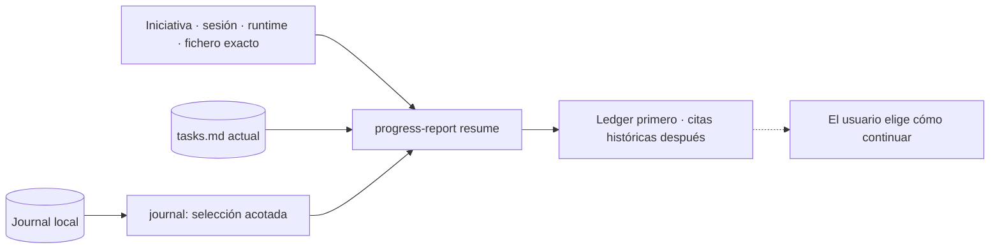
```mermaid
flowchart LR
  Selector[Iniciativa · sesión · runtime · fichero exacto] --> Resume[progress-report resume]
  Tasks[(tasks.md actual)] --> Resume
  Journal[(Journal local)] --> Select[journal: selección acotada]
  Select --> Resume
  Resume --> View[Ledger primero · citas históricas después]
  View -.-> Decision[El usuario elige cómo continuar]
```

Startup/resume usa el mismo compositor con `--history-only`; compact omite el
historial. Replay y el bloque de progreso siguen separados: el hook completo
conserva operaciones de recuperación. El dossier manual no ejecuta recuperación,
meter, Git ni backends, y no crea otro ciclo o almacén.

## 1 · La cadena completa de una iniciativa

Research-first aporta investigación dirigida. La selección común conecta
stack-practices, backend-practices, frontend-quality y delivery-practices con
diseño, planificación, implementación, revisión y QA. La carga es bajo demanda.

Fase de **producto**: `analyst → evaluator` (+ `architect` opcional tras el go). Fase de **desarrollo**: `planner → implementer → qa`. La revisión adversarial despacha sus lentes al agente de solo lectura `reviewer`.

```mermaid
flowchart LR
    idea(["💡 Idea / petición"]) --> analyst["🗣️ analyst<br/>toma de requerimientos"]
    analyst -->|spec aprobada| evaluator["💶 evaluator<br/>presupuesta<br/>(+ code-health opt-in: riesgo medido)"]
    evaluator -->|go| planner["🗺️ planner<br/>plan + tasks"]
    evaluator -.->|"go + complejidad Alta<br/>(opt-in)"| architect["🏗️ architect<br/>2-3 opciones → design.md<br/>2 pasadas: opciones → elección del usuario → ADR"]
    architect -->|design aprobado| planner
    evaluator -.->|no-go| fin1(["✋ se descarta"])
    planner --> implementer["⚙️ implementer<br/>código + ledger"]
    implementer --> scope{"scope-check.py<br/>diff ⊆ Archivos?"}
    scope -.->|fuera de alcance| implementer
    scope -->|exit 0| review["🔍 skill adversarial-review<br/>lentes A+B → agente reviewer (solo lectura)<br/>en paralelo, contexto fresco<br/>(+ lente C seguridad si el diff lo amerita)"]
    review -->|sin gaps| qa["✅ qa<br/>E2E Playwright"]
    review -.->|gaps de corrección| implementer
    qa -->|verde| documenter["📚 documenter<br/>docs del proyecto"]
    qa -.->|rojo| implementer
    review -.->|"plan con test-plan: n/a (sin UI)"| qasinui["✅ qa · modo sin UI<br/>ledger-lint + coverage-check<br/>sin Playwright ni URL"]
    qasinui --> documenter
    documenter -.->|"candidato propuesto<br/>(opcional, buzón)"| kcurator["🗂️ knowledge-curator<br/>Knowledge Gate<br/>approve/needs_changes/rejected"]
    documenter --> retro["🔁 /retro<br/>calibración"]
    kcurator --> retro
    nemesis["🛡️ nemesis<br/>auditoría"] -.->|hallazgos críticos| analyst
    retro -.->|CALIBRATION.md| evaluator
    style fin1 fill:#fdecea,stroke:#ef9a9a
    style documenter fill:#e8f5e9,stroke:#81c784
    style kcurator fill:#e8f5e9,stroke:#81c784
```

Todo vive en **una carpeta por iniciativa**: `docs/roadmap/<fecha>-<slug>/`
(`spec.md → evaluation.md → [design.md] → improvement-plan.md + tasks.md → testing/ → retro.md`).

## 2 · `/pm-cycle` — rol producto (define y presupuesta, cierra en la puerta)

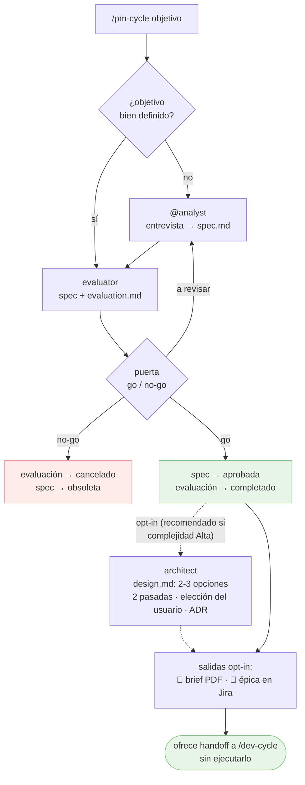
```mermaid
flowchart TD
    A["/pm-cycle objetivo"] --> B{"¿objetivo<br/>bien definido?"}
    B -->|no| C["@analyst<br/>entrevista → spec.md"]
    B -->|sí| D["evaluator<br/>spec + evaluation.md"]
    C --> D
    D --> E{"puerta<br/>go / no-go"}
    E -->|no-go| F["evaluación → cancelado<br/>spec → obsoleta"]
    E -->|a revisar| C
    E -->|go| G["spec → aprobada<br/>evaluación → completado"]
    G -.->|"opt-in (recomendado si<br/>complejidad Alta)"| AR["architect<br/>design.md: 2-3 opciones<br/>2 pasadas · elección del usuario · ADR"]
    AR -.-> H
    G --> H["salidas opt-in:<br/>📄 brief PDF · 🎫 épica en Jira"]
    H --> I(["ofrece handoff a /dev-cycle<br/>sin ejecutarlo"])
    style F fill:#fdecea,stroke:#ef9a9a
    style G fill:#e8f5e9,stroke:#81c784
    style I fill:#e8f5e9,stroke:#81c784
```

## 3 · `/dev-cycle` — ciclo de desarrollo (con puertas)

> **Puerta de entrada (Fase 0-bis):** `/dev-cycle` pregunta primero **flujo completo** vs **vía rápida**. La vía rápida salta evaluator+architect+planner (crea un `tasks.md` ligero) y entra directa en implementación, pero mantiene revisión de dos lentes + qa. **La revisión es la skill `adversarial-review`** (fuente única del método: puerta `scope-check.py`, lentes A/B despachadas al agente de solo lectura **`reviewer`** —fallback a subagente genérico—, lentes **condicionales** C de seguridad y **D de rendimiento** decididas por `review-lens-select.py` (rutas/líneas sensibles · patrones N+1, `await`/regex en bucle, `sleep` bloqueante; `dev.json` `revision.lenteSeguridad`/`revision.lenteRendimiento`), bucle acotado a 3); `/dev-cycle` solo la invoca, lleva el contador de intentos e imputa el worklog `[revisión]`. También se usa a demanda («revísame este diff») sin ledger. **Fase 2-a (opcional):** `architect` antes de `planner` cuando hay `design.md` o el usuario lo pide. **Modelo por agente:** antes de cada despacho, `model-tier.py <agente>` (frontmatter + `dev.json` `modelos`) → parámetro `model` del Agent tool.
>
> **Dos puertas de entrada al mismo gate:** el command `/dev-cycle` (explícito, con la barra) y la skill `quick-implement`, que se auto-invoca por lenguaje natural («implementa X rápido») y entra por la rama de vía rápida tras su filtro de idoneidad. La skill no define método propio: delega en esta misma Fase 0-bis.

```mermaid
flowchart TD
    NL(["petición en lenguaje natural<br/>«implementa X rápido»"]) -.->|"skill quick-implement<br/>(filtro de idoneidad)"| Z
    A["/dev-cycle objetivo"] --> Z{"flujo completo<br/>o vía rápida?"}
    Z -->|vía rápida| Q["tasks.md ligero<br/>(sin spec/eval/plan)"]
    Q --> H
    Z -->|completo| B{"¿carpeta con<br/>spec+evaluación<br/>de /pm-cycle?"}
    B -->|sí| AD
    B -->|no| C["evaluator → puerta go/no-go"]
    C -->|go| AD{"¿design.md o<br/>lo pide el usuario?"}
    AD -->|sí| AR["architect<br/>opciones → design.md aprobado"]
    AR --> D
    AD -->|no| D["planner<br/>improvement-plan + tasks.md"]
    C -->|no-go| X(["parar"])
    D --> E["opt-in: volcar plan a Jira<br/>jira-sync: 1 issue por tarea"]
    E --> H["implementer<br/>tarea a tarea<br/>(dev.json opt-in: TDD ·<br/>worktree · subagentes frescos)<br/>P5: gate de cobertura skill unit-tests<br/>(coverage-gate.py --changed-only)"]
    H --> SC{"scope-check.py<br/>ficheros cambiados ⊆<br/>Archivos del ledger?"}
    SC -.->|"exit 1: gap Important<br/>(sin gastar revisores)"| H
    SC -->|exit 0| R["🔍 skill adversarial-review<br/>lentes A+B → agente reviewer<br/>(solo lectura, tier model-tier.py)<br/>+ C seguridad + D rendimiento<br/>(condicionales: review-lens-select.py)<br/>(fusión + dedupe)"]
    R -.->|gaps| H
    R --> I["qa · E2E local<br/>veredicto: qa-gate.py"]
    I -->|"rojo (máx. 3 intentos,<br/>luego preguntar)"| H
    I -->|verde| J["documenter<br/>una vez al final"]
    J --> KG{"¿hay candidatos en<br/>docs/knowledge/candidates/**?"}
    KG -->|sí| KC["knowledge-curator<br/>Knowledge Gate<br/>(curator-gate.py)"]
    KG -.->|"no: omisión honesta<br/>(una línea, sin fallo)"| CS
    KC --> CS["skill changelog-sync<br/>[Unreleased] EN + [Sin publicar] ES<br/>desde el ledger cerrado"]
    CS --> K["opcional: nemesis<br/>auditoría"]
    K --> RG["paso 8: /retro + retro-gate.py<br/>retro.md + fila en CALIBRATION.md<br/>(puerta: exit 0)"]
    RG -->|"exit 0"| L(["cierre: plan completado · retro<br/>spec implementada"])
    RG -.->|"exit 1: cierre pendiente de retro<br/>(spec sigue aprobada)"| L
    style X fill:#fdecea,stroke:#ef9a9a
    style L fill:#e8f5e9,stroke:#81c784
```

`tasks.md` es el **ledger canónico** de progreso de todo el ciclo.

## 4 · Jira (opt-in) — volcado del plan al crearlo

> **Granularidad** (`.claude/jira.json` → `granularidad`): **tarea** = un issue por `T-XX` (defecto); **fase** = un issue por Fase con sus tareas como checklist. En modo fase, comentarios/worklog/Done van al issue de la fase; el issue cierra cuando todas sus tareas están `completado`. Además, el **resultado del revisor** se publica como comentario (por criterio ✓/✗ + nº intentos) y su tiempo se imputa como worklog `[revisión]` aparte — con la granularidad elegida.

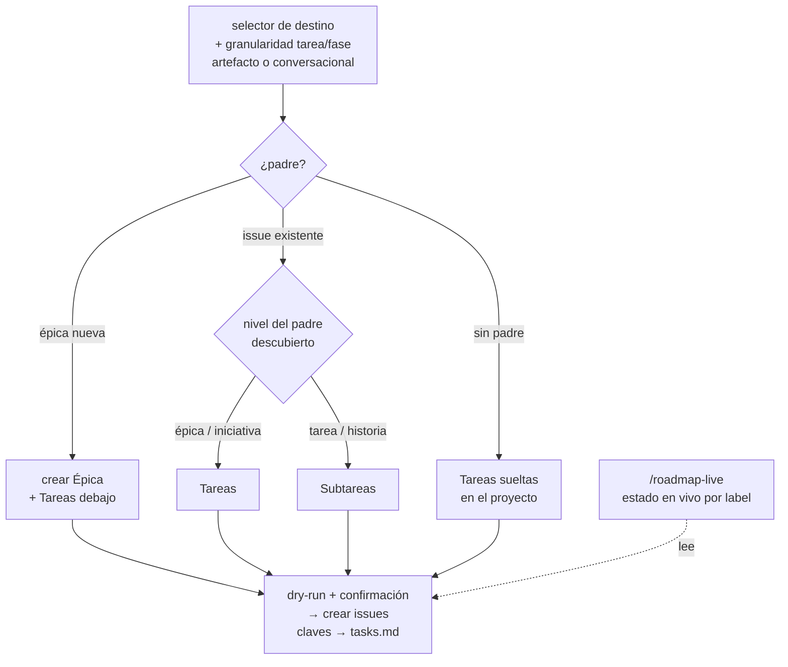
```mermaid
flowchart TD
    A["selector de destino<br/>+ granularidad tarea/fase<br/>artefacto o conversacional"] --> B{"¿padre?"}
    B -->|épica nueva| C["crear Épica<br/>+ Tareas debajo"]
    B -->|issue existente| D{"nivel del padre<br/>descubierto"}
    B -->|sin padre| E["Tareas sueltas<br/>en el proyecto"]
    D -->|épica / iniciativa| C2["Tareas"]
    D -->|tarea / historia| C3["Subtareas"]
    C --> F["dry-run + confirmación<br/>→ crear issues<br/>claves → tasks.md"]
    C2 --> F
    C3 --> F
    E --> F
    O["/roadmap-live<br/>estado en vivo por label"] -.->|lee| F
```

## 4b · Jira (opt-in) — imputación al completar cada tarea

> **Ojo: completar una tarea NO la pasa a Done.** El worklog se imputa al cerrar la tarea; el issue
> solo llega a *Done* con el evento `aprobado` del ciclo de abajo (4c), tras revisión y `qa`.

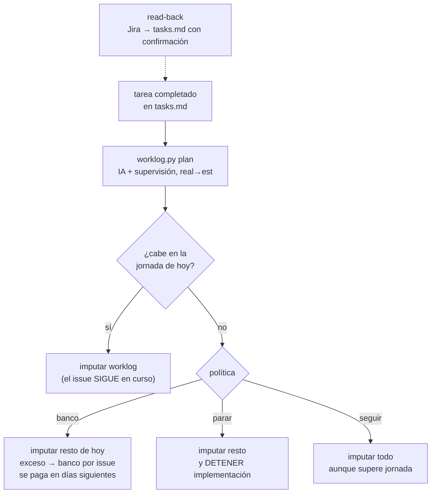
```mermaid
flowchart TD
    G["tarea completado<br/>en tasks.md"] --> H["worklog.py plan<br/>IA + supervisión, real→est"]
    H --> I{"¿cabe en la<br/>jornada de hoy?"}
    I -->|sí| J["imputar worklog<br/>(el issue SIGUE en curso)"]
    I -->|no| K{"política"}
    K -->|banco| L["imputar resto de hoy<br/>exceso → banco por issue<br/>se paga en días siguientes"]
    K -->|parar| M["imputar resto<br/>y DETENER implementación"]
    K -->|seguir| N["imputar todo<br/>aunque supere jornada"]
    P["read-back<br/>Jira → tasks.md con confirmación"] -.-> G
```

## 4c · Jira (opt-in) — el ciclo de eventos de la Fase 3 (quién dispara qué)

Los 7 eventos los genera `skills/jira-sync/scripts/jira-flow.py` (`ops` deterministas: etiqueta →
transición → comentario firmado → worklog); el agente solo las **ejecuta** vía el conector. El
`--actor` de cada evento es fijo: si no casa, exit 2. Detalle operativo en la tabla «Ciclo Jira de la
Fase 3» de `commands/dev-cycle.md` (fuente única).

| Evento | Quién lo dispara | Transición del issue | Comentario (etiqueta) |
|---|---|---|---|
| `arrancar` | `implementer` | → *En curso* (`en-curso`) | — |
| `implementado` | `implementer` | — (sigue En curso) | `ca-implementer` |
| `revision` (intento sin gaps) | skill `adversarial-review` (firma `--actor reviewer`) | — | `ca-reviewer` |
| `gaps` (intento con gaps) | skill `adversarial-review` (firma `--actor reviewer`) | → *En curso* (`reabrir`) | `ca-reviewer` |
| `qa-verde` / `qa-rojo` | `qa` | — | `ca-qa` |
| `aprobado` | **el orquestador** (`/dev-cycle`) | → *Done* (`done`) | `ca-orquestador` |

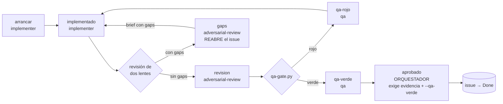
```mermaid
flowchart LR
    A["arrancar<br/>implementer"] --> B["implementado<br/>implementer"]
    B --> C{"revisión de<br/>dos lentes"}
    C -->|sin gaps| D["revision<br/>adversarial-review"]
    C -->|con gaps| E["gaps<br/>adversarial-review<br/>REABRE el issue"]
    E -->|brief con gaps| B
    D --> F{"qa-gate.py"}
    F -->|rojo| G["qa-rojo<br/>qa"]
    G --> B
    F -->|verde| H["qa-verde<br/>qa"]
    H --> I["aprobado<br/>ORQUESTADOR<br/>exige evidencia + --qa-verde"]
    I --> J[("issue → Done")]
```

> **Done es una puerta, no un efecto colateral.** `aprobado` es el ÚNICO evento que mueve el issue a
> *Done*, lo dispara solo el orquestador y `jira-flow.py` lo rechaza (exit 2, `ops: []`) si el ledger
> no trae una última sección de revisión sin gaps pendientes o si falta `--qa-verde` (el exit 0 de
> `qa-gate.py`). Con `.claude/jira.json` `enabled` ≠ `true` todo el ciclo devuelve `ops: []` sin
> ruido, y cada evento ya publicado queda anotado (`flow` en `jira-state.json`) para no repetirse.

## 5 · Confluence — bidireccional (opt-in)

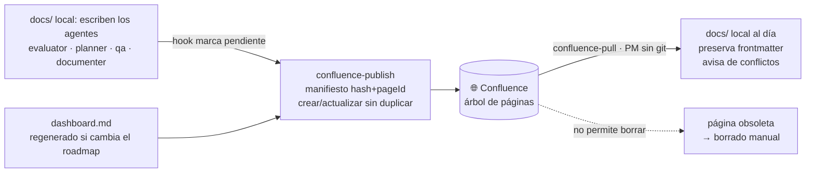
```mermaid
flowchart LR
    A["docs/ local: escriben los agentes<br/>evaluator · planner · qa · documenter"] -->|hook marca pendiente| C["confluence-publish<br/>manifiesto hash+pageId<br/>crear/actualizar sin duplicar"]
    B["dashboard.md<br/>regenerado si cambia el roadmap"] --> C
    C --> D[("🌐 Confluence<br/>árbol de páginas")]
    D -->|"confluence-pull · PM sin git"| E["docs/ local al día<br/>preserva frontmatter<br/>avisa de conflictos"]
    D -.->|no permite borrar| F["página obsoleta<br/>→ borrado manual"]
```

> **Política de publicación (2026-08-20-confluence-policy):** opt-out sobre `include: ["**/*.md"]`
> — un documento nuevo se publica salvo que caiga en una exclusión conocida. Detalle normativo y
> tabla completa de exclusiones: `skills/confluence-publish/SKILL.md`, sección "qué sube y qué no".

**Matriz disparador → artefacto → ¿se publica?** (los 11 disparadores conocidos que aplican, o
declaran que no aplican, el paso `agent-kits/shared/confluence-optin.md`):

| Disparador | Artefacto(s) que produce | ¿Se publica? |
|---|---|---|
| `analyst` | `spec.md` | ✅ Sí |
| `evaluator` | `evaluation.md` (+ `spec.md` si lo crea) | ✅ Sí |
| `architect` | `design.md` (+ ADR en `docs/knowledge/adr/`) | ✅ Sí — decisión de arquitectura, como `spec.md` y los ADR (no es tablero de ejecución) |
| `planner` | `improvement-plan.md`, `tasks.md` | ❌ No — plan y ledger (D1): su sitio es el repo y Jira, no Confluence |
| `implementer` | actualiza `tasks.md` por tarea; dispara la sincronización **al cerrar cada fase** (D3) | ⚠️ El disparo sí ocurre, pero `tasks.md` en sí **no** sube (D1) — refresca lo demás que haya cambiado bajo `docs/` (típicamente `dashboard.md`) |
| `qa` | `testing/report.md` + `report.pdf`, `screenshots/`, `raw/` | ❌ No — `**/testing/**` (D4): el informe embebe capturas que el conector no puede adjuntar; queda solo-local |
| `documenter` | documentación de referencia bajo `docs/` (arquitectura, stack, guías, producto…) | ✅ Sí |
| `/pm-backlog` | `docs/roadmap/BACKLOG.md` | ✅ Sí |
| `/retro` | `retro.md` + `docs/roadmap/CALIBRATION.md` | ✅ Sí |
| `/spec-drift` | `docs/roadmap/DRIFT.md` | ✅ Sí |
| `/roadmap-brief` | `docs/roadmap/brief.md` + `brief.pdf` | ⚠️ El `.md` sí; el `.pdf` no entra en el espejo (no es `.md`) |

**"No" estructurales** (no dependen de un disparador concreto — son exclusiones de la política que
aplican siempre, escriba quien escriba): `docs/en/**` (árbol EN duplicado, para lectores de
GitHub), `docs/examples/**` y `docs/agents/**` (documentación interna del plugin, no del producto
del proyecto consumidor), `docs/**/atlassian-connector-notes.md` y, como siempre,
`docs/security-scan/**` (invariante no negociable de `nemesis`). Verificable con
`confluence-scope.py --status` / `--check` (`skills/confluence-publish/scripts/`).

**Puntos de nacimiento de `docs/knowledge/`** (memoria técnica, `2026-08-20-knowledge-capture`) —
**sí entra en el espejo por defecto**, no está en el `exclude` (a diferencia del plan/ledger de la
fila `planner` de arriba): `planner`/`implementer` escriben un ADR en `docs/knowledge/adr/` cuando
una decisión de diseño cruza el umbral (ver regla 10 de `CONVENTIONS.md`); `debug-root-cause`
escribe un gotcha en `docs/knowledge/gotchas/GOT-NNN-<slug>.md` (fichero nuevo) al cerrar su Fase 4
(causa raíz confirmada); `qa` escribe un gotcha cuando un flaky justificado resulta ser un patrón,
no un accidente; `/retro` produce una segunda salida con lecciones de proceso en
`docs/knowledge/lessons/LES-NNN-<agente>-<slug>.md` (fichero nuevo), además de su
fila numérica en `CALIBRATION.md`. Los cinco agentes lectores (`evaluator`, `planner`,
`implementer`, `qa`, `documenter`) aplican `agent-kits/shared/knowledge-check.md` antes de
trabajar (progressive disclosure: solo el índice + su área). El **journal de sesión**
(`docs/knowledge/journal/`, bitácora generada por el hook `SessionEnd`) es memoria episódica, no
curada: `evaluator`/`planner`/`architect` leen solo la última entrada de su iniciativa, `/retro` la
usa como fuente de causas de desviación y lo que merezca doctrina se promueve a ADR/gotcha/lección.
Detalle completo: regla 10 de [`CONVENTIONS.md`](CONVENTIONS.md).

## 6 · Visibilidad y aprendizaje (todo solo-lectura)

> **Coste de generación (usage-meter):** cada artefacto del ciclo (y cada tarea) se **mide** con tokens reales de la transcripción (`agent-kits/shared/usage-meter.py`); el bloque `generacion:` de su frontmatter alimenta la sección **coste de proceso** de `/roadmap-metrics`, y `/retro` calibra con ello el **ratio tokens→hora** que usan el evaluator y el propio meter. Fechas = contexto · tokens = medida · horas = derivadas.

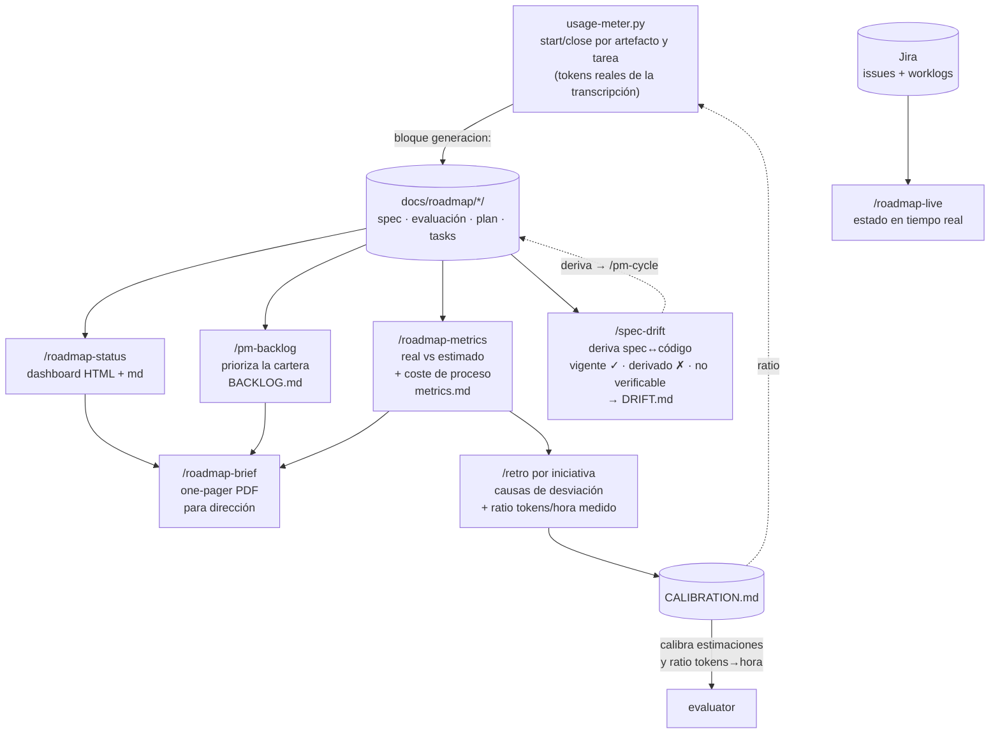
```mermaid
flowchart TD
    M["usage-meter.py<br/>start/close por artefacto y tarea<br/>(tokens reales de la transcripción)"] -->|bloque generacion:| R
    R[("docs/roadmap/*/<br/>spec · evaluación · plan · tasks")] --> S["/roadmap-status<br/>dashboard HTML + md"]
    R --> T["/pm-backlog<br/>prioriza la cartera<br/>BACKLOG.md"]
    R --> U["/roadmap-metrics<br/>real vs estimado<br/>+ coste de proceso<br/>metrics.md"]
    S --> V["/roadmap-brief<br/>one-pager PDF<br/>para dirección"]
    T --> V
    U --> V
    J[("Jira<br/>issues + worklogs")] --> W["/roadmap-live<br/>estado en tiempo real"]
    U --> X["/retro por iniciativa<br/>causas de desviación<br/>+ ratio tokens/hora medido"]
    R --> DR["/spec-drift<br/>deriva spec↔código<br/>vigente ✓ · derivado ✗ · no verificable<br/>→ DRIFT.md"]
    DR -.->|"deriva → /pm-cycle"| R
    X --> Y[("CALIBRATION.md")]
    Y -->|calibra estimaciones<br/>y ratio tokens→hora| Z["evaluator"]
    Y -.->|ratio| M
```

## 6b · Visibilidad en vivo (hooks deterministas + statusline opt-in)

> Mientras `implementer`/subagentes trabajan, el usuario ve el avance sin que nadie lo redacte:
> todo sale de `progress-report.py` sobre el **ledger canónico** (`tasks.md`). Los hooks
> **informan, no deciden** (siempre exit 0). Detalle: [`observability.md`](observability.md).
> **Journal de sesión** (memory-health + memory-retrieval F4 + **session-end-durable-capture**): en cada
> turno, `UserPromptSubmit` acumula el texto del usuario en un log crudo no versionado
> (`.claude/session-prompts-<session_id>.log`, opt-out `<private>`, secretos evidentes redactados —
> ese log es también el **checkpoint** de la sesión). Claude registra `SessionEnd` con timeout
> de 5 s en exec form; Codex lo registra con 3 s y comando de shell. Ese tiempo incluye
> el arranque; la declaración no garantiza que el cierre complete. OpenCode captura en
> `session.execution`, con presupuesto propio del adapter, no como teardown SessionEnd.
> El launcher invoca `journal-capture.py` y escribe solo un **envelope atómico**
> (≤ 64 KiB, sin git/IA/red, CA-01) en la **outbox** local (`agent-kits/shared/outbox.py`). La
> **materialización** corre después, de forma recuperable: `SessionStart` invoca `journal.py replay
> --budget-ms 300 --max 3` (drena la outbox reutilizando git/log de prompts/IA opt-in, nunca bloquea
> el arranque) y `journal.py recover` (una sesión con log sin envelope y sin sesión viva pasada la
> ventana configurada se materializa como `recuperado_sin_cierre`, CA-07) — o `journal.py replay/recover`
> a demanda. Solo entonces se escribe la entrada determinista en `docs/knowledge/journal/` (idempotente
> por `session_id`, atómica); al arrancar/retomar, `SessionStart` la reinyecta compactada. Resumen por
> IA **opt-in** (`sesion.resumen`), degradando siempre. `/doctor` diagnostica la cola (`journal.py
> status`: pendientes, huérfanas, dead-letter con remedio nombrado, triage del «Hook cancelled»). Lo
> que se repite en ≥ 2 sesiones lo propone `journal.py candidatas` como lección `propuesta` por la
> puerta de `/retro`.

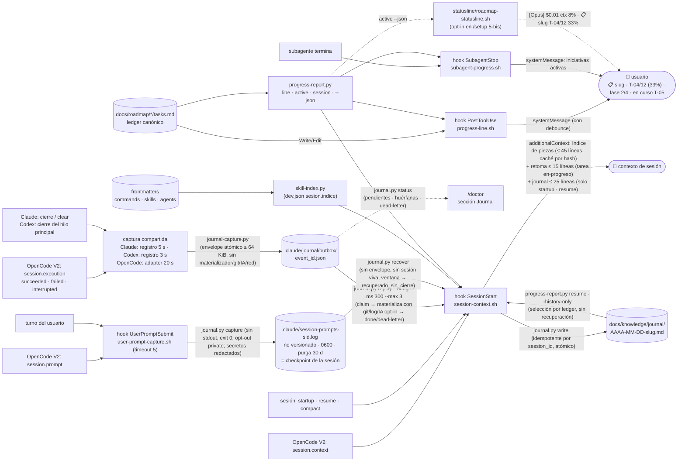
```mermaid
flowchart LR
    L[("docs/roadmap/*/tasks.md<br/>ledger canónico")] -->|Write/Edit| H1["hook PostToolUse<br/>progress-line.sh"]
    H1 -->|"systemMessage (con debounce)"| U(["👀 usuario<br/>📋 slug · T-04/12 (33%) · fase 2/4 · en curso T-05"])
    SA["subagente termina"] --> H2["hook SubagentStop<br/>subagent-progress.sh"]
    H2 -->|"systemMessage: iniciativas activas"| U
    OC["OpenCode V2: session.context"] --> H3
    OCP["OpenCode V2: session.prompt"] --> H5
    OCI["OpenCode V2: session.execution<br/>succeeded · failed · interrupted"] --> H4
    SS["sesión: startup · resume · compact"] --> H3["hook SessionStart<br/>session-context.sh"]
    H3 -->|"additionalContext: índice de piezas (≤ 45 líneas, caché por hash)<br/>+ retoma ≤ 15 líneas (tarea en-progreso)<br/>+ journal ≤ 25 líneas (solo startup · resume)"| C(["🧠 contexto de sesión"])
    UP["turno del usuario"] --> H5["hook UserPromptSubmit<br/>user-prompt-capture.sh (timeout 5)"]
    H5 -->|"journal.py capture (sin stdout, exit 0; opt-out private; secretos redactados)"| LOG[(".claude/session-prompts-sid.log<br/>no versionado · 0600 · purga 30 d<br/>= checkpoint de la sesión")]
    SE["Claude: cierre / clear<br/>Codex: cierre del hilo principal"] --> H4["captura compartida<br/>Claude: registro 5 s · Codex: registro 3 s<br/>OpenCode: adapter 20 s"]
    H4 -->|"journal-capture.py<br/>(envelope atómico ≤ 64 KiB, sin materializador/git/IA/red)"| OB[(".claude/journal/outbox/<br/>event_id.json")]
    OB -->|"journal.py replay --budget-ms 300 --max 3<br/>(claim → materializa con git/log/IA opt-in → done/dead-letter)"| H3
    LOG -->|"journal.py recover<br/>(sin envelope, sin sesión viva, ventana → recuperado_sin_cierre)"| H3
    H3 -->|"journal.py write (idempotente por session_id, atómico)"| J[("docs/knowledge/journal/<br/>AAAA-MM-DD-slug.md")]
    J -->|"progress-report.py resume --history-only<br/>(selección por ledger, sin recuperación)"| H3
    OB -.->|"journal.py status<br/>(pendientes · huérfanas · dead-letter)"| DOC["/doctor<br/>sección Journal"]
    FM[("frontmatters<br/>commands · skills · agents")] --> SI["skill-index.py<br/>(dev.json sesion.indice)"]
    SI --> H3
    L --> P["progress-report.py<br/>line · active · session · --json"]
    P --> H1 & H2 & H3
    P -.->|"active --json"| SL["statusline/roadmap-statusline.sh<br/>(opt-in en /setup 5-bis)"]
    SL -.->|"[Opus] $0.01 ctx 8% · 📋 slug T-04/12 33%"| U
```

## 6c · Guardrails deterministas del `implementer` (hook de guardia con alcance de agente)

> Las guardias distribuidas usan un dispatcher global previo a la tool, por IDs nativos
> propios exactos del mapa generado. `native-guardrail.py` normaliza la mutación y aplica
> `guardrail-check.py`; un rol desconocido no adquiere restricciones por parecido del nombre.
> Claude ignora hooks del frontmatter de agentes de plugin; una copia local conserva su
> wrapper. El mapa no acredita origen del prompt ni sandbox efectivo. ADR-023 y regla 8 de
> CONVENTIONS; opt-out en `.claude/dev.json`.
> El launcher valida una única respuesta estructurada acotada. Sin evaluación
> válida, avisa en el canal nativo y conserva permisos normales. Un deny completo
> se conserva ante fallos posteriores; el arranque bajo carga sigue en diagnóstico.

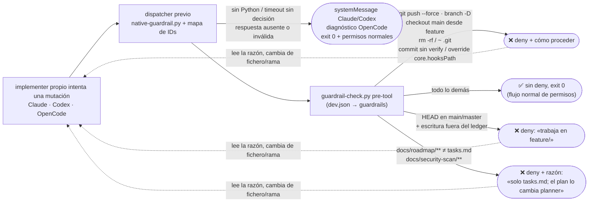
```mermaid
flowchart LR
    T["implementer propio intenta una mutación<br/>Claude · Codex · OpenCode"] --> W["dispatcher previo<br/>native-guardrail.py + mapa de IDs"]
    W -->|"sin Python / timeout sin decisión<br/>respuesta ausente o inválida"| M(["systemMessage Claude/Codex<br/>diagnóstico OpenCode<br/>exit 0 + permisos normales"])
    W --> G["guardrail-check.py pre-tool<br/>(dev.json → guardrails)"]
    G -->|"docs/roadmap/** ≠ tasks.md<br/>docs/security-scan/**"| D(["❌ deny + razón:<br/>«solo tasks.md; el plan lo cambia planner»"])
    G -->|"HEAD en main/master<br/>+ escritura fuera del ledger"| D2(["❌ deny: «trabaja en feature/<slug>»"])
    G -->|"git push --force · branch -D<br/>checkout main desde feature<br/>rm -rf / ~ .git<br/>commit sin verify / override core.hooksPath"| D3(["❌ deny + cómo proceder"])
    G -->|"todo lo demás"| A(["✅ sin deny, exit 0<br/>(flujo normal de permisos)"])
    D & D2 & D3 -.->|"lee la razón, cambia de fichero/rama"| T
```

La regla `git` protege los IDs propios exactos de `implementer` y `architect`.
Consume valores de opciones, incluidos prefijos largos unívocos, y respeta
`--` antes de rutas; no trata mensajes como flags. `--verify` o
`--no-no-verify` posterior restaura la verificación y `--amend` por sí
solo pasa esta comprobación. Un override de `core.hooksPath` requiere revisión
explícita; cambiar su ruta no siempre implica desactivar hooks.

La gramática reconoce asignaciones literales y wrappers `env -i` o
`--ignore-environment`; `-u NAME`, `-uNAME` o `--unset=NAME`; `-C DIR` o
`--chdir=DIR`; `command -p`; `exec -a NAME`, `-c` o `-l`. Analiza opciones
Git `-c` y `--config-env`, `GIT_CONFIG_COUNT` con sus claves y
`GIT_CONFIG_PARAMETERS`. Compara el nombre base del ejecutable sin distinguir
mayúsculas, incluidos nombres Windows con `.exe`.

Cada orden conserva su propia decisión, también entre líneas. Comillas,
comentarios y continuaciones escapadas mantienen la separación entre flags
y texto. Se admiten clusters soportados y valores cortos pegados en wrappers,
como `exec -cl` y `env -C.`.

La recursión existente de shell `-c` y `eval` termina en profundidad 3.
No expande variables, resuelve aliases, abre scripts ni inspecciona
configuración Git externa. El dispatcher reconoce la tool PowerShell;
sus asignaciones y scripts quedan fuera de la gramática literal. No es
un sandbox; configurar
`{"guardrails": {"git": false}}` en `.claude/dev.json` desactiva la regla.

## 6d · El tercer bucle — especialización por proyecto (`/specialize`, opt-in)

> El plugin sabe **cómo** trabajar y no sabe **dónde** está trabajando. `/specialize` cierra ese hueco
> con la misma gramática que ya tienen el ciclo (`tasks.md`) y la memoria
> (`docs/knowledge/README.md`): registro canónico + puerta de entrada + puerta de cierre. Detalle
> completo: [`SPECIALIZATION.md`](SPECIALIZATION.md). **Invariante de dirección**: `/specialize`
> **lee** `docs/knowledge/` y **nunca escribe** en él — la promoción a doctrina sigue siendo
> exclusiva de `/retro` (por eso este bucle no se solapa con el de memoria, `ADR-011`). Esta
> iteración cubre F1 (sustrato, **entregado**: cascada de personas de `task-brief.py`) y F2
> (nacimiento, **contrato de diseño, aún no en el árbol**); F3 (deriva semántica) queda diferida,
> no descartada.

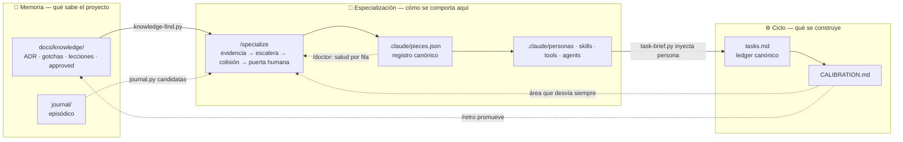
```mermaid
flowchart LR
  subgraph MEM["🧠 Memoria — qué sabe el proyecto"]
    K["docs/knowledge/<br/>ADR · gotchas · lecciones · approved"]
    J["journal/<br/>episódico"]
  end
  subgraph ESP["🧬 Especialización — cómo se comporta aquí"]
    SP["/specialize<br/>evidencia → escalera → colisión → puerta humana"]
    REG[".claude/pieces.json<br/>registro canónico"]
    PZ[".claude/personas · skills · tools · agents"]
  end
  subgraph CIC["⚙️ Ciclo — qué se construye"]
    T["tasks.md<br/>ledger canónico"]
    CAL["CALIBRATION.md"]
  end
  K -->|"knowledge-find.py"| SP
  J -.->|"journal.py candidatas"| SP
  CAL -.->|"área que desvía siempre"| SP
  SP --> REG --> PZ
  PZ -->|"task-brief.py inyecta persona"| T
  T --> CAL
  CAL -.->|"/retro promueve"| K
  REG -.->|"/doctor: salud por fila"| SP
```

## 7 · Configuración (una pasada con `/setup`)

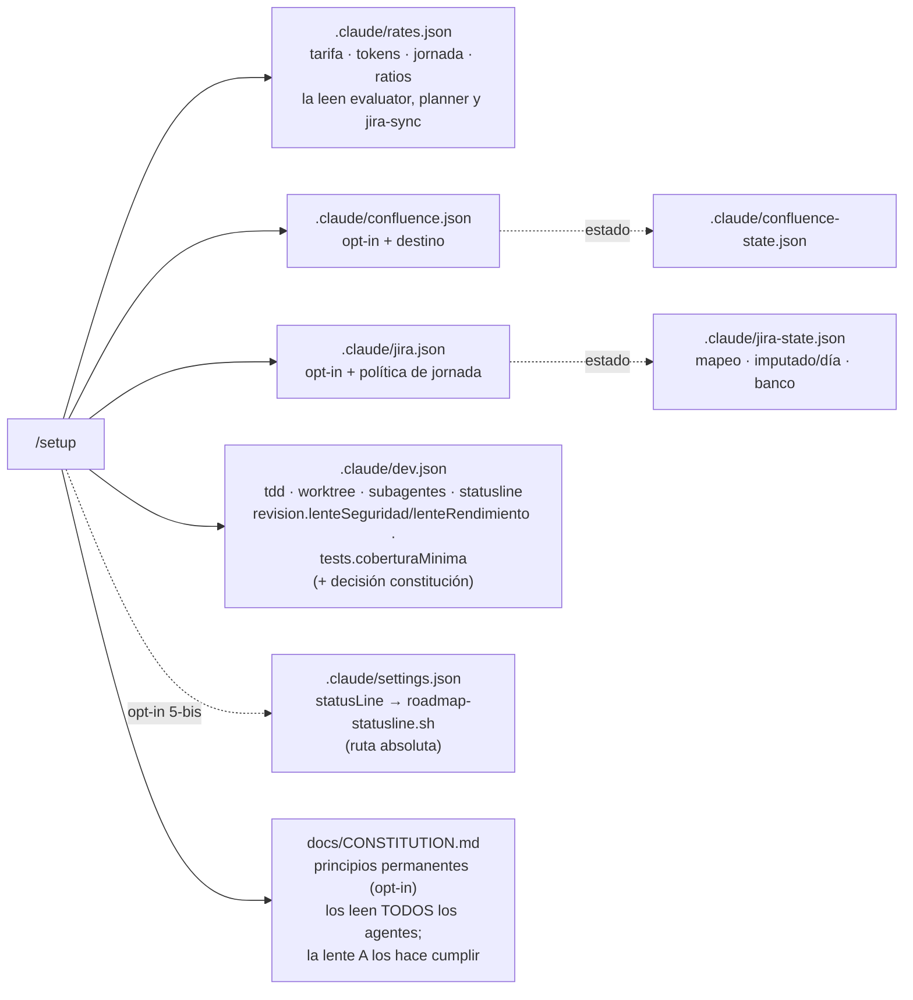
```mermaid
flowchart LR
    A["/setup"] --> B[".claude/rates.json<br/>tarifa · tokens · jornada · ratios<br/>la leen evaluator, planner y jira-sync"]
    A --> C[".claude/confluence.json<br/>opt-in + destino"]
    A --> D[".claude/jira.json<br/>opt-in + política de jornada"]
    A --> G[".claude/dev.json<br/>tdd · worktree · subagentes · statusline<br/>revision.lenteSeguridad/lenteRendimiento ·<br/>tests.coberturaMinima<br/>(+ decisión constitución)"]
    A -.->|"opt-in 5-bis"| SL[".claude/settings.json<br/>statusLine → roadmap-statusline.sh<br/>(ruta absoluta)"]
    A --> H["docs/CONSTITUTION.md<br/>principios permanentes (opt-in)<br/>los leen TODOS los agentes;<br/>la lente A los hace cumplir"]
    C -.->|estado| E[".claude/confluence-state.json"]
    D -.->|estado| F[".claude/jira-state.json<br/>mapeo · imputado/día · banco"]
```

> **Comprobar la instalación:** `/doctor` lee todo esto (y los hooks, la statusline y el estado del trabajo) sin
> escribir nada y da un veredicto ✅/⚠️/❌ por línea con el arreglo al lado. Es la primera parada cuando un hook
> «no salta» o una skill no se activa; `/setup` la ofrece si ya hay config en `.claude/`.

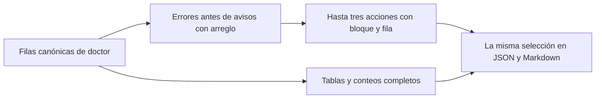
```mermaid
flowchart LR
    Comprobaciones[Filas canónicas de doctor] --> Informe[Tablas y conteos completos]
    Comprobaciones --> Prioridad[Errores antes de avisos con arreglo]
    Prioridad --> Acciones[Hasta tres acciones con bloque y fila]
    Acciones --> Salida[La misma selección en JSON y Markdown]
    Informe --> Salida
```

Las acciones no ejecutan arreglos. Las líneas informativas se conservan en el
informe y no originan recomendaciones. Las capacidades opcionales activadas
pueden comprobar su backend con red acotada; el informe no acredita por sí solo
ejecución de hooks ni salud global.

El catálogo de `/plugin-catalog` sigue un flujo de lectura independiente:

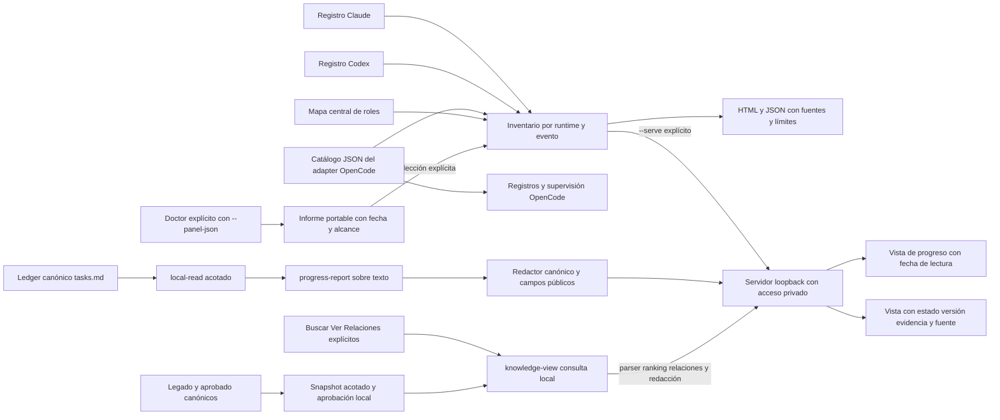
```mermaid
flowchart LR
    Claude[Registro Claude] --> Panel[Inventario por runtime y evento]
    Codex[Registro Codex] --> Panel
    Catalogo[Catálogo JSON del adapter OpenCode] --> Adapter[Registros y supervisión OpenCode]
    Catalogo --> Panel
    Roles[Mapa central de roles] --> Panel
    Doctor[Doctor explícito con --panel-json] --> Proyeccion[Informe portable con fecha y alcance]
    Proyeccion -->|selección explícita| Panel
    Panel --> Vista[HTML y JSON con fuentes y límites]
    Panel -->|--serve explícito| Servidor[Servidor loopback con acceso privado]
    Ledger[Ledger canónico tasks.md] --> Lector[local-read acotado]
    Lector --> Resumen[progress-report sobre texto]
    Resumen --> Redactor[Redactor canónico y campos públicos]
    Redactor --> Servidor
    Servidor --> Progreso[Vista de progreso con fecha de lectura]
    Accion[Buscar Ver Relaciones explícitos] --> Consulta[knowledge-view consulta local]
    Corpus[Legado y aprobado canónicos] --> Snapshot[Snapshot acotado y aprobación local]
    Snapshot --> Consulta
    Consulta -->|parser ranking relaciones y redacción| Servidor
    Servidor --> Memoria[Vista con estado versión evidencia y fuente]
```

El panel no ejecuta doctor ni los hooks. Presencia y presupuestos declarados
no acreditan carga o ejecución; el stream de cierre OpenCode tiene su propio
contrato, sin heredar el timeout de teardown Codex.

Detalle de cada fichero: regla 9 de [`CONVENTIONS.md`](CONVENTIONS.md). Comportamientos del
conector Atlassian: [`atlassian-connector-notes.md`](atlassian-connector-notes.md).

> **Nota (Confluence):** si esta página se publica en Confluence vía `confluence-publish`, los
> diagramas Mermaid solo se dibujan si el espacio tiene una app/macro de Mermaid instalada; si no,
> se verá el código fuente del diagrama. En GitHub y editores compatibles se renderizan siempre.

> **Mantenimiento:** al añadir o cambiar un agente, comando o skill, actualiza el diagrama
> correspondiente de este documento (ver checklist de `CONVENTIONS.md`).
