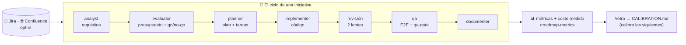

# custom-agents — índice de documentación

[English](en/README.md) · **Español**

Repositorio de **agentes custom** para Claude Code, con sus skills y toolkits. Se despliega en la carpeta `.claude/` de un proyecto (ver [`INSTALL.md`](INSTALL.md)).



**Guía de lectura:** este índice ubica cada pieza · [`FLOWS.md`](FLOWS.md) dibuja todos los flujos · [`CONVENTIONS.md`](CONVENTIONS.md) fija las reglas · cada agente tiene su doc en [`agents/`](agents/).

Antes de añadir o tocar un agente, lee [`CONVENTIONS.md`](CONVENTIONS.md): define dónde va cada cosa y cómo se declaran las dependencias entre agentes para que no se pisen. Para una **visión visual de los flujos** (cadena de agentes, ciclos PM/dev, Jira, Confluence, métricas), ver [`FLOWS.md`](FLOWS.md). Para qué mide el plugin (coste por artefacto/tarea) y cómo convive con monitores de sesión en vivo, ver [`observability.md`](observability.md).

## Agentes disponibles

| Agente | Qué hace | Dependencias | Documentación |
|--------|----------|--------------|---------------|
| **nemesis** | Auditoría de ciberseguridad end-to-end: SAST (estático) + DAST (pentest activo local), memoria e informe visual. | skill `cybersecurity`, kit `agent-kits/nemesis` | [nemesis.md](agents/nemesis.md) · [presentación](agents/nemesis-presentacion.md) · [toolkit](agents/nemesis-toolkit.md) |
| **planner** | Genera planes de implementación detallados y presupuestados (tiempo, coste €, tokens) en `docs/roadmap/`. Sincroniza sus docs en Confluence. | kit `agent-kits/planner`, skills `confluence-publish` · `jira-sync` | [planner.md](agents/planner.md) |
| **implementer** | Implementa un plan aprobado fase a fase (escribe código real, sobre rama), marcando `tasks.md` como ledger canónico por tarea. Handoff a `qa`. Al completar tareas, refleja progreso en Jira (opt-in). | agente `qa`, skill `jira-sync` | [implementer.md](agents/implementer.md) |
| **analyst** | **Toma de requerimientos**: conversa (entrevista, ejemplos, user stories, contraejemplos) y convierte una idea vaga en una `spec.md` sólida en formato fijo; itera hasta la **aprobación** y hace handoff a `evaluator`. | skill `discovery`, agente `evaluator` | [analyst.md](agents/analyst.md) |
| **evaluator** | Evalúa/presupuesta una spec (la crea si llega por prompt) en `docs/roadmap/<fecha>-<slug>/`. Lee `CALIBRATION.md` para ajustar estimaciones. Enlaza spec↔evaluación y hace handoff a `planner`. Sincroniza sus docs en Confluence. | kit `agent-kits/evaluator`, agente `planner`, skill `confluence-publish` | [evaluator.md](agents/evaluator.md) |
| **pdfy** | Convierte archivos a PDF con aspecto moderno (Markdown, HTML y Word → PDF vía Chromium headless + tema CSS). | skill `to-pdf` | [pdfy.md](agents/pdfy.md) |
| **qa** | Audita un plan ejecutando E2E con Playwright (solo local), captura evidencias y genera informe md+pdf con checklist manual en `docs/roadmap/<slug>/testing/`. Sincroniza el informe en Confluence. | skill `to-pdf`, kit `agent-kits/qa`, skill `confluence-publish` | [qa.md](agents/qa.md) |
| **documenter** | Genera y mantiene la documentación técnica y de producto del proyecto bajo `docs/`, con estructura **derivada del propio proyecto** (índice, RAG-INDEX, arquitectura, stack, unidades, guías, producto). Sincroniza en Confluence. | kit `agent-kits/documenter`, skill `confluence-publish` | [documenter.md](agents/documenter.md) |

**Cadena de trabajo (carpeta única por iniciativa):** `docs/roadmap/<fecha>-<slug>/` contiene `spec.md` (qué) → `evaluation.md` (cuánto/si conviene) → `improvement-plan.md` + `tasks.md` (cómo) (+ `testing/`). Se referencian entre sí y se actualizan según se crean (ver regla 7 de [`CONVENTIONS.md`](CONVENTIONS.md)). `pdfy` exporta cualquier documento a PDF.

**Cierre del ciclo (documentación):** al terminar la implementación de un plan y con las pruebas automáticas de `qa` en verde, `qa` hace handoff a `documenter`, que genera/actualiza la documentación de referencia del proyecto (arquitectura, stack, unidades, guías, producto) bajo `docs/`, reflejando el estado final. `documenter` corre **una vez al final del plan**, no por tarea.

**Sincronización con Confluence (opcional, opt-in, bidireccional):** `planner`, `evaluator` y `qa` invocan `confluence-publish` (`docs/ → Confluence`) al escribir en `docs/`; y `/confluence-pull` hace el sentido inverso (`Confluence → docs/`) para que un PM sin git tenga su copia al día. Ambas comparten el mapa `.claude/confluence-state.json`, así que son idempotentes entre sí. La primera vez la skill pregunta si se quiere sincronizar; si se dice que no (`enabled: false`), no vuelve a preguntar ni sincroniza. Si se activa, refleja los cambios en Confluence (crear/actualizar; borrado → marcado como obsoleto) según el espacio/anclaje guardado en `.claude/confluence.json`. Nunca se publica `docs/security-scan/`. Alta del conector Atlassian: ver [`INSTALL.md`](INSTALL.md).

## Comandos (orquestadores)

Dirigen la cadena invocando a los agentes **por nombre** y con puertas de control, sobre la **misma carpeta por iniciativa** `docs/roadmap/<fecha>-<slug>/`.

| Comando | Rol | Alcance | Cierre |
|---------|-----|---------|--------|
| **`/pm-cycle <objetivo>`** | Producto / PM | `spec → evaluación` (agente `evaluator`) | Cierra en la puerta go/no-go. En *go* deja spec `aprobada` + evaluación `completado` y **ofrece** el handoff a `/dev-cycle` (sin ejecutarlo). Salidas opt-in de cierre: brief PDF (`pdfy`) y handoff a Jira. No planifica ni implementa. |
| **`/dev-cycle <objetivo>`** | Desarrollo | Ciclo completo `evaluación → plan → implementación → pruebas → documentación` | **Cadena nativa SIEMPRE por defecto** (disciplina opt-in en `.claude/dev.json`: TDD, worktrees, subagentes frescos); un motor SDD externo solo bajo petición explícita. Si arranca sobre una carpeta con spec+evaluación de `/pm-cycle`, sigue directo en la planificación. |
| **`/pm-backlog [criterio]`** | Producto / cartera | Lee todas las `evaluation.md` y **prioriza** (solo lectura) | Escribe `docs/roadmap/BACKLOG.md` con orden recomendado (quick wins vs. apuestas grandes). No planifica; remite a `/dev-cycle` para ejecutar. |
| **`/roadmap-status`** | Visibilidad | Escanea `docs/roadmap/*/` (solo lectura) | Genera el dashboard `docs/roadmap/dashboard.html` (local) y `dashboard.md` (se publica en Confluence para PMs sin git) vía skill `roadmap-dashboard`. |
| **`/roadmap-metrics`** | Presupuesto | Compara real vs estimado (solo lectura) | Informe `docs/roadmap/metrics.md`: producción (IA+supervisión), horas humanas y tokens **reales vs estimados** con desviaciones y total de cartera (skill `roadmap-dashboard`). |
| **`/roadmap-brief`** | Dirección | One-pager de cartera → PDF | Combina estado + prioridades + real vs estimado en un brief ejecutivo (`brief.pdf`) vía `to-pdf`. |
| **`/roadmap-live [slug]`** | Estado en vivo | Lee Jira en tiempo real | Dashboard de issues + horas imputadas por label (artefacto en Cowork; conversacional en CLI). |
| **`/retro <slug>`** | Aprendizaje | Retro de iniciativa cerrada | Real vs estimado + causas → `CALIBRATION.md`, histórico que calibra las estimaciones del `evaluator`. |
| **`/setup`** | Onboarding | Configura el proyecto en una pasada | Crea `.claude/rates.json`, decide los opt-ins de Confluence y Jira, ofrece la constitución (`docs/CONSTITUTION.md`) y la disciplina de desarrollo (`.claude/dev.json`). Idempotente. |
| **`/spec-drift [slug]`** | Gobernanza | Deriva spec↔código de las specs `implementada` (solo lectura) | Subagentes frescos verifican cada criterio contra el código de hoy (`vigente ✓ / derivado ✗ / no verificable` con evidencia) → `docs/roadmap/DRIFT.md` + oferta de `/pm-cycle` para lo derivado. |
| **`/confluence-pull [subcarpeta]`** | Producto / sin git | Baja Confluence → `docs/` local (skill `confluence-pull`) | Trae el estado actual sin git; preserva frontmatter, avisa de conflictos y confirma antes de escribir. Complemento inverso de la publicación. |

Así se separan los roles: **`/pm-cycle`** decide *qué* y *cuánto cuesta* (una iniciativa), **`/pm-backlog`** decide *en qué orden* (la cartera), **`/roadmap-status`** da visibilidad, y **`/dev-cycle`** construye. Todos comparten carpeta y `<slug>`, de modo que el traspaso es sin fricción (ver reglas 7 y 8 de [`CONVENTIONS.md`](CONVENTIONS.md)).

## Skills compartidas

| Skill | Qué hace | Usada por |
|-------|----------|-----------|
| **cybersecurity** | Análisis estático de seguridad en 8 dimensiones (OWASP, CWE, secretos, deps, IaC, threat intel, authz, compliance). | nemesis |
| **to-pdf** | Convierte Markdown/HTML/Word a PDF con tema moderno (Chromium headless + CSS). | pdfy, qa |
| **confluence-publish** | Publica/espeja la doc del proyecto en Confluence vía el conector Atlassian (Rovo MCP). Cada proyecto elige espacio y anclaje (raíz o hijo del árbol) en `.claude/confluence.json`; idempotente (crea/actualiza). | planner, evaluator, qa |
| **confluence-pull** | Sentido **inverso**: baja Confluence → `docs/` local, para PMs sin git. Reutiliza `confluence.json` y el mapa `confluence-state.json`; preserva el frontmatter local, avisa de conflictos y confirma antes de escribir. Solo lee de Confluence. | comando `/confluence-pull` |
| **roadmap-dashboard** | Escanea `docs/roadmap/*/` y genera un dashboard **HTML** (vista local), **Markdown** (para publicar en Confluence) o **JSON** (estado, prioridad y presupuesto por iniciativa). Solo lectura. | comandos `/roadmap-status`, `/pm-backlog`; skill `confluence-publish` |
| **debug-root-cause** | Depuración sistemática hasta la causa raíz en 4 fases con evidencia obligatoria (reproducción mínima → aislamiento → hipótesis probada → fix + regresión); prohibido arreglar a ciegas. | `/dev-cycle` (gancho automático al 3.er rojo de qa); a demanda |
| **discovery** | Convierte una idea vaga en una `spec.md` sólida con entrevista guiada (objetivo, alcance/fuera de alcance, criterios, restricciones, supuestos) antes de evaluar. No estima. | comando `/pm-cycle` (opt-in) |
| **quick-implement** | Atajo en **lenguaje natural** a la vía rápida de `/dev-cycle` (los commands solo se disparan con la barra; las skills se auto-invocan por su descripción): filtro de idoneidad obligatorio y delegación en la fuente única del método, conservando ledger, revisión de dos lentes y `qa-gate`. | peticiones tipo «implementa X rápido» sin escribir el comando |
| **plugin-dev** | Meta-skill para desarrollar ESTE plugin: árbol de decisión (agente/skill/comando/kit/fragmento shared/hook), frontmatter obligatorio con model tiering y tools mínimos, validación TDD-ish (test primero → linter → suites → auto-revisión), obligaciones de doc y anti-patrones reales. Incluye plantillas de agente, skill y comando. | quien desarrolle ESTE plugin (sesiones de trabajo sobre el propio repo; ningún agente la declara como dependencia) |
| **jira-sync** | Vuelca un plan (`tasks.md`) a Jira vía el conector Atlassian: un issue por tarea bajo el proyecto/épica elegidos (selector artefacto en Cowork o conversacional en CLI/VS Code), tipo derivado de la jerarquía del padre. Al completar tareas, imputa horas (Tiempo IA + Supervisión, tope jornada) y marca *Done*. Opt-in (`.claude/jira.json`), idempotente. | planner, implementer |

## Config compartida de presupuesto (`.claude/rates.json`)

Los parámetros económicos y de estimación (tarifa €/h, precio de tokens, tipo de cambio, ratio de supervisión, margen de contingencia, horas de jornada) viven en **un único sitio**, `.claude/rates.json` del proyecto, que leen `evaluator`, `planner` y `jira-sync`. Así los presupuestos son coherentes y se ajustan en un solo fichero. Plantilla en [`agent-kits/evaluator/templates/rates.example.json`](../agent-kits/evaluator/templates/rates.example.json); si no existe, los agentes usan sus defaults.

## Mapa del repositorio

```
custom-agents/               (se despliega como .claude/)
├── agents/                  # definición de cada agente (*.md, planos)
├── skills/                  # skills COMPARTIDAS entre agentes
├── agent-kits/              # toolkits PRIVADOS por agente (namespaced)
└── docs/                    # TODA la documentación (estás aquí)
    ├── README.md            # este índice
    ├── CONVENTIONS.md       # convención de organización y dependencias
    ├── INSTALL.md           # cómo desplegar el bundle
    └── agents/              # un doc por agente
```
