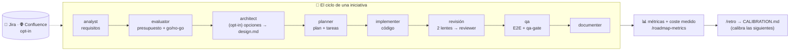

# custom-agents — índice de documentación

[English](en/README.md) · **Español**

Repositorio de **agentes custom** para Claude Code, con sus skills y toolkits. Se despliega en la carpeta `.claude/` de un proyecto (ver [`INSTALL.md`](INSTALL.md)).



**Guía de lectura:** este índice ubica cada pieza · [`FLOWS.md`](FLOWS.md) dibuja todos los flujos · [`CONVENTIONS.md`](CONVENTIONS.md) fija las reglas · cada agente tiene su doc en [`agents/`](agents/) · [`agents/ROLES.md`](agents/ROLES.md) es la matriz **un rol, un dueño** (quién decide/escribe/lee cada responsabilidad, y los solapes ya resueltos — [`ADR-011`](knowledge/adr/ADR-011-un-rol-un-dueno-agentes-retirados-y-responsabilidades-fusionadas.md)).

| Carpeta del repo | Qué es | Dónde se explica |
|---|---|---|
| `evals/` | Evals de **activación**: un JSON por skill/comando/agente con prompts que deben dispararla (positivos, uno literal de la description) y vecinos que no (negativos con `redirect`); `check.py` estático en CI, `run.py` local con `claude -p`. Complementa al índice de piezas que inyecta el hook `SessionStart`. El job **opcional** `headless.yml.MANUAL-COPY` → `.github/workflows/headless.yml` (secret `ANTHROPIC_API_KEY`) sí lanza `claude`: subconjunto barato de `run.py` + comprobación de **hooks en sesión real** por fichero-testigo. | [`../evals/README.md`](../evals/README.md) · lección [`LES-011`](knowledge/lessons/LES-011-plugin-dev-activacion-se-prueba-con-evals.md) |
| `scripts/` · `CONTRIBUTING.md` · `github-templates.MANUAL-COPY/` | `lint_plugin.py` (linter), `release.py` (release mecánico completo: mueve `[Unreleased]`/`[Sin publicar]` en los dos CHANGELOG, corre lint+evals, comprueba copias manuales y modo `100644` de los `.sh`, bump en 3 sitios, commit+tag; `--dry-run`, `--check`) y `export-skills.py` (paquete **portable «solo skills»** para Codex/Copilot/Cursor: `AGENTS.md`, regla `.cursor/rules/*.mdc`, `skills/` copiable; determinista, `--check`; salida `dist/` ignorada; la Release lo adjunta como zip). Cómo contribuir (proponer pieza con `plugin-dev`, checklist pre-PR, commits `T-XX:`/`feat:`/`chore:`, copias `.MANUAL-COPY`) en [`../CONTRIBUTING.md`](../CONTRIBUTING.md); plantillas de issues (issue forms) y PR en `github-templates.MANUAL-COPY/` → `.github/`. | [`INSTALL.md`](INSTALL.md) («Al publicar», «Usar las skills fuera de Claude Code») · [`../CONTRIBUTING.md`](../CONTRIBUTING.md) |

Antes de añadir o tocar un agente, lee [`CONVENTIONS.md`](CONVENTIONS.md): define dónde va cada cosa y cómo se declaran las dependencias entre agentes para que no se pisen. Para una **visión visual de los flujos** (cadena de agentes, ciclos PM/dev, Jira, Confluence, métricas), ver [`FLOWS.md`](FLOWS.md). Para qué mide el plugin (coste por artefacto/tarea), la **visibilidad en vivo** (línea de progreso del ledger por hook, contexto de retoma al arrancar/compactar, statusline opt-in) y cómo convive con monitores de sesión, ver [`observability.md`](observability.md).

## Agentes disponibles

| Agente | Qué hace | Dependencias | Documentación |
|--------|----------|--------------|---------------|
| **nemesis** | Auditoría de ciberseguridad end-to-end: SAST (estático) + DAST (pentest activo local), memoria e informe visual. | skill `cybersecurity`, kit `agent-kits/nemesis` | [nemesis.md](agents/nemesis.md) · [presentación](agents/nemesis-presentacion.md) · [toolkit](agents/nemesis-toolkit.md) |
| **planner** | Genera planes de implementación detallados y presupuestados (tiempo, coste €, tokens) en `docs/roadmap/`. Sincroniza sus docs en Confluence. | kit `agent-kits/planner`, skills `confluence-publish` · `jira-sync` | [planner.md](agents/planner.md) |
| **implementer** | Implementa un plan aprobado fase a fase (escribe código real, sobre rama), marcando `tasks.md` como ledger canónico por tarea. Handoff a `qa`. Al completar tareas, refleja progreso en Jira (opt-in); sincroniza Confluence al cerrar cada fase (opt-in). | agente `qa`, skills `jira-sync` · `confluence-publish` | [implementer.md](agents/implementer.md) |
| **analyst** | **Toma de requerimientos y descubrimiento**: conversa (entrevista, ejemplos, user stories, contraejemplos) y convierte una idea vaga en una `spec.md` sólida en formato fijo; itera hasta la **aprobación** y hace handoff a `evaluator`. Puerta de entrada única al descubrimiento (`ADR-011`: absorbe la skill `discovery`, retirada). | agente `evaluator` | [analyst.md](agents/analyst.md) |
| **evaluator** | Evalúa/presupuesta una spec (la crea si llega por prompt) en `docs/roadmap/<fecha>-<slug>/`. Lee `CALIBRATION.md` para ajustar estimaciones. Enlaza spec↔evaluación y hace handoff a `planner`. Sincroniza sus docs en Confluence. | kit `agent-kits/evaluator`, agente `planner`, skill `confluence-publish` | [evaluator.md](agents/evaluator.md) |
| **architect** | **Diseño con opciones (opt-in)**: a partir de la spec aprobada explora el repo y produce `design.md` con 2-3 opciones comparadas (complejidad, riesgo, coste relativo, reversibilidad), las presenta por trozos, fija la elegida **solo con la validación del usuario** y escribe el ADR `propuesta`. Enlaza spec ↔ design ↔ plan. No estima ni planifica. `model: opus` · `effort: high`. | kit `agent-kits/architect`, fragmentos `agent-kits/shared`, agente `planner` | [architect.md](agents/architect.md) |
| **qa** | Audita un plan ejecutando E2E con Playwright (solo local), captura evidencias y genera informe md+pdf con checklist manual en `docs/roadmap/<slug>/testing/`. El informe queda **solo-local**: no se sincroniza con Confluence (`**/testing/**` excluido de la política — capturas embebidas que el conector no puede adjuntar). | skill `to-pdf`, kit `agent-kits/qa` | [qa.md](agents/qa.md) |
| **documenter** | Genera y mantiene la documentación técnica y de producto del proyecto bajo `docs/`, con estructura **derivada del propio proyecto** (índice, RAG-INDEX, arquitectura, stack, unidades, guías, producto). Sincroniza en Confluence. | kit `agent-kits/documenter`, skill `confluence-publish` | [documenter.md](agents/documenter.md) |
| **reviewer** | **Una lente de revisión** (A conformidad · B corrección · C seguridad) en contexto fresco y **solo lectura por construcción** (`tools: Read, Grep, Glob, Bash`, sin Write/Edit): devuelve la tabla ✓/✗ por criterio y los gaps graduados con `fichero:línea` que fusiona `adversarial-review`. La skill lo despacha por nombre con el tier de `model-tier.py`; fallback a subagente genérico. `model: opus` · `effort: high`. | skill `adversarial-review`, fragmentos `agent-kits/shared` | [reviewer.md](agents/reviewer.md) |

**Cadena de trabajo (carpeta única por iniciativa):** `docs/roadmap/<fecha>-<slug>/` contiene `spec.md` (qué) → `evaluation.md` (cuánto/si conviene) → `design.md` (con qué arquitectura; opcional, `architect`) → `improvement-plan.md` + `tasks.md` (cómo) (+ `testing/`). Se referencian entre sí y se actualizan según se crean (ver regla 7 de [`CONVENTIONS.md`](CONVENTIONS.md)). La skill `to-pdf` exporta cualquier documento a PDF.

**Cierre del ciclo (documentación):** al terminar la implementación de un plan y con las pruebas automáticas de `qa` en verde, `qa` hace handoff a `documenter`, que genera/actualiza la documentación de referencia del proyecto (arquitectura, stack, unidades, guías, producto) bajo `docs/`, reflejando el estado final. `documenter` corre **una vez al final del plan**, no por tarea.

**Memoria técnica del proyecto (`docs/knowledge/`):** decisiones de diseño (`adr/ADR-NNN-<slug>.md`), trampas comprobadas (`gotchas/GOT-NNN-<slug>.md`) y lecciones de proceso (`lessons/LES-NNN-<agente>-<slug>.md`, una por fichero, plantilla `agent-kits/shared/templates/adr.md` para los ADR), con `README.md` como **único punto de entrada** (índice de entrada, lectura SELECTIVA). Siempre activa, sin opt-in: se lee por área con `agent-kits/shared/knowledge-check.md` (`evaluator` → lecciones de estimación, `planner`/`implementer` → decisiones + su área, `qa` → trampas, `documenter` → todo, para indexarla en "arquitectura y decisiones") y se escribe con umbral anti-burocracia vía `agent-kits/shared/knowledge-write.md` (`planner`/`implementer` escriben ADR en puertas de decisión, `qa`/`debug-root-cause` un gotcha cuando un fallo resulta ser patrón, `/retro` una lección técnica). Junto a ella, el **journal de sesión** (`docs/knowledge/journal/AAAA-MM-DD-<slug>.md`, memoria **episódica** no curada): el hook `SessionEnd` deja una entrada determinista por sesión (`agent-kits/shared/journal.py`: iniciativa activa, ficheros tocados, tareas que cambiaron de estado, marcadores del meter; idempotente por `session_id`) y `SessionStart` reinyecta la última al arrancar/retomar; `evaluator`/`planner`/`architect` leen solo la de su iniciativa, `/retro` la usa para causas de desviación; excluido de Confluence; sin resumen por IA (la doc oficial de hooks no lo permite — ADR-010).

**Sincronización con Confluence (opcional, opt-in, bidireccional, con política curada):** `planner`, `evaluator`, `documenter`, `implementer` (al cerrar cada fase) y los comandos de fin de ciclo (`/retro`, `/spec-drift`, `/roadmap-brief`, `/pm-backlog`) invocan `confluence-publish` (`docs/ → Confluence`) al escribir en `docs/`; y `/confluence-pull` hace el sentido inverso (`Confluence → docs/`) para que un PM sin git tenga su copia al día. Ambas comparten el mapa `.claude/confluence-state.json`, así que son idempotentes entre sí. La primera vez la skill pregunta si se quiere sincronizar; si se dice que no (`enabled: false`), no vuelve a preguntar ni sincroniza. Si se activa, refleja los cambios en Confluence (crear/actualizar; borrado → marcado como obsoleto) según el espacio/anclaje guardado en `.claude/confluence.json`. **La política es opt-out** (`include: ["**/*.md"]` + `exclude`, ver `skills/confluence-publish/SKILL.md` sección "qué sube y qué no"): quedan fuera, entre otros, `docs/en/**`, `docs/examples/**`, `docs/agents/**`, el plan y el ledger de cada iniciativa (`improvement-plan.md`/`tasks.md`), `**/testing/**` (informe de `qa`, solo-local) y, siempre, `docs/security-scan/**`. Con el **staging activo** (`docs/confluence/`, carpeta generada por `confluence-scope.py --stage`, nunca editable a mano) se ve de un vistazo exactamente qué se publica; matriz completa disparador→artefacto→¿se publica? en [`FLOWS.md`](FLOWS.md) sección 5. `qa` es la excepción visible: su informe **no** se sincroniza. Alta del conector Atlassian: ver [`INSTALL.md`](INSTALL.md).

## Comandos (orquestadores)

Dirigen la cadena invocando a los agentes **por nombre** y con puertas de control, sobre la **misma carpeta por iniciativa** `docs/roadmap/<fecha>-<slug>/`.

| Comando | Rol | Alcance | Cierre |
|---------|-----|---------|--------|
| **`/pm-cycle <objetivo>`** | Producto / PM | `spec → evaluación` (agente `evaluator`) | Cierra en la puerta go/no-go. En *go* deja spec `aprobada` + evaluación `completado` y **ofrece** el handoff a `/dev-cycle` (sin ejecutarlo). Salidas opt-in de cierre: brief PDF (skill `to-pdf`) y handoff a Jira. No planifica ni implementa. |
| **`/dev-cycle <objetivo>`** | Desarrollo | Ciclo completo `evaluación → plan → implementación → pruebas → documentación` | **Cadena nativa SIEMPRE por defecto** (disciplina opt-in en `.claude/dev.json`: TDD, worktrees, subagentes frescos); un motor SDD externo solo bajo petición explícita. Si arranca sobre una carpeta con spec+evaluación de `/pm-cycle`, sigue directo en la planificación. |
| **`/pm-backlog [criterio]`** | Producto / cartera | Lee todas las `evaluation.md` y **prioriza** (solo lectura) | Escribe `docs/roadmap/BACKLOG.md` con orden recomendado (quick wins vs. apuestas grandes). No planifica; remite a `/dev-cycle` para ejecutar. |
| **`/roadmap-status`** | Visibilidad | Escanea `docs/roadmap/*/` (solo lectura) | Genera el dashboard `docs/roadmap/dashboard.html` (local) y `dashboard.md` (se publica en Confluence para PMs sin git) vía skill `roadmap-dashboard`. |
| **`/roadmap-metrics`** | Presupuesto | Compara real vs estimado (solo lectura) | Informe `docs/roadmap/metrics.md`: producción (IA+supervisión), horas humanas y tokens **reales vs estimados** con desviaciones y total de cartera (skill `roadmap-dashboard`). |
| **`/roadmap-brief`** | Dirección | One-pager de cartera → PDF | Combina estado + prioridades + real vs estimado en un brief ejecutivo (`brief.pdf`) vía `to-pdf`. |
| **`/roadmap-live [slug]`** | Estado en vivo | Lee Jira en tiempo real | Dashboard de issues + horas imputadas por label (artefacto en Cowork; conversacional en CLI). |
| **`/retro <slug>`** | Aprendizaje | Retro de iniciativa cerrada | Real vs estimado + causas → `CALIBRATION.md`, histórico que calibra las estimaciones del `evaluator`. |
| **`/setup`** | Onboarding | Configura el proyecto en una pasada | Crea `.claude/rates.json`, decide los opt-ins de Confluence y Jira, ofrece la constitución (`docs/CONSTITUTION.md`), la disciplina de desarrollo, la statusline y la lente de seguridad de la revisión (`.claude/dev.json`). Idempotente. |
| **`/spec-drift [slug]`** | Gobernanza | Deriva spec↔código de las specs `implementada` (solo lectura) | Subagentes frescos verifican cada criterio contra el código de hoy (`vigente ✓ / derivado ✗ / no verificable` con evidencia) → `docs/roadmap/DRIFT.md` + oferta de `/pm-cycle` para lo derivado. |
| **`/confluence-pull [subcarpeta]`** | Producto / sin git | Baja Confluence → `docs/` local (skill `confluence-pull`) | Trae el estado actual sin git; preserva frontmatter, avisa de conflictos y confirma antes de escribir. Complemento inverso de la publicación. |
| **`/doctor`** | Diagnóstico | Comprueba herramientas, plugin/hooks, statusline, configs de `.claude/` y estado del trabajo (solo lectura, sin red) | Veredicto ✅/⚠️/❌ por línea con el comando que arregla cada fallo; `--json` para tooling. Primera parada cuando algo «no salta». |

Así se separan los roles: **`/pm-cycle`** decide *qué* y *cuánto cuesta* (una iniciativa), **`/pm-backlog`** decide *en qué orden* (la cartera), **`/roadmap-status`** da visibilidad, y **`/dev-cycle`** construye. Todos comparten carpeta y `<slug>`, de modo que el traspaso es sin fricción (ver reglas 7 y 8 de [`CONVENTIONS.md`](CONVENTIONS.md)).

## Skills compartidas

| Skill | Qué hace | Usada por |
|-------|----------|-----------|
| **cybersecurity** | Análisis estático de seguridad en 8 dimensiones (OWASP, CWE, secretos, deps, IaC, threat intel, authz, compliance). `SKILL.md` corto (mapa de fases); los 8 prompts de especialistas, recon, agregación/informe y estrategia de codebase grande viven en `references/` (lectura bajo demanda). | nemesis |
| **to-pdf** | Convierte Markdown/HTML/Word a PDF con tema moderno (Chromium headless + CSS). | qa, `/roadmap-brief` |
| **confluence-publish** | Publica/espeja la doc del proyecto en Confluence vía el conector Atlassian (Rovo MCP), con **política curada** (opt-out sobre `include: ["**/*.md"]`, resumen en su `SKILL.md` sección "qué sube y qué no" y tabla normativa en `references/config-and-policy.md`; el asistente y el algoritmo de publicación también en `references/`) y **staging generado** (`confluence-scope.py --stage` regenera `docs/confluence/`). Cada proyecto elige espacio y anclaje (raíz o hijo del árbol) en `.claude/confluence.json`; idempotente (crea/actualiza). | planner, evaluator, documenter, implementer, `/retro`, `/spec-drift`, `/roadmap-brief` |
| **confluence-pull** | Sentido **inverso**: baja Confluence → `docs/` local, para PMs sin git. Reutiliza `confluence.json` y el mapa `confluence-state.json`; preserva el frontmatter local, avisa de conflictos y confirma antes de escribir. Solo lee de Confluence. | comando `/confluence-pull` |
| **roadmap-dashboard** | Escanea `docs/roadmap/*/` y genera un dashboard **HTML** (vista local), **Markdown** (para publicar en Confluence) o **JSON** (estado, prioridad y presupuesto por iniciativa). Solo lectura. | comandos `/roadmap-status`, `/pm-backlog`; skill `confluence-publish` |
| **debug-root-cause** | Depuración sistemática hasta la causa raíz en 4 fases con evidencia obligatoria (reproducción mínima → aislamiento → hipótesis probada → fix + regresión); prohibido arreglar a ciegas. | `/dev-cycle` (gancho automático al 3.er rojo de qa); a demanda |
| **adversarial-review** | Revisión adversarial de un diff con lentes de contexto fresco en paralelo: A (conformidad con spec/plan/constitución, ✓/✗ por criterio), B (solo defectos de corrección), C (seguridad, **condicional**) y D (rendimiento, **condicional**) — ambas condicionales las decide `review-lens-select.py` por rutas/líneas sensibles o patrones de riesgo (N+1, `await`/regex en bucle, `sleep` bloqueante) del diff; `dev.json` `revision.lenteSeguridad`/`revision.lenteRendimiento`. Fusión, graduación Critical/Important/Minor, bucle acotado a 3 con rebate por evidencia, traza «Revisión de dos lentes — intento N» en el ledger. **Fuente única del método**; también a demanda sobre una rama sin ledger. | `/dev-cycle` (Fase 3), `quick-implement`; a demanda («revísame este diff») |
| **quick-implement** | Atajo en **lenguaje natural** a la vía rápida de `/dev-cycle` (nació cuando los commands solo se disparaban con la barra; hoy Claude Code también los invoca por descripción —lo prueban los evals de `command-*`—, y la skill sigue aportando el filtro de idoneidad y los disparadores negativos): filtro de idoneidad obligatorio y delegación en la fuente única del método, conservando ledger, revisión de dos lentes y `qa-gate`. | peticiones tipo «implementa X rápido» sin escribir el comando |
| **plugin-dev** | Meta-skill para desarrollar ESTE plugin: árbol de decisión (agente/skill/comando/kit/fragmento shared/hook), frontmatter obligatorio con model tiering y tools mínimos, validación TDD-ish (test primero → linter → suites → auto-revisión), obligaciones de doc y anti-patrones reales. Incluye plantillas de agente, skill y comando. | quien desarrolle ESTE plugin (sesiones de trabajo sobre el propio repo; ningún agente la declara como dependencia) |
| **tdd** | **Fuente única de RED-GREEN-REFACTOR**: ley dura («el código escrito antes de su test se borra y se reescribe tras el rojo»), ciclo por criterio con evidencia obligatoria `RED: <test> falló con <error> · <fecha>` en el ledger, qué NO es TDD, excepciones `TDD n/a`, tabla de racionalización; `references/by-stack.md` (correr UN test rojo por stack) y `references/anti-patterns.md`. | `implementer` (con `dev.json` `tdd: true`), subagentes vía `task-brief.py`; a demanda («hazlo con TDD») |
| **code-health** | Informe **determinista** de salud del código (`code-health.py`, sin modelo, 14 tests): duplicados por shingles de tokens normalizados entre ficheros (pares `fichero:línea`, %), tamaño/anidamiento/funciones largas por heurística por lenguaje, hotspots (`git log` × tamaño) y TODO/FIXME/HACK con antigüedad por `git blame`; MD o `--json`, `--baseline` (mejora/empeora). Sin git omite hotspots y antigüedad con aviso. NO refactoriza ni busca vulnerabilidades. | `evaluator` (P2, opt-in: riesgo/complejidad), `planner` (deuda con baseline), `/roadmap-brief` (fila opcional); a demanda («salud del código») |
| **dependency-upgrade** | Prepara la actualización de dependencias **sin ejecutarla**: `deps-inventory.py` (7 manifiestos + lockfiles, declarada/bloqueada, `latest` SOLO del `outdated` oficial de npm/composer/pip/go si está en PATH — nunca inventado —, salto patch/minor/major), changelog/UPGRADING upstream por cada major (breaking changes con `fichero:línea`) y `spec.md` «upgrade-<paquete|lote>» con la plantilla del evaluator para presupuestar/planificar. Vulnerabilidades y CVE → `nemesis`. | a demanda («actualiza las dependencias», «prepara el upgrade de X»); handoff a `evaluator` → `planner` |
| **jira-sync** | Vuelca un plan (`tasks.md`) a Jira vía el conector Atlassian: un issue por tarea bajo el proyecto/épica elegidos (selector artefacto en Cowork o conversacional en CLI/VS Code), tipo derivado de la jerarquía del padre. Al completar tareas, imputa horas (Tiempo IA + Supervisión, tope jornada) y marca *Done*. Opt-in (`.claude/jira.json`), idempotente. `SKILL.md` corto; casuística por paso en `references/` (destino y tipos, creación, progreso/tope de jornada, revisión, config). | planner, implementer |
| **changelog-sync** | Genera las entradas `[Unreleased]`/`[Sin publicar]` de los DOS CHANGELOG a partir de los ledgers **CERRADOS** (`docs/roadmap/*/tasks.md` con `estado: completado`): un bullet por `T-XX` de **una o dos frases** — escalera determinista campo `- **Changelog**:` de la tarea (se usa tal cual) → 1.ª frase de la `Descripción` si cabe en 200 caracteres → su oración principal → solo el título con puntero al ledger; nunca trunca con `…` — más hasta 3 ficheros clave (ninguno si la tarea toca más de 6), categoría `Added/Changed/Fixed` deducida o `changelog:` en el frontmatter, idempotente por slug. `--check` avisa de las tareas cerradas sin el campo. No crea la sección de versión (la abre `release.py`) ni inventa alcance. | Aviso (no bloqueo) en las precondiciones de `scripts/release.py`; cierre de `/dev-cycle` Fase 6 y `quick-implement`; a demanda («escribe el changelog») |
| **unit-tests** | Pirámide de pruebas + GATE de cobertura determinista y agnóstico de stack (`coverage-gate.py`: detecta pytest/jest/vitest/phpunit/go, mide con la herramienta OFICIAL solo si está en PATH, `--changed-only` mide solo los ficheros del diff; sin herramienta/stack/parseo → aviso y exit 2, nunca inventa un %). Skill **compartida, no agente nuevo** (evitar roles duplicados — `LES-013`). | `implementer` (P5, gate opt-in por `dev.json` `tests.coberturaMinima`), `qa` (pirámide en el informe), Lente A de `adversarial-review`; a demanda («sube la cobertura de tests») |
| **api-contract** | Flujo **CONTRACT-FIRST** para OpenAPI 3.x sin dependencias externas (`openapi-lint.py`): valida la estructura mínima (`operationId` único, `responses` con 2xx y 4xx/5xx, `$ref` internos resueltos, parámetros con `schema`/`content`) y `--diff <old> <new>` detecta cambios **ROMPEDORES** frente a compatibles informativos. Plantillas de tests de contrato (`schemathesis`, `dredd`, `prism`) sugeridas sin instalarlas. | `planner` (abre tareas de contrato), Lente A de `adversarial-review` (`--diff` si el diff toca la spec); a demanda («valida este OpenAPI») |

## Config compartida de presupuesto (`.claude/rates.json`)

Los parámetros económicos y de estimación (tarifa €/h, precio de tokens, tipo de cambio, ratio de supervisión, margen de contingencia, horas de jornada) viven en **un único sitio**, `.claude/rates.json` del proyecto, que leen `evaluator`, `planner` y `jira-sync`. Así los presupuestos son coherentes y se ajustan en un solo fichero. Plantilla en [`agent-kits/evaluator/templates/rates.example.json`](../agent-kits/evaluator/templates/rates.example.json); si no existe, los agentes usan sus defaults.

## Mapa del repositorio

```
custom-agents/               (se despliega como .claude/)
├── CONTRIBUTING.md          # cómo contribuir (pieza nueva con plugin-dev, checklist pre-PR, commits, copias .MANUAL-COPY)
├── scripts/                 # lint_plugin.py · release.py · export-skills.py (→ dist/, ignorado por git)
├── agents/                  # definición de cada agente (*.md, planos)
├── skills/                  # skills COMPARTIDAS entre agentes
├── agent-kits/              # toolkits PRIVADOS por agente (namespaced)
└── docs/                    # TODA la documentación (estás aquí)
    ├── README.md            # este índice
    ├── CONVENTIONS.md       # convención de organización y dependencias
    ├── INSTALL.md           # cómo desplegar el bundle (+ publicar con release.py · skills portables fuera de Claude Code)
    ├── agents/              # un doc por agente
    └── knowledge/           # memoria técnica: adr/ · gotchas/ · lessons/ · journal/ (bitácora de sesión, generada) · README.md (índice)
```
