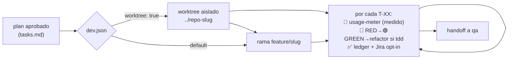

# Agente: implementer

Implementa un **plan aprobado** ejecutándolo **fase a fase**. Es el eslabón entre
`planner` y `qa`: convierte `improvement-plan.md` + `tasks.md` en **código funcionando**.



## Qué hace

- Lee la iniciativa en `docs/roadmap/<fecha>-<slug>/` (`improvement-plan.md`, `tasks.md`, `test-plan.md` si hay UI) y `docs/CONSTITUTION.md` si existe (la respeta y la cita).
- Trabaja sobre una **rama de trabajo** (`feature/<slug>`) — o, con `worktree: true` en `.claude/dev.json`, en un **worktree de git aislado** por iniciativa (degradación a rama normal si no hay soporte).
- Implementa cada tarea `T-XX` cumpliendo sus criterios de aceptación. Con `tdd: true`, sigue **RED-GREEN-REFACTOR** con la **evidencia del rojo** registrada en el ledger (`RED: <test> falló con <error> · <fecha>`); tareas sin código testeable se declaran `TDD n/a`.
- **Mide cada tarea** con `usage-meter.py` (tokens reales → horas-IA `(medido)` en el ledger, que son las que se imputan a Jira).
- Mantiene **`tasks.md` como ledger canónico**: marca cada tarea (checkbox + estado) y actualiza el resumen a medida que avanza.
- Hace **handoff a `qa`** al terminar. La documentación (`documenter`) va después, solo si `qa` queda en verde.

## Qué NO hace

- No planifica ni evalúa (eso es `planner`/`evaluator`).
- No prueba el producto (E2E lo hace `qa`) ni escribe la documentación de referencia (`documenter`).
- No toca `docs/roadmap/` salvo `tasks.md` (progreso), ni `docs/security-scan/`.

## A diferencia del resto

Es el **único agente que modifica el código** del proyecto. Por eso trabaja sobre rama, respeta
los guardrails del repo (p. ej. el local-only de `nemesis`) y no marca completado nada con tests
fallando o criterios sin cumplir.

## Ledger canónico

`tasks.md` es la **fuente única de verdad** del progreso. Si conviven otras herramientas con su
propio registro (todo-list, orquestadores externos como *superpowers SDD*), esos registros son
espejo, no fuente. Ver regla 8 de [`CONVENTIONS.md`](../CONVENTIONS.md).

## Uso

```
@implementer implementa el plan docs/roadmap/2026-07-10-mi-feature/
@implementer ejecuta la fase 2
```

O, dentro del ciclo completo, mediante el command `/dev-cycle`. `implementer` es el motor de
implementación de la **cadena nativa — el defecto SIEMPRE**; superpowers solo entra si el usuario
lo pide explícitamente (`--superpowers`), y aun así `tasks.md` sigue siendo el ledger canónico.
Con `subagentes: true` en `dev.json`, las tareas las despacha `/dev-cycle` a **subagentes de
contexto fresco** (brief determinista de `task-brief.py`) y `implementer` actúa como fallback
cuando un despacho falla dos veces.

## Dependencias

- Agente `qa` (handoff de pruebas al terminar).
- Kit shared: `usage-meter.py` (medición por tarea), `constitution-check.md`, `ledger-lint.py`.
- Config `.claude/dev.json` (opt-in: `tdd` · `worktree` · `subagentes`; defaults off).
