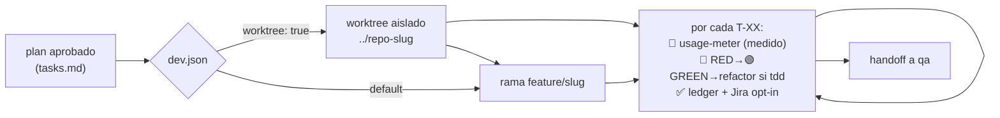

# Agente: implementer

Implementa un **plan aprobado** ejecutándolo **fase a fase**. Es el eslabón entre
`planner` y `qa`: convierte `improvement-plan.md` + `tasks.md` en **código funcionando**.


```mermaid
flowchart LR
    P["plan aprobado<br/>(tasks.md)"] --> B{"dev.json"}
    B -->|"worktree: true"| W["worktree aislado<br/>../repo-slug"]
    B -->|default| R["rama feature/slug"]
    W --> T & R --> T["por cada T-XX:<br/>📏 usage-meter (medido)<br/>🔴 RED→🟢GREEN→refactor si tdd<br/>✅ ledger + Jira opt-in"]
    T --> H["handoff a qa"]
```

## Qué hace

- Lee la iniciativa en `docs/roadmap/<fecha>-<slug>/` (`improvement-plan.md`, `tasks.md`, `test-plan.md` si hay UI) y `docs/CONSTITUTION.md` si existe (la respeta y la cita).
- Trabaja sobre una **rama de trabajo** (`feature/<slug>`) — o, con `worktree: true` en `.claude/dev.json`, en un **worktree de git aislado** por iniciativa (degradación a rama normal si no hay soporte).
- Implementa cada tarea `T-XX` cumpliendo sus criterios de aceptación. Con `tdd: true`, sigue **RED-GREEN-REFACTOR** con la **evidencia del rojo** registrada en el ledger (`RED: <test> falló con <error> · <fecha>`); tareas sin código testeable se declaran `TDD n/a`.
- **Regenera lo generado antes de cerrar la tarea** (arista E2 de [`CONTRACTS.md`](CONTRACTS.md)): si tocó `commands/`, `agents/` o `hooks/`, ejecuta `python3 scripts/export-interop.py` y pega la evidencia de `python3 scripts/export-interop.py --check` (exit 0) en el ledger. La Lente A corre ese mismo `--check` por su cuenta, así que llegar a la revisión con `interop/` desincronizado es un gap seguro. Y actualiza en la MISMA tarea las piezas que **describen** lo tocado (arista E3), que el `planner` ya dejó en `Archivos`.
- **Mide cada tarea** con `usage-meter.py` (tokens reales → horas-IA `(medido)` en el ledger, que son las que se imputan a Jira).
- Mantiene **`tasks.md` como ledger canónico**: marca cada tarea (checkbox + estado) y actualiza el resumen a medida que avanza. Al marcarla `completado` escribe además el campo opcional **`- **Cerrada**: AAAA-MM-DD`** (la fecha de cierre, mismo patrón que `Changelog`): lo lee el burndown de la página Plan del panel (`agent-kits/shared/ledger-view.py`) y `ledger-lint` valida solo su formato y que no sea anterior a la creación del ledger.
- Hace **handoff a `qa`** al terminar. La documentación (`documenter`) va después, solo si `qa` queda en verde.

## Ledger y perfil de ejecución

Para estados, evidencias RED y cabeceras de revisión, usa `ledger-write.py` del
shared según `ledger-write.md`: es preferente en normal y obligatorio en `lite`.
El writer valida el ledger, conserva campos ajenos y publica tras bloqueo y
comprobación de versión. Un conflicto exige releer; no sobrescribas su evidencia.
El fallback manual de una instalación normal parcial conserva `ledger-lint.py`.

`execution-profile.py` resuelve los flags efectivos. Lite implementa en el hilo
actual, sin paralelismo ni subagentes de implementación. Consume el brief completo
que genera `task-brief.py`: techo6000, exit2 y stdout vacío si falta el writer o
el contexto obligatorio no cabe. Diseño aprobado no verificable impide ese
despacho. No recortes criterios, verificación, diseño, persona ni gates para entrar
en el techo. Normal conserva sus presupuestos y techo10000. Revisores frescos
secuenciales, TDD elegido, QA, cobertura y Knowledge Gate conservan sus puertas.

## Qué NO hace

- No planifica ni evalúa (eso es `planner`/`evaluator`).
- No prueba el producto (E2E lo hace `qa`) ni escribe la documentación de referencia (`documenter`).
- No toca `docs/roadmap/` salvo `tasks.md` (progreso) y el índice `docs/roadmap/README.md`, ni `docs/security-scan/`.

## A diferencia del resto

Es el **único agente que modifica el código** del proyecto. Por eso trabaja sobre rama, respeta
los guardrails del repo (p. ej. el local-only de `nemesis`) y no marca completado nada con tests
fallando o criterios sin cumplir.

## Guardrails deterministas (hook de guardia con alcance del agente)

Sus reglas duras usan `agent-kits/shared/guardrail-check.py`. El dispatcher
`agent-kits/shared/native-guardrail.py` selecciona los IDs propios exactos de
`implementer` y `architect` en Claude, Codex y OpenCode. No restringe agentes
ajenos por parecido del nombre. Claude ignora hooks del frontmatter de agentes
de plugin; una copia local conserva `hooks/implementer-guardrail.sh`.
El registro global no convierte las reglas del implementer en reglas para
`planner`/`evaluator`, que escriben en `docs/roadmap/` legítimamente.
Las reglas del implementer deniegan con una razón y cómo proceder:

| Regla (`dev.json` → `guardrails`) | Qué bloquea |
|---|---|
| `alcance` | Write/Edit/MultiEdit/NotebookEdit sobre `docs/roadmap/**` que no sea `tasks.md` (incl. `testing/`, de qa) y sobre `docs/security-scan/**`; rutas case-insensitive (`Docs/Roadmap/…` también). `docs/knowledge/**` sigue permitido por la política de rutas histórica; ello no autoriza nuevas escrituras de memoria fuera del servicio compartido ni prueba confinamiento nativo de esa vía. En la raíz de `docs/roadmap/` solo se permite `README.md` (índice de iniciativas, que el cierre de cada iniciativa actualiza); `CALIBRATION.md`, `DRIFT.md` y `BACKLOG.md` quedan bloqueados **por diseño**: los escriben `/retro`, `/spec-drift` y `/pm-backlog`, que son comandos y no pasan por este hook. |
| `ramaPrincipal` | Escrituras fuera del ledger con HEAD en `main`/`master` («trabaja en `feature/<slug>`»). Sin git → no aplica. |
| `git` | `git push --force|-f|--force-with-lease`, refspec `+rama`, `git branch -D`, `git checkout|switch main|master` desde una rama de trabajo y `rm -rf` de `/`, `~`, `.git` o `.`. También `git commit` con verificación desactivada (`--no-verify`/`-n`) o un override explícito de `core.hooksPath`. Órdenes con efecto fuera del repo: `npm|pnpm|yarn publish`, `docker|podman system|volume prune`, `kubectl delete` (salvo `--dry-run`) y `DROP TABLE|DATABASE|SCHEMA` pasado a un cliente SQL; análisis literal (no ve SQL desde fichero ni por tubería). |

La regla `git` también protege al `architect`. El parser consume valores de
opciones de commit, incluidos prefijos largos unívocos, y respeta `--` antes
de las rutas: un mensaje con `-n` no es un flag ejecutable. Un `--verify` o
`--no-no-verify` posterior restaura la verificación;
`--amend` por sí solo no la desactiva. Un override de `core.hooksPath` durante
el commit requiere revisión explícita, incluso si apunta a otra carpeta válida.

Cada orden conserva su propia decisión, también entre líneas. La puntuación
entre comillas es texto; los comentarios no aportan flags. Un salto de línea
escapado conserva la orden. Los wrappers reconocen clusters de sus flags
soportados y valores pegados, como `exec -cl` y `env -C.`.

El parser reconoce asignaciones literales y estos wrappers: `env -i` o
`--ignore-environment`; `-u NAME`, `-uNAME` o `--unset=NAME`; `-C DIR` o
`--chdir=DIR`; `command -p`; `exec -a NAME`, `-c` o `-l`. Analiza opciones
Git `-c` y `--config-env`, `GIT_CONFIG_COUNT` con sus claves y
`GIT_CONFIG_PARAMETERS`. La comparación del nombre base del ejecutable ignora
mayúsculas y contempla nombres Windows con `.exe`.

Conserva la recursión existente de shell `-c` y `eval`, hasta profundidad 3.
No expande variables, resuelve aliases, abre scripts ni inspecciona
configuración Git externa. El dispatcher reconoce la tool PowerShell, pero
sus asignaciones y scripts quedan fuera de esta gramática literal. No
constituye un sandbox. `{"git": false}` desactiva esta regla en
`.claude/dev.json` → `guardrails`.

Degradación: sin `python3` el hook avisa una vez (`systemMessage`) y no bloquea; un error interno
del script permite (nunca bloqueo fantasma). Desactivación: `.claude/dev.json` →
`"guardrails": false` (todo, con aviso) o `{"alcance": false, …}` por regla. **Un DENY no es un
error**: el agente lee la razón y cambia de fichero o rama.

Sus skills (`jira-sync`, `confluence-publish`) son opt-in y se invocan bajo demanda: el agente
**no** las precarga con el campo nativo `skills:` (≈15k tokens por arranque; regla token-diet de
la regla 4 de `CONVENTIONS.md`).

Aparte, el alcance del **diff completo** lo comprueba `agent-kits/shared/scope-check.py`
(ficheros cambiados vs. campos `Archivos` del ledger; exit 0 obligatorio en su DoD y como puerta
previa a la revisión de dos lentes en `/dev-cycle`). Y **exit 0 no basta**: si el script imprime
⚠️ —por **stderr**, y en la clave `avisos` si se repite el comando con `--json`— es que un glob de
`alcance.excluir` está apagando la puerta, y el DoD lo trata como gap Important —acotar el glob,
declarar los ficheros o justificar la exclusión en el ledger—; la skill `adversarial-review` lee los
mismos avisos en su puerta previa. El ⚠️ es **un solo disparo con dos formas**, y las dos
exigen que la exclusión de usuario esté haciendo el trabajo pesado (≥ 3 ficheros y ≥ la mitad del
diff, contando solo lo que el default NO excluye), ya deje la lista «fuera de alcance» vacía o se
coma esa fracción con un único glob: una exclusión legítima que se limita a quitar ruido no avisa
nunca, porque un ⚠️ en cada pasada verde sería un gap Important perpetuo e imposible de cerrar.
Por debajo de ese umbral no hay ⚠️, pero tampoco silencio: el script publica **siempre** una línea
ℹ️ —stderr, y claves `info`/`excluidos_usuario` del `--json`— con los ficheros que esconde cada
glob de usuario y su patrón. Es visibilidad, no veredicto: el DoD manda leerla y comprobar que lo
excluido es lo que se quería excluir; el gap aparece si ahí sale código sin declarar.

## Memoria técnica del proyecto

Consulta memoria pertinente con `agent-kits/shared/knowledge-check.md`: legado aceptado y
approved conservan estados/autoridad; propuestas no se aplican como doctrina. Una ambigüedad resuelta que cruza el umbral se propone con decisión y evidencia del código.
Usa `agent-kits/shared/knowledge-curation.py propose --root <proyecto> --filename <nombre.md>
--producer implementer` con Markdown por stdin y salida JSON. El servicio redacta, crea sólo pending
sin `estado` y devuelve ruta/SHA. No escribe ni promueve nuevas entradas en legado. Sin servicio,
informa pendiente y no recurre a Write/Edit. Curator decide; `apply` persiste ligado al SHA original,
con motivo y metadatos válidos. Conflicto/alto impacto requieren resolución humana, no fecha.
[Contrato](../roadmap/2026-10-07-catalog-capabilities/comparisons/memory-curation-contract.md).

## Ledger canónico

`tasks.md` es la **fuente única de verdad** del progreso. Si conviven otras herramientas con su
propio registro (todo-list, orquestadores SDD externos), esos registros son
espejo, no fuente. Ver regla 8 de [`CONVENTIONS.md`](../CONVENTIONS.md).

## Uso

```
@implementer implementa el plan docs/roadmap/2026-07-10-mi-feature/
@implementer ejecuta la fase 2
```

O, dentro del ciclo completo, mediante el command `/dev-cycle`. `implementer` es **el** motor de
implementación del plugin: el ciclo no delega la implementación en ningún orquestador externo.
`tasks.md` es siempre el ledger canónico.
Con `subagentes: true` en `dev.json`, las tareas las despacha `/dev-cycle` a **subagentes de
contexto fresco** (brief determinista de `task-brief.py`) y `implementer` actúa como fallback
cuando un despacho falla dos veces.

## Dependencias

- Agente `qa` (handoff de pruebas al terminar).
- Kit shared: `usage-meter.py` (medición por tarea), `constitution-check.md`, `ledger-lint.py`.
- Config `.claude/dev.json` (opt-in: `tdd` · `worktree` · `subagentes`; defaults off).

## Contexto técnico común

Aplica `agent-kits/shared/capability-check.md` con tu rol y el paquete/áreas de
la tarea. La selección comparte criterios y escenarios del ledger; consulta
solo mapas/referencias pertinentes. Stack-practices consolida PHP/CodeIgniter,
Python y React. Los métodos, artefactos y puertas del rol conservan su dueño.
Sin selector o guía disponible, avisa del límite y continúa con el contrato de
la tarea; no confundas selección con ejecución, tools o permisos.

## Integraciones opcionales por proyecto

El rol usa `project-integrations.md` para sus eventos, sin exigir Jira ni Confluence. Consulta el [workflow detallado](../guides/core-workflows.md) y los [adaptadores del proyecto](../CUSTOMIZATION.md). Destino remoto, recibos y permisos pertenecen al adaptador; los gates locales mantienen su dueño.
