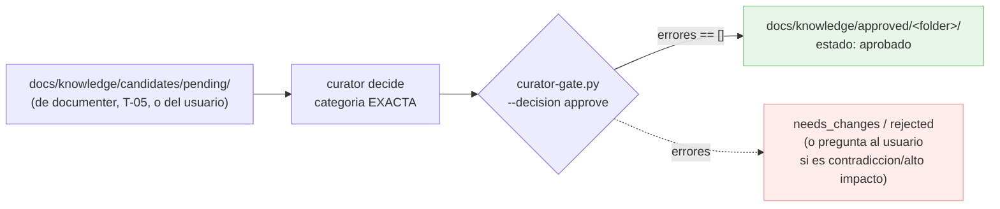

# Documentación del agente `knowledge-curator`

Único agente que **aprueba, rechaza o pide cambios** sobre conocimiento propuesto bajo
`docs/knowledge/candidates/`, y el **único que escribe** en `docs/knowledge/approved/`
(`ADR-018`, `knowledge-services` T-04). El veredicto de contrato (evidencia mínima, `fuentes`,
`tags`, lista negra, token de `estado`) **no es una impresión**: lo da un script determinista con
exit code.

---

## 1. Entrada y salida

- **Entrada:** candidatos bajo `docs/knowledge/candidates/{pending,needs_changes,rejected}/`
  (propuestos por `documenter`, T-05, o directamente por el usuario) y el índice de
  `docs/knowledge/approved/` (para detectar contradicciones/duplicados).
- **Salida:** el propio árbol de `docs/knowledge/candidates/**` (mueve/actualiza ficheros dentro) y
  `docs/knowledge/approved/<folder>/` (candidatos aprobados, con frontmatter completo). Nunca
  escribe fuera de `docs/knowledge/**`, no exporta a ningún backend y no toca `docs/roadmap/`.

## 2. Cómo funciona

Carga la taxonomía del proyecto (`.claude/knowledge-services/taxonomy.json`, o el default del
plugin) con `agent-kits/shared/knowledge-schema.py` y el índice de lo ya aprobado con
`agent-kits/shared/knowledge-index.py`. Decide la **categoría exacta** de cada candidato (un
`folder` puede servir a varias categorías — p. ej. `PATTERN` y `GOTCHA` comparten `gotchas/` en el
default del plugin — así que solo el Curator, que conoce la categoría con la que aprueba, puede
comparar la evidencia contra el `min_evidence` correcto; delegado desde el **gap 3** de la revisión
de dos lentes de T-01/T-02, porque `knowledge-index.py` solo valida FORMA, nunca presencia ni
semántica de categoría).

Ejecuta `agent-kits/knowledge-curator/curator-gate.py <candidato.md> --decision approve|reject|needs_changes
[--category KEY] --root . --json` por cada candidato. `approve` exige el contrato completo:
`evidencia` presente y con rango ≥ `min_evidence` de la categoría exacta, `fuentes` no vacía,
`tags` en forma `clave:valor`, sin términos de la lista negra (`taxonomy.json` → `denylist`), y
`estado` (si se declara) solo con el token en español **`aprobado`** —nunca
`approved`/`pending`/`needs_changes`/`rejected`, que son nombres de carpeta del flujo de
candidatos, no valores de `estado` (delegado desde el **gap 34** de la revisión de dos lentes de
T-02: el mismo token que exige `knowledge-index.py` sobre `approved/`); y sin colisión con
`approved/` (**gap 50**: ni un `id` ya indexado ni un fichero con el mismo nombre en la carpeta
destino). `reject`/`needs_changes` **no corren nada de eso** (**gap 58**): ni evidencia, ni
`fuentes`/`tags`, ni lista negra, ni el token de `estado`, ni siquiera exigen que `category` esté
declarada (**gap 53** — si falta, se dictamina igual con solo un `aviso` no bloqueante); una
`category` **inválida** (declarada pero inexistente en `taxonomy.json`) sigue siendo error de uso
en las tres decisiones. El candidato, además, debe vivir bajo
`docs/knowledge/candidates/{pending,needs_changes,rejected}/` del `--root` (**gap 48**,
contención por `realpath`): cualquier otra ruta es un error de uso, no un candidato.

El gate **no mueve ficheros ni detecta contradicciones semánticas**: eso es juicio del agente. Ante
una contradicción con una entrada ya `approved/`, o un candidato de **alto impacto** (afecta a 2+
piezas, o reescribe una decisión ya tomada), el Curator **pregunta al usuario** antes de decidir —
nunca resuelve solo.

## 3. Contrato de aprobación (`curator-gate.py`)

| Entrada | Salida | Exit codes |
|---|---|---|
| ruta del candidato + `--decision` + categoría (frontmatter o `--category`) + `--root` | `{decision, categoria, errores[]}` (`--json`) o texto | `0` decisión permitida · `1` con errores bloqueantes (solo en `approve`) · `2` uso/taxonomía inválida/candidato inexistente |

Ver `agent-kits/knowledge-curator/README.md` para el detalle del contrato y
`agent-kits/knowledge-curator/test_curator_gate.py` para los casos cubiertos.

## 4. Relación con el resto de la cadena

- **`documenter` (T-05) propone, nunca aprueba.** Detecta candidatos al cerrar el ciclo y escribe
  la propuesta en `docs/knowledge/candidates/pending/`; el Curator es quien decide.
- **`/dev-cycle` Fase 4-bis "Knowledge Gate" (T-06)** invoca al Curator sobre los candidatos de una
  iniciativa **después** de QA verde y `documenter`, con **omisión honesta** si no hay candidatos.
- **No exporta a backends.** `knowledge-sync.py` y los adaptadores (Kwipu, Graphiti) son de
  T-07..T-09; el Curator solo deja `approved/` correcto y reconstruible.

## 5. Guardrails

- **Un rol, un dueño** (`ADR-011`, `docs/agents/ROLES.md`): único escritor de
  `docs/knowledge/candidates/**` y `docs/knowledge/approved/**`.
- **El gate decide el contrato, el agente decide el juicio.** Nunca aprueba con `errores != []`.
- **Sin exportación ni roadmap.** Fuera de `docs/knowledge/**`, no toca nada.
