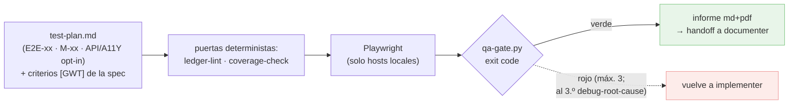

# Documentación del agente `qa`

Agente que **audita un plan** ejecutando sus tests E2E con **Playwright** contra la app local, captura evidencias y entrega un informe **md + pdf** con checklist manual. El veredicto verde/rojo **no es una impresión**: lo dan scripts con exit code.

---

## 1. Entrada y salida

- **Entrada:** una iniciativa en `docs/roadmap/<fecha>-<slug>/` con su `test-plan.md` (bloques `E2E-xx` automáticos y `M-xx` manuales, que genera `planner`), más la **URL local** de la app en ejecución.
- **Salida:** `docs/roadmap/<fecha>-<slug>/testing/` con `report.md` + `report.pdf`, `screenshots/` y `raw/` (results.json + trazas).

---

## 2. Cómo funciona

`planner` define los tests en `test-plan.md`; `qa` los ejecuta. Antes de nada corre dos **puertas deterministas**: `ledger-lint.py` (ledger coherente) y `coverage-check.py` (cobertura criterios↔tests — incluye los **criterios `[GWT]`** de la spec: cada `- [ ] [GWT] CA-XX — Dado…, Cuando…, Entonces…` debe tener su bloque E2E; un GWT sin cubrir es rojo). Luego traduce cada escenario `E2E-xx` a un test Playwright (los `[GWT]` se traducen 1:1: Dado→setup, Cuando→acciones, Entonces→aserciones), los corre contra la URL local, captura screenshots y recoge resultados en JSON. El **veredicto verde/rojo lo emite `qa-gate.py`** sobre ese JSON (verde ⟺ 0 fallos, 0 flaky sin justificar, 0 interrumpidos, ≥1 test ejecutado). El informe incluye estado global, resultado por escenario con capturas, checklist manual `M-xx` y trazabilidad tarea→resultado; el PDF se genera con **`to-pdf`**.

**Iniciativa sin UI (`test-plan: n/a (sin UI)`).** Cuando el `improvement-plan.md` declara ese marcador en su frontmatter, no hay `test-plan.md` **por diseño**: `qa` corre solo sus dos puertas deterministas (`ledger-lint.py` y `coverage-check.py`, que reconoce el marcador y sale en exit 0 diciéndolo), deja UNA línea en el informe — «sin UI por diseño» — y termina; ni Playwright, ni URL, ni petición de regenerar nada. Los criterios `[GWT]` de una spec sin UI no se cubren con E2E: `coverage-check` los lista para que la revisión los vea, y su evidencia es el campo `Verificación` de la tarea que los cierra en `tasks.md`. Sin marcador **y** sin `test-plan.md`, el aviso es **uno** —con el comando que lo fija— y `qa` termina: no es un bucle. Dos avisos más del mismo JSON van al informe cuando aparecen: **`marcador_no_canonico`** (el marcador exime, pero escrito con mayúsculas, tabulador, doble espacio o comillas el `grep -F` del literal no lo encuentra y el resto de la cadena no lo ve) y **`rutas_ui_degradado`** (el diff no se ha mirado: sin `git`, fuera de un repo, con un `.git` presente cuyo `git rev-parse` falla —config rota, `safe.directory`, repo corrupto: el motivo cita el stderr de git—, sin base determinable, o con una base que no aporta diff —`HEAD` en la rama principal—; ahí solo se ha mirado el alcance declarado, y eso no es «no hay interfaz»). Las «rutas con pinta de interfaz» se leen del diff y de los campos `Archivos`: una carpeta declarada SIN barra final (`src/components`, `frontend`) cuenta si de verdad es un directorio —la misma pregunta al sistema de ficheros que hace `scope-check.casa()`—, y cuando la única pista es el nombre de la carpeta, la extensión tiene que ser de interfaz (`db/views/v.sql`, `templates/mail.json` o `assets/fuente.ttf` son datos, no vistas). Decisión: `ADR-017`; hueco E1 de [`CONTRACTS.md`](CONTRACTS.md).

---

## 3. Requisitos y guardrail

- **Node** en la máquina. Playwright + Chromium se instalan **fuera del repo** en `~/.claude/tool-cache/qa/`, con **permiso previo** (descarga pesada) — mismo patrón opt-in que `nemesis`.
- **Guardrail:** los E2E solo contra hosts **locales/privados** (`localhost`, `127.0.0.1`, `*.test`, redes privadas). Una URL externa se rechaza.

---

## 4. Relación con `planner`

`planner` genera el `test-plan.md` (y las etiquetas **Cubre (tests)** en las tareas de UI); `qa` lo consume. Si un plan no tiene `test-plan.md`, hay que (re)generarlo con `planner` antes de auditar.

---

## 5. Cómo se invoca

Dentro del proyecto, en Claude Code:

- `usa el agente qa contra https://miapp.test`
- `qa, audita el plan docs/roadmap/2026-07-09-mi-feature con la app en http://localhost:8080`
- `prueba la UI con Playwright y genera el informe`

La primera vez pide permiso para instalar Playwright/Chromium y confirma la URL local.

---

## 5-bis. Memoria técnica del proyecto

Antes de auditar, lee el índice de `docs/knowledge/` (si existe) y abre las entradas de `gotchas/` que apliquen — útil para no reabrir un flaky ya diagnosticado (paso compartido `agent-kits/shared/knowledge-check.md`). Cuando un flaky justificado resulta ser un **patrón** (no un accidente: ya hay una entrada sobre ese test/motivo en `gotchas/`, o el mismo motivo se repite en otro test de la tanda actual), escribe un fichero nuevo `docs/knowledge/gotchas/GOT-NNN-<slug>.md` citando la entrada existente — excepción declarada a "no toca `docs/roadmap/`" (`agent-kits/shared/knowledge-write.md`).

---

## 6. Kit (`agent-kits/qa/`)

- `runner/` — proyecto Playwright (config con reporter JSON + capturas + trazas; `tests/E2E-example.spec.mjs` como patrón).
- `lib-guardrail.sh` — gate local-only de la URL.
- `qa-gate.py` — **veredicto determinista** verde/rojo sobre `results.json` (exit code; con tests).
- `coverage-check.py` — cobertura criterios↔tests: `tasks.md` ↔ `test-plan.md` ↔ criterios `[GWT]` de la spec (con tests).
- `templates/report.md` — plantilla del informe.
