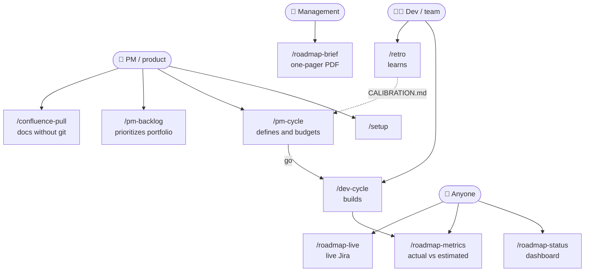
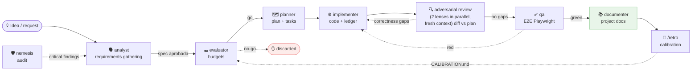
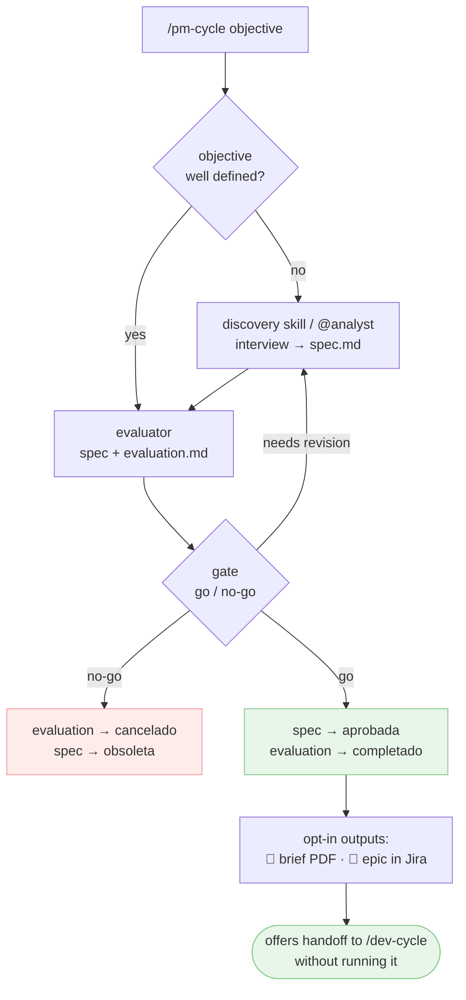
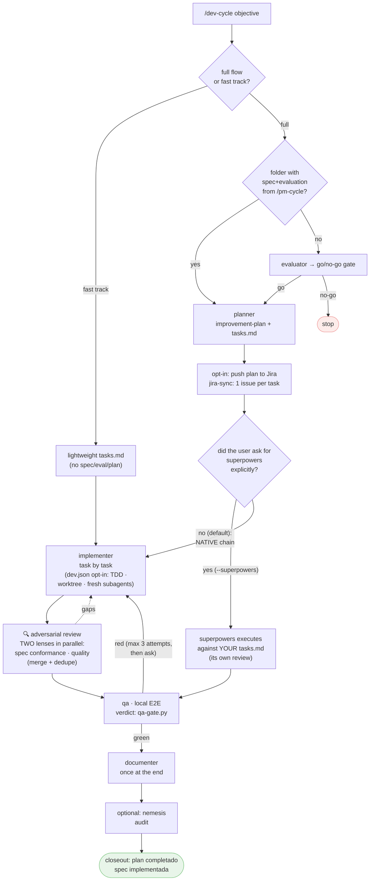
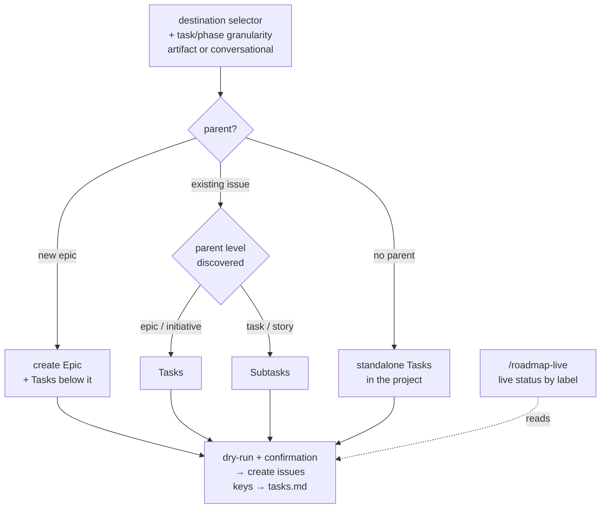
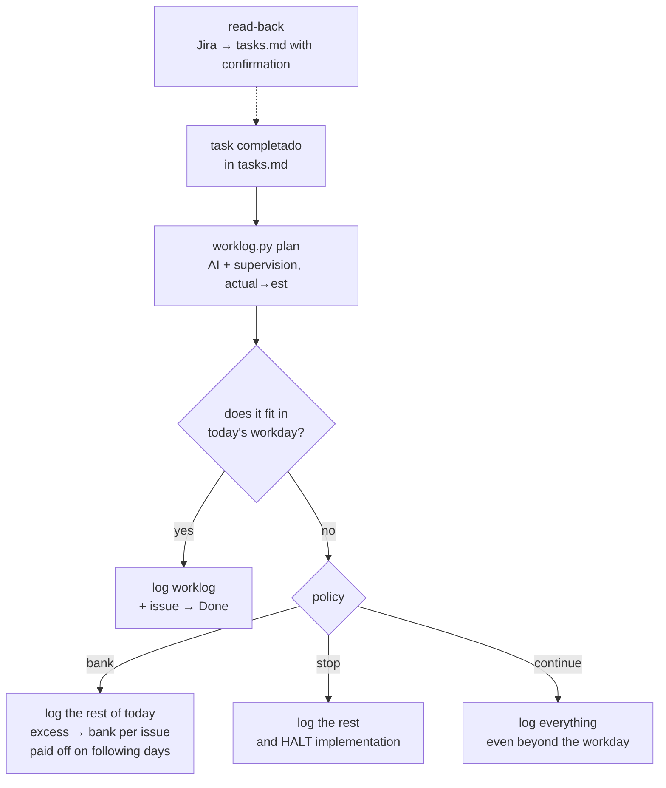
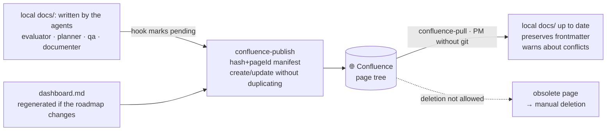
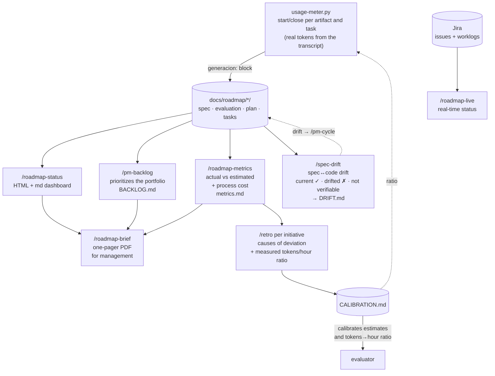
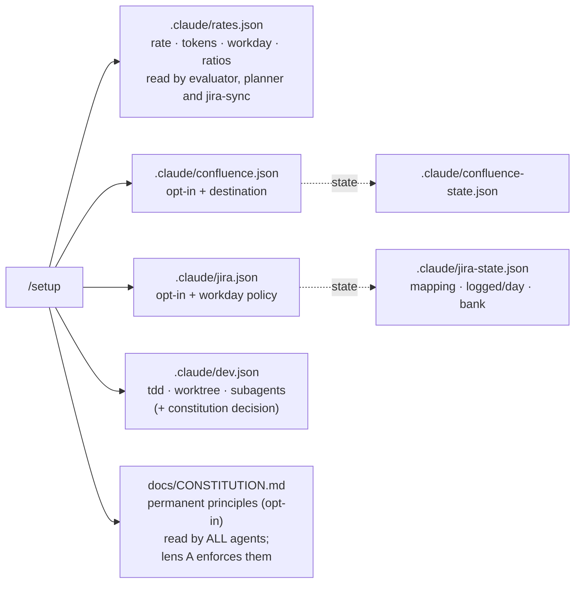

# Plugin flows — diagrams

**English** · [Español](../FLOWS.md)

Visual overview of how agents, commands and skills fit together. The diagrams are Mermaid
(they render on GitHub and in compatible editors).

**Legend:** **solid** arrow = main flow · **dotted** arrow = optional, return or feedback · diamond = decision/gate · green = forward path (*go*/green) · red = rejection or step back (*no-go*/red).

## 0 · General map — who uses what

## 1 · The complete chain of an initiative

**Product** phase: `analyst → evaluator`. **Development** phase: `planner → implementer → qa`.

Everything lives in **one folder per initiative**: `docs/roadmap/<fecha>-<slug>/`
(`spec.md → evaluation.md → improvement-plan.md + tasks.md → testing/ → retro.md`).

## 2 · `/pm-cycle` — product role (defines and budgets, closes at the gate)

## 3 · `/dev-cycle` — development cycle (with gates)

> **Entry gate (Phase 0-bis):** `/dev-cycle` first asks **full flow** vs **fast track**. The fast track skips evaluator+planner (creates a lightweight `tasks.md`) and goes straight into implementation, but keeps the two-lens review + qa.

`tasks.md` is the **canonical ledger** of progress in both modes.

## 4 · Jira (opt-in) — pushing the plan when it is created

> **Granularity** (`.claude/jira.json` → `granularidad`): **task** = one issue per `T-XX` (default); **phase** = one issue per Phase with its tasks as a checklist. In phase mode, comments/worklog/Done go to the phase's issue; the issue closes when all its tasks are `completado`. Additionally, the **reviewer's result** (Mode B) is published as a comment (per criterion ✓/✗ + number of attempts) and its time is logged as a separate `[revisión]` worklog — at the chosen granularity.

## 4b · Jira (opt-in) — time logging when each task is completed

## 5 · Confluence — bidirectional (opt-in)

## 6 · Visibility and learning (all read-only)

> **Generation cost (usage-meter):** each artifact of the cycle (and each task in Mode B) is **measured** with real tokens from the transcript (`agent-kits/shared/usage-meter.py`); the `generacion:` block in its frontmatter feeds the **process cost** section of `/roadmap-metrics`, and `/retro` uses it to calibrate the **tokens→hour ratio** used by the evaluator and by the meter itself. Dates = context · tokens = measurement · hours = derived.

## 7 · Configuration (one pass with `/setup`)

Details on each file: rule 9 of [`CONVENTIONS.md`](CONVENTIONS.md). Atlassian connector
behaviors: [`atlassian-connector-notes.md` (Spanish)](../atlassian-connector-notes.md).

> **Note (Confluence):** if this page is published to Confluence via `confluence-publish`, the
> Mermaid diagrams only render if the space has a Mermaid app/macro installed; otherwise
> the diagram's source code will be shown. On GitHub and in compatible editors they always render.

> **Maintenance:** when adding or changing an agent, command or skill, update the corresponding
> diagram in this document (see the checklist in `CONVENTIONS.md`).
