# Plugin flows — diagrams

**English** · [Español](../FLOWS.md)

Visual overview of how agents, commands and skills fit together. The diagrams are Mermaid
(they render on GitHub and in compatible editors).

**Legend:** **solid** arrow = main flow · **dotted** arrow = optional, return or feedback · diamond = decision/gate · green = forward path (*go*/green) · red = rejection or step back (*no-go*/red).

## 0 · General map — who uses what

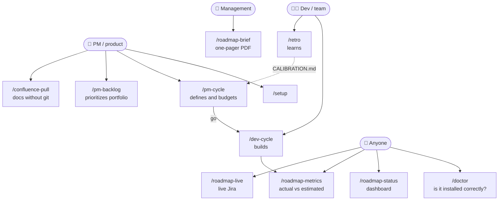

## 1 · The complete chain of an initiative

**Product** phase: `analyst → evaluator` (+ optional `architect` after the go). **Development** phase: `planner → implementer → qa`. The adversarial review dispatches its lenses to the read-only `reviewer` agent.

```mermaid
flowchart LR
    idea(["💡 Idea / request"]) --> analyst["🗣️ analyst<br/>requirements gathering"]
    analyst -->|spec aprobada| evaluator["💶 evaluator<br/>budgets<br/>(+ code-health opt-in: measured risk)"]
    evaluator -->|go| planner["🗺️ planner<br/>plan + tasks"]
    evaluator -.->|"go + High complexity<br/>(opt-in)"| architect["🏗️ architect<br/>2-3 options → design.md<br/>2 passes: options → user choice → ADR"]
    architect -->|design approved| planner
    evaluator -.->|no-go| fin1(["✋ discarded"])
    planner --> implementer["⚙️ implementer<br/>code + ledger"]
    implementer --> scope{"scope-check.py<br/>diff ⊆ Archivos?"}
    scope -.->|out of scope| implementer
    scope -->|exit 0| review["🔍 skill adversarial-review<br/>lenses A+B → reviewer agent (read-only)<br/>in parallel, fresh context<br/>(+ security lens C when the diff warrants it)"]
    review -->|no gaps| qa["✅ qa<br/>E2E Playwright"]
    review -.->|correctness gaps| implementer
    qa -->|green| documenter["📚 documenter<br/>project docs"]
    qa -.->|red| implementer
    documenter --> retro["🔁 /retro<br/>calibration"]
    nemesis["🛡️ nemesis<br/>audit"] -.->|critical findings| analyst
    retro -.->|CALIBRATION.md| evaluator
    style fin1 fill:#fdecea,stroke:#ef9a9a
    style documenter fill:#e8f5e9,stroke:#81c784
```

Everything lives in **one folder per initiative**: `docs/roadmap/<fecha>-<slug>/`
(`spec.md → evaluation.md → [design.md] → improvement-plan.md + tasks.md → testing/ → retro.md`).

## 2 · `/pm-cycle` — product role (defines and budgets, closes at the gate)

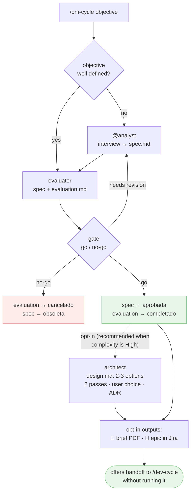

## 3 · `/dev-cycle` — development cycle (with gates)

> **Entry gate (Phase 0-bis):** `/dev-cycle` first asks **full flow** vs **fast track**. The fast track skips evaluator+architect+planner (creates a lightweight `tasks.md`) and goes straight into implementation, but keeps the two-lens review + qa. **The review is the `adversarial-review` skill** (single source of the method: `scope-check.py` gate, lenses A/B dispatched to the read-only **`reviewer`** agent — fallback to a generic subagent —, **conditional** lenses C (security) and **D (performance)** decided by `review-lens-select.py` (sensitive paths/lines · N+1, `await`/regex in a loop, blocking `sleep` patterns; `dev.json` `revision.lenteSeguridad`/`revision.lenteRendimiento`), loop bounded to 3); `/dev-cycle` only invokes it, keeps the attempt counter and logs the `[revisión]` worklog. It is also used on demand ("review this diff") without a ledger. **Phase 2-a (optional):** `architect` before `planner` when `design.md` exists or the user asks for it. **Model per agent:** before each dispatch, `model-tier.py <agent>` (frontmatter + `dev.json` `modelos`) → the Agent tool's `model` parameter.
>
> **Two entry points into the same gate:** the `/dev-cycle` command (explicit, with the slash) and the `quick-implement` skill, which auto-invokes from natural language ("implement X quickly") and enters through the fast-track branch after its suitability filter. The skill defines no method of its own: it delegates to this very Phase 0-bis.

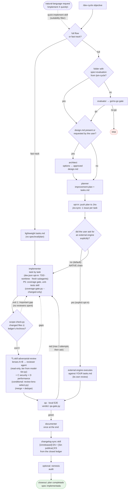

`tasks.md` is the **canonical ledger** of progress in both modes.

## 4 · Jira (opt-in) — pushing the plan when it is created

> **Granularity** (`.claude/jira.json` → `granularidad`): **task** = one issue per `T-XX` (default); **phase** = one issue per Phase with its tasks as a checklist. In phase mode, comments/worklog/Done go to the phase's issue; the issue closes when all its tasks are `completado`. Additionally, the **reviewer's result** (Mode B) is published as a comment (per criterion ✓/✗ + number of attempts) and its time is logged as a separate `[revisión]` worklog — at the chosen granularity.

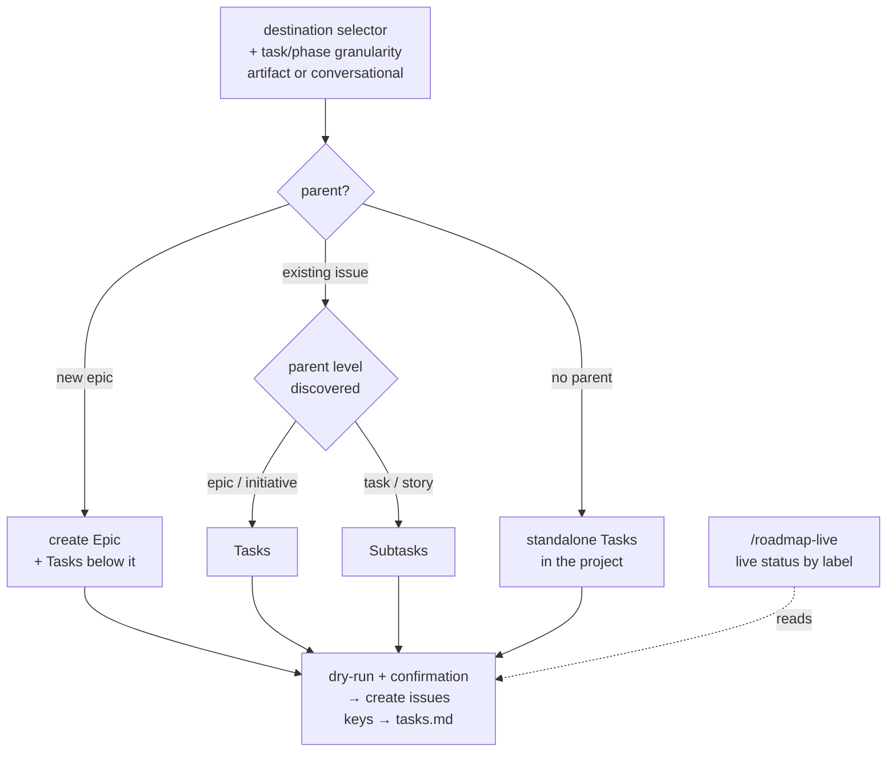

## 4b · Jira (opt-in) — time logging when each task is completed

> **Careful: completing a task does NOT move it to Done.** The worklog is logged when the task
> closes; the issue only reaches *Done* through the `aprobado` event of the cycle below (4c), after
> review and `qa`.

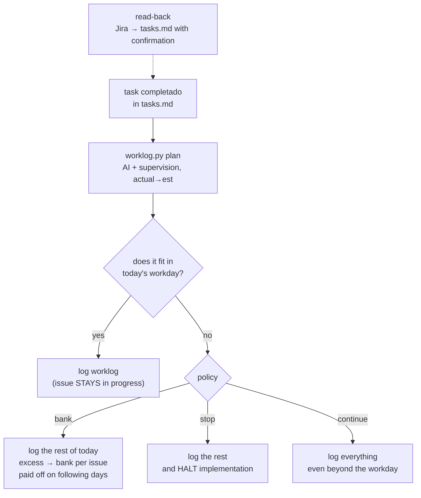

## 4c · Jira (opt-in) — the Phase 3 event cycle (who fires what)

The 7 events are generated by `skills/jira-sync/scripts/jira-flow.py` (deterministic `ops`: label →
transition → signed comment → worklog); the agent only **executes** them through the connector. Each
event has a fixed `--actor`: a mismatch is exit 2. Operational detail lives in the "Ciclo Jira de la
Fase 3" table of `commands/dev-cycle.md` (single source).

| Event | Who fires it | Issue transition | Comment (label) |
|---|---|---|---|
| `arrancar` | `implementer` | → *In Progress* (`en-curso`) | — |
| `implementado` | `implementer` | — (stays In Progress) | `ca-implementer` |
| `revision` (attempt with no gaps) | `reviewer` | — | `ca-reviewer` |
| `gaps` (attempt with gaps) | `reviewer` | → *In Progress* (`reabrir`) | `ca-reviewer` |
| `qa-verde` / `qa-rojo` | `qa` | — | `ca-qa` |
| `aprobado` | **the orchestrator** (`/dev-cycle`) | → *Done* (`done`) | `ca-orquestador` |

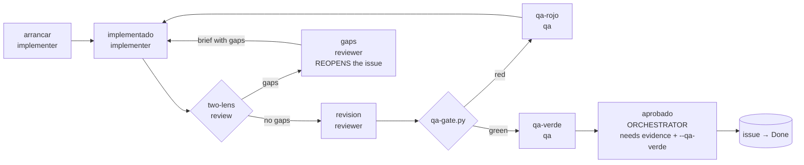

> **Done is a gate, not a side effect.** `aprobado` is the ONLY event that moves the issue to *Done*,
> only the orchestrator fires it, and `jira-flow.py` rejects it (exit 2, `ops: []`) when the ledger
> has no latest review section free of pending gaps, or when `--qa-verde` (the exit 0 of
> `qa-gate.py`) is missing. With `.claude/jira.json` `enabled` ≠ `true` the whole cycle returns
> `ops: []` with no noise, and every published event is recorded (`flow` in `jira-state.json`) so it
> is not repeated.

## 5 · Confluence — bidirectional (opt-in)

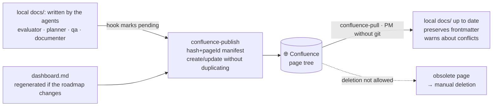

> **Publication policy (2026-08-20-confluence-policy):** opt-out over `include: ["**/*.md"]` — a
> new document is published by default unless it falls under a known exclusion. Full normative
> detail and exclusion table: `skills/confluence-publish/SKILL.md`, "qué sube y qué no" (what
> ships and what doesn't) section.

**Trigger → artifact → does it publish? matrix** (the 11 known triggers that apply, or explicitly
declare they do not apply, the `agent-kits/shared/confluence-optin.md` step):

| Trigger | Artifact(s) it produces | Does it publish? |
|---|---|---|
| `analyst` | `spec.md` | ✅ Yes |
| `evaluator` | `evaluation.md` (+ `spec.md` if it creates it) | ✅ Yes |
| `architect` | `design.md` (+ ADR in `docs/knowledge/adr/`) | ✅ Yes — an architecture decision, like `spec.md` and the ADRs (not an execution board) |
| `planner` | `improvement-plan.md`, `tasks.md` | ❌ No — plan and ledger (D1): they live in the repo and in Jira, not in Confluence |
| `implementer` | updates `tasks.md` per task; triggers the sync **when closing each phase** (D3) | ⚠️ The trigger DOES fire, but `tasks.md` itself does **not** get published (D1) — it refreshes whatever else changed under `docs/` (typically `dashboard.md`) |
| `qa` | `testing/report.md` + `report.pdf`, `screenshots/`, `raw/` | ❌ No — `**/testing/**` (D4): the report embeds screenshots the connector cannot attach; stays local-only |
| `documenter` | reference documentation under `docs/` (architecture, stack, guides, product…) | ✅ Yes |
| `/pm-backlog` | `docs/roadmap/BACKLOG.md` | ✅ Yes |
| `/retro` | `retro.md` + `docs/roadmap/CALIBRATION.md` | ✅ Yes |
| `/spec-drift` | `docs/roadmap/DRIFT.md` | ✅ Yes |
| `/roadmap-brief` | `docs/roadmap/brief.md` + `brief.pdf` | ⚠️ The `.md` does; the `.pdf` is not part of the mirror (it is not `.md`) |

**Structural "no"s** (not tied to a specific trigger — policy exclusions that always apply,
whoever writes them): `docs/en/**` (duplicated EN tree, for GitHub readers), `docs/examples/**`
and `docs/agents/**` (the plugin's own internal documentation, not the consumer project's
product), `docs/**/atlassian-connector-notes.md` and, as always, `docs/security-scan/**`
(non-negotiable `nemesis` invariant). Verifiable with `confluence-scope.py --status` / `--check`
(`skills/confluence-publish/scripts/`).

**Where `docs/knowledge/` is born** (project technical memory, `2026-08-20-knowledge-capture`) —
**it IS in the mirror by default**, it is not in `exclude` (unlike the plan/ledger in the
`planner` row above): `planner`/`implementer` write an ADR under `docs/knowledge/adr/` when a
design decision crosses the threshold (see CONVENTIONS.md rule 10); `debug-root-cause` writes a
gotcha to a new file under `docs/knowledge/gotchas/GOT-NNN-<slug>.md` when it closes its Phase 4
(root cause confirmed); `qa` writes a gotcha when a justified flaky turns out to be a pattern, not
an accident; `/retro` produces a second output with process lessons in a new file under
`docs/knowledge/lessons/LES-NNN-<agent>-<slug>.md`, in addition to its
numeric row in `CALIBRATION.md`. The five reader agents (`evaluator`, `planner`, `implementer`,
`qa`, `documenter`) apply `agent-kits/shared/knowledge-check.md` before working (progressive
disclosure: only the index + their area). The **session journal** (`docs/knowledge/journal/`, a log
generated by the `SessionEnd` hook) is episodic, uncurated memory: `evaluator`/`planner`/`architect`
read only their initiative's latest entry, `/retro` uses it as a source of deviation causes, and
whatever deserves doctrine is promoted to an ADR/gotcha/lesson. Full detail: `CONVENTIONS.md` rule 10.

## 6 · Visibility and learning (all read-only)

> **Generation cost (usage-meter):** each artifact of the cycle (and each task in Mode B) is **measured** with real tokens from the transcript (`agent-kits/shared/usage-meter.py`); the `generacion:` block in its frontmatter feeds the **process cost** section of `/roadmap-metrics`, and `/retro` uses it to calibrate the **tokens→hour ratio** used by the evaluator and by the meter itself. Dates = context · tokens = measurement · hours = derived.

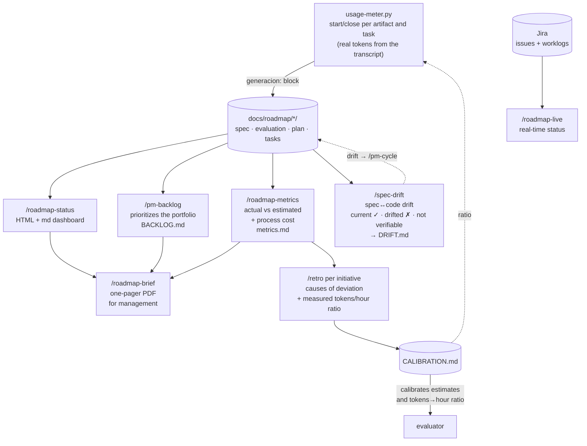

## 6b · Live visibility (deterministic hooks + opt-in status line)

> While `implementer`/subagents work, the user sees progress without anyone writing it up:
> everything comes from `progress-report.py` over the **canonical ledger** (`tasks.md`). Hooks
> **inform, they never decide** (always exit 0). Details: [`observability.md`](observability.md).
> **Session journal** (memory-health): when the session ends, `SessionEnd` leaves a deterministic
> entry under `docs/knowledge/journal/` (active initiative, files touched, tasks whose state changed,
> meter markers); on startup/resume, `SessionStart` re-injects it compacted. No AI summary: hook output
> on `SessionEnd` is ignored by contract (ADR-010).

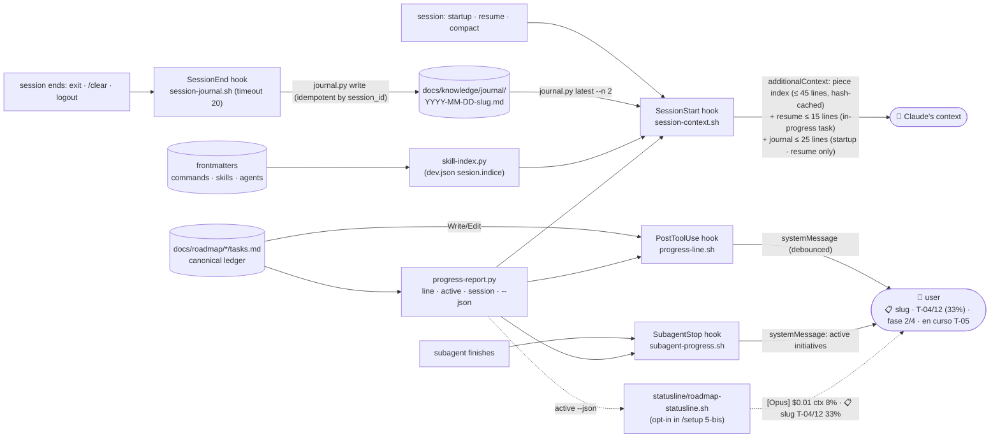

## 6c · Deterministic guardrails of the `implementer` (agent-scoped guard hook)

> The implementer's hard rules no longer depend on the model remembering them: a `PreToolUse`
> hook registered **only in its frontmatter** (`agents/implementer.md`) enforces them through
> `guardrail-check.py` (a script with tests). Other agents do not carry it: `planner`/`evaluator`
> legitimately write to `docs/roadmap/` (ADR-007). Can be switched off in `.claude/dev.json`.

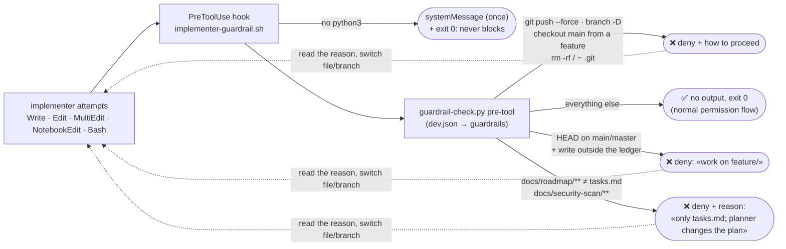

## 7 · Configuration (one pass with `/setup`)

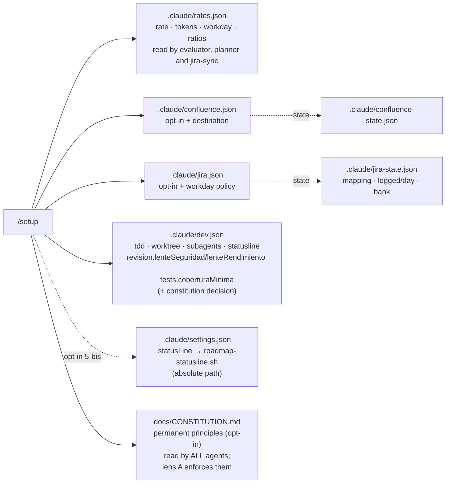

> **Checking the installation:** `/doctor` reads all of this (plus hooks, status line and work state) without
> writing anything and gives a ✅/⚠️/❌ verdict per line with the fix next to it. It is the first stop when a hook
> "does not fire" or a skill does not activate; `/setup` offers it when `.claude/` already has config.

Details on each file: rule 9 of [`CONVENTIONS.md`](CONVENTIONS.md). Atlassian connector
behaviors: [`atlassian-connector-notes.md` (Spanish)](../atlassian-connector-notes.md).

> **Note (Confluence):** if this page is published to Confluence via `confluence-publish`, the
> Mermaid diagrams only render if the space has a Mermaid app/macro installed; otherwise
> the diagram's source code will be shown. On GitHub and in compatible editors they always render.

> **Maintenance:** when adding or changing an agent, command or skill, update the corresponding
> diagram in this document (see the checklist in `CONVENTIONS.md`).
