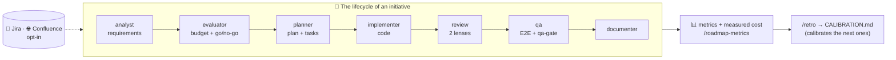

# custom-agents — documentation index

**English** · [Español](../README.md)

Repository of **custom agents** for Claude Code, with their skills and toolkits. It is deployed into a project's `.claude/` folder (see [`INSTALL.md`](INSTALL.md)).



**Reading guide:** this index locates each piece · [`FLOWS.md`](FLOWS.md) draws all the flows · [`CONVENTIONS.md`](CONVENTIONS.md) sets the rules · each agent has its own doc in [`agents/`](../agents/) (Spanish).

Before adding or touching an agent, read [`CONVENTIONS.md`](CONVENTIONS.md): it defines where everything goes and how dependencies between agents are declared so they do not step on each other. For a **visual overview of the flows** (agent chain, PM/dev cycles, Jira, Confluence, metrics), see [`FLOWS.md`](FLOWS.md). For what the plugin measures (cost per artifact/task) and how it coexists with live session monitors, see [`observability.md`](observability.md).

## Available agents

> Per-agent docs and roadmap artifacts are currently Spanish-only.

| Agent | What it does | Dependencies | Documentation |
|--------|----------|--------------|---------------|
| **nemesis** | End-to-end cybersecurity audit: SAST (static) + DAST (active local pentest), memory and visual report. | skill `cybersecurity`, kit `agent-kits/nemesis` | [nemesis.md (Spanish)](../agents/nemesis.md) · [presentation (Spanish)](../agents/nemesis-presentacion.md) · [toolkit (Spanish)](../agents/nemesis-toolkit.md) |
| **planner** | Generates detailed, budgeted implementation plans (time, cost €, tokens) in `docs/roadmap/`. Syncs its docs to Confluence. | kit `agent-kits/planner`, skills `confluence-publish` · `jira-sync` | [planner.md (Spanish)](../agents/planner.md) |
| **implementer** | Implements an approved plan phase by phase (writes real code, on a branch), keeping `tasks.md` as the canonical per-task ledger. Handoff to `qa`. As tasks complete, it reflects progress in Jira (opt-in). | agent `qa`, skill `jira-sync` | [implementer.md (Spanish)](../agents/implementer.md) |
| **analyst** | **Requirements gathering**: converses (interview, examples, user stories, counterexamples) and turns a vague idea into a solid `spec.md` in a fixed format; iterates until **approval** and hands off to `evaluator`. | skill `discovery`, agent `evaluator` | [analyst.md (Spanish)](../agents/analyst.md) |
| **evaluator** | Evaluates/budgets a spec (creating it if it arrives via prompt) in `docs/roadmap/<date>-<slug>/`. Reads `CALIBRATION.md` to adjust estimates. Links spec↔evaluation and hands off to `planner`. Syncs its docs to Confluence. | kit `agent-kits/evaluator`, agent `planner`, skill `confluence-publish` | [evaluator.md (Spanish)](../agents/evaluator.md) |
| **pdfy** | Converts files to modern-looking PDFs (Markdown, HTML and Word → PDF via headless Chromium + CSS theme). | skill `to-pdf` | [pdfy.md (Spanish)](../agents/pdfy.md) |
| **qa** | Audits a plan by running E2E with Playwright (local only), captures evidence and generates an md+pdf report with a manual checklist in `docs/roadmap/<slug>/testing/`. Syncs the report to Confluence. | skill `to-pdf`, kit `agent-kits/qa`, skill `confluence-publish` | [qa.md (Spanish)](../agents/qa.md) |
| **documenter** | Generates and maintains the project's technical and product documentation under `docs/`, with a structure **derived from the project itself** (index, RAG-INDEX, architecture, stack, units, guides, product). Syncs to Confluence. | kit `agent-kits/documenter`, skill `confluence-publish` | [documenter.md (Spanish)](../agents/documenter.md) |

**Work chain (single folder per initiative):** `docs/roadmap/<date>-<slug>/` contains `spec.md` (what) → `evaluation.md` (how much / whether it is worth it) → `improvement-plan.md` + `tasks.md` (how) (+ `testing/`). They reference each other and are updated as they are created (see rule 7 of [`CONVENTIONS.md`](CONVENTIONS.md)). `pdfy` exports any document to PDF.

**Closing the cycle (documentation):** once the implementation of a plan is finished and `qa`'s automated tests are green, `qa` hands off to `documenter`, which generates/updates the project's reference documentation (architecture, stack, units, guides, product) under `docs/`, reflecting the final state. `documenter` runs **once at the end of the plan**, not per task.

**Confluence sync (optional, opt-in, bidirectional):** `planner`, `evaluator` and `qa` invoke `confluence-publish` (`docs/ → Confluence`) when writing to `docs/`; and `/confluence-pull` does the reverse (`Confluence → docs/`) so that a PM without git has an up-to-date copy. Both share the `.claude/confluence-state.json` map, so they are idempotent with each other. The first time, the skill asks whether you want to sync; if you say no (`enabled: false`), it never asks or syncs again. If enabled, it mirrors changes to Confluence (create/update; deletion → marked as obsolete) according to the space/anchor saved in `.claude/confluence.json`. `docs/security-scan/` is never published. Setting up the Atlassian connector: see [`INSTALL.md`](INSTALL.md).

## Commands (orchestrators)

They drive the chain by invoking agents **by name** and with control gates, over the **same per-initiative folder** `docs/roadmap/<date>-<slug>/`.

| Command | Role | Scope | Closure |
|---------|-----|---------|--------|
| **`/pm-cycle <goal>`** | Product / PM | `spec → evaluation` (agent `evaluator`) | Closes at the go/no-go gate. On *go*, it leaves the spec `aprobada` (approved) + evaluation `completado` (completed) and **offers** the handoff to `/dev-cycle` (without running it). Opt-in closing outputs: PDF brief (`pdfy`) and handoff to Jira. It does not plan or implement. |
| **`/dev-cycle <goal>`** | Development | Full cycle `evaluation → plan → implementation → tests → documentation` | **Native chain ALWAYS by default** (opt-in discipline in `.claude/dev.json`: TDD, worktrees, fresh subagents); an external SDD engine only on explicit request. If started on a folder holding a spec+evaluation from `/pm-cycle`, it continues straight into planning. |
| **`/pm-backlog [criterion]`** | Product / portfolio | Reads every `evaluation.md` and **prioritizes** (read-only) | Writes `docs/roadmap/BACKLOG.md` with a recommended order (quick wins vs. big bets). It does not plan; it defers to `/dev-cycle` for execution. |
| **`/roadmap-status`** | Visibility | Scans `docs/roadmap/*/` (read-only) | Generates the dashboard `docs/roadmap/dashboard.html` (local) and `dashboard.md` (published to Confluence for PMs without git) via the `roadmap-dashboard` skill. |
| **`/roadmap-metrics`** | Budget | Compares actual vs. estimated (read-only) | Report `docs/roadmap/metrics.md`: production (AI+supervision), human hours and **actual vs. estimated** tokens with deviations and a portfolio total (`roadmap-dashboard` skill). |
| **`/roadmap-brief`** | Management | Portfolio one-pager → PDF | Combines status + priorities + actual vs. estimated into an executive brief (`brief.pdf`) via `to-pdf`. |
| **`/roadmap-live [slug]`** | Live status | Reads Jira in real time | Dashboard of issues + hours logged per label (artifact in Cowork; conversational in the CLI). |
| **`/retro <slug>`** | Learning | Retro of a closed initiative | Actual vs. estimated + causes → `CALIBRATION.md`, the history that calibrates the `evaluator`'s estimates. |
| **`/setup`** | Onboarding | Configures the project in one pass | Creates `.claude/rates.json`, decides the Confluence and Jira opt-ins, offers the constitution (`docs/CONSTITUTION.md`) and the development discipline (`.claude/dev.json`). Idempotent. |
| **`/spec-drift [slug]`** | Governance | Spec↔code drift of `implementada` (implemented) specs (read-only) | Fresh subagents verify each criterion against today's code (`vigente ✓ / derivado ✗ / no verificable` — current / drifted / unverifiable — with evidence) → `docs/roadmap/DRIFT.md` + offer of `/pm-cycle` for what has drifted. |
| **`/confluence-pull [subfolder]`** | Product / no git | Pulls Confluence → local `docs/` (skill `confluence-pull`) | Fetches the current state without git; preserves frontmatter, warns about conflicts and confirms before writing. Inverse counterpart of publishing. |

This is how roles are separated: **`/pm-cycle`** decides *what* and *how much it costs* (one initiative), **`/pm-backlog`** decides *in what order* (the portfolio), **`/roadmap-status`** provides visibility, and **`/dev-cycle`** builds. They all share the folder and `<slug>`, so the handover is frictionless (see rules 7 and 8 of [`CONVENTIONS.md`](CONVENTIONS.md)).

## Shared skills

| Skill | What it does | Used by |
|-------|----------|-----------|
| **cybersecurity** | Static security analysis across 8 dimensions (OWASP, CWE, secrets, deps, IaC, threat intel, authz, compliance). | nemesis |
| **to-pdf** | Converts Markdown/HTML/Word to PDF with a modern theme (headless Chromium + CSS). | pdfy, qa |
| **confluence-publish** | Publishes/mirrors the project docs to Confluence via the Atlassian connector (Rovo MCP). Each project chooses a space and anchor (space root or child of the tree) in `.claude/confluence.json`; idempotent (creates/updates). | planner, evaluator, qa |
| **confluence-pull** | The **reverse** direction: pulls Confluence → local `docs/`, for PMs without git. Reuses `confluence.json` and the `confluence-state.json` map; preserves local frontmatter, warns about conflicts and confirms before writing. Only reads from Confluence. | command `/confluence-pull` |
| **roadmap-dashboard** | Scans `docs/roadmap/*/` and generates an **HTML** dashboard (local view), **Markdown** (for publishing to Confluence) or **JSON** (state, priority and budget per initiative). Read-only. | commands `/roadmap-status`, `/pm-backlog`; skill `confluence-publish` |
| **debug-root-cause** | Systematic debugging down to the root cause in 4 phases with mandatory evidence (minimal reproduction → isolation → tested hypothesis → fix + regression); blind fixing is forbidden. | `/dev-cycle` (automatic hook on qa's 3rd red); on demand |
| **discovery** | Turns a vague idea into a solid `spec.md` through a guided interview (goal, scope/out of scope, criteria, constraints, assumptions) before evaluating. It does not estimate. | command `/pm-cycle` (opt-in) |
| **plugin-dev** | Meta-skill for developing THIS plugin: decision tree (agent/skill/command/kit/shared fragment/hook), mandatory frontmatter with model tiering and minimal tools, TDD-ish validation (test first → linter → suites → self-review), documentation obligations and real anti-patterns. Includes agent, skill and command templates. | whoever develops THIS plugin (work sessions on the repo itself; no agent declares it as a dependency) |
| **jira-sync** | Pushes a plan (`tasks.md`) to Jira via the Atlassian connector: one issue per task under the chosen project/epic (artifact selector in Cowork or conversational in CLI/VS Code), issue type derived from the parent's hierarchy. As tasks complete, it logs hours (AI time + supervision, capped at a workday) and marks them *Done*. Opt-in (`.claude/jira.json`), idempotent. | planner, implementer |

## Shared budget config (`.claude/rates.json`)

The economic and estimation parameters (hourly rate €/h, token pricing, exchange rate, supervision ratio, contingency margin, workday hours) live in **a single place**, the project's `.claude/rates.json`, read by `evaluator`, `planner` and `jira-sync`. That keeps budgets consistent and adjustable in one file. Template in [`agent-kits/evaluator/templates/rates.example.json`](../../agent-kits/evaluator/templates/rates.example.json); if it does not exist, the agents use their defaults.

## Repository map

```
custom-agents/               (deployed as .claude/)
├── agents/                  # definition of each agent (*.md, flat)
├── skills/                  # skills SHARED between agents
├── agent-kits/              # PRIVATE per-agent toolkits (namespaced)
└── docs/                    # ALL the documentation (you are here)
    ├── README.md            # this index
    ├── CONVENTIONS.md       # organization and dependency conventions
    ├── INSTALL.md           # how to deploy the bundle
    └── agents/              # one doc per agent
```
