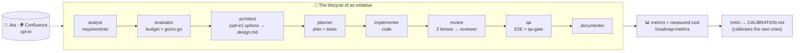

# custom-agents — documentation index

**English** · [Español](../README.md)

Repository of **custom agents** for Claude Code, with their skills and toolkits. It is deployed into a project's `.claude/` folder (see [`INSTALL.md`](INSTALL.md)).



**Reading guide:** this index locates each piece · [`FLOWS.md`](FLOWS.md) draws all the flows · [`CONVENTIONS.md`](CONVENTIONS.md) sets the rules · each agent has its own doc in [`agents/`](../agents/) (Spanish) · [`agents/ROLES.md`](../agents/ROLES.md) (Spanish) is the **one role, one owner** matrix (who decides/writes/reads each responsibility, and the overlaps already resolved — [`ADR-011`](../knowledge/adr/ADR-011-un-rol-un-dueno-agentes-retirados-y-responsabilidades-fusionadas.md), Spanish).

| Repo folder | What it is | Where it is explained |
|---|---|---|
| `evals/` | **Activation** evals: one JSON per skill/command/agent with prompts that must fire it (positives, one literal from the description) and neighbours that must not (negatives with `redirect`); `check.py` static in CI, `run.py` local with `claude -p`. Complements the piece index injected by the `SessionStart` hook. The **optional** job `headless.yml.MANUAL-COPY` → `.github/workflows/headless.yml` (secret `ANTHROPIC_API_KEY`) does run `claude`: a cheap `run.py` subset + a **real-session hook check** via witness file. | [`../../evals/README.md`](../../evals/README.md) (ES + EN) · lesson [`LES-011`](../knowledge/lessons/LES-011-plugin-dev-activacion-se-prueba-con-evals.md) (Spanish) |
| `scripts/` · `CONTRIBUTING.md` · `github-templates.MANUAL-COPY/` | `lint_plugin.py` (linter), `release.py` (complete mechanical release: moves `[Unreleased]`/`[Sin publicar]` in both CHANGELOGs, runs lint+evals, checks manual copies and `100644` mode of `.sh` files, bumps 3 places, commit+tag; `--dry-run`, `--check`) and `export-skills.py` (**portable "skills-only" package** for Codex/Copilot/Cursor: `AGENTS.md`, `.cursor/rules/*.mdc` rule, copyable `skills/`; deterministic, `--check`; output `dist/` gitignored; the Release attaches it as a zip). How to contribute (propose a piece with `plugin-dev`, pre-PR checklist, `T-XX:`/`feat:`/`chore:` commits, `.MANUAL-COPY` copies) in [`../../CONTRIBUTING.md`](../../CONTRIBUTING.md); issue forms and PR template in `github-templates.MANUAL-COPY/` → `.github/`. | [`INSTALL.md`](INSTALL.md) ("When publishing", "Using the skills outside Claude Code") · [`../../CONTRIBUTING.md`](../../CONTRIBUTING.md) |

Before adding or touching an agent, read [`CONVENTIONS.md`](CONVENTIONS.md): it defines where everything goes and how dependencies between agents are declared so they do not step on each other. For a **visual overview of the flows** (agent chain, PM/dev cycles, Jira, Confluence, metrics), see [`FLOWS.md`](FLOWS.md). For what the plugin measures (cost per artifact/task), the **live visibility** (ledger progress line per hook, resume context on startup/compaction, opt-in status line) and how it coexists with live session monitors, see [`observability.md`](observability.md).

## Available agents

> Per-agent docs and roadmap artifacts are currently Spanish-only.

| Agent | What it does | Dependencies | Documentation |
|--------|----------|--------------|---------------|
| **nemesis** | End-to-end cybersecurity audit: SAST (static) + DAST (active local pentest), memory and visual report. | skill `cybersecurity`, kit `agent-kits/nemesis` | [nemesis.md (Spanish)](../agents/nemesis.md) · [presentation (Spanish)](../agents/nemesis-presentacion.md) · [toolkit (Spanish)](../agents/nemesis-toolkit.md) |
| **planner** | Generates detailed, budgeted implementation plans (time, cost €, tokens) in `docs/roadmap/`. Syncs its docs to Confluence. | kit `agent-kits/planner`, skills `confluence-publish` · `jira-sync` | [planner.md (Spanish)](../agents/planner.md) |
| **implementer** | Implements an approved plan phase by phase (writes real code, on a branch), keeping `tasks.md` as the canonical per-task ledger. Handoff to `qa`. As tasks complete, it reflects progress in Jira (opt-in); syncs to Confluence when closing each phase (opt-in). | agent `qa`, skills `jira-sync` · `confluence-publish` | [implementer.md (Spanish)](../agents/implementer.md) |
| **analyst** | **Requirements gathering and discovery**: converses (interview, examples, user stories, counterexamples) and turns a vague idea into a solid `spec.md` in a fixed format; iterates until **approval** and hands off to `evaluator`. Single entry door to discovery (`ADR-011`: absorbs the retired `discovery` skill). | agent `evaluator` | [analyst.md (Spanish)](../agents/analyst.md) |
| **evaluator** | Evaluates/budgets a spec (creating it if it arrives via prompt) in `docs/roadmap/<date>-<slug>/`. Reads `CALIBRATION.md` to adjust estimates. Links spec↔evaluation and hands off to `planner`. Syncs its docs to Confluence. | kit `agent-kits/evaluator`, agent `planner`, skill `confluence-publish` | [evaluator.md (Spanish)](../agents/evaluator.md) |
| **architect** | **Design with options (opt-in)**: from the approved spec it explores the repo and produces `design.md` with 2-3 compared options (complexity, risk, relative cost, reversibility), presents them in chunks, fixes the chosen one **only after the user validates it** and writes the `propuesta` ADR. Links spec ↔ design ↔ plan. Neither estimates nor plans. `model: opus` · `effort: high`. | kit `agent-kits/architect`, fragments `agent-kits/shared`, agent `planner` | [architect.md (Spanish)](../agents/architect.md) |
| **qa** | Audits a plan by running E2E with Playwright (local only), captures evidence and generates an md+pdf report with a manual checklist in `docs/roadmap/<slug>/testing/`. The report stays **local-only**: it is not synced to Confluence (`**/testing/**` is excluded by policy — embedded screenshots the connector cannot attach). | skill `to-pdf`, kit `agent-kits/qa` | [qa.md (Spanish)](../agents/qa.md) |
| **documenter** | Generates and maintains the project's technical and product documentation under `docs/`, with a structure **derived from the project itself** (index, RAG-INDEX, architecture, stack, units, guides, product). Syncs to Confluence. | kit `agent-kits/documenter`, skill `confluence-publish` | [documenter.md (Spanish)](../agents/documenter.md) |
| **reviewer** | **One review lens** (A conformance · B correctness · C security) on fresh context, **read-only by construction** (`tools: Read, Grep, Glob, Bash`, no Write/Edit): returns the ✓/✗ table per criterion and the graded gaps with `file:line` that `adversarial-review` merges. The skill dispatches it by name with the tier from `model-tier.py`; fallback to a generic subagent. `model: opus` · `effort: high`. | skill `adversarial-review`, fragments `agent-kits/shared` | [reviewer.md (Spanish)](../agents/reviewer.md) |

**Work chain (single folder per initiative):** `docs/roadmap/<date>-<slug>/` contains `spec.md` (what) → `evaluation.md` (how much / whether it is worth it) → `design.md` (with which architecture; optional, `architect`) → `improvement-plan.md` + `tasks.md` (how) (+ `testing/`). They reference each other and are updated as they are created (see rule 7 of [`CONVENTIONS.md`](CONVENTIONS.md)). The `to-pdf` skill exports any document to PDF.

**Closing the cycle (documentation):** once the implementation of a plan is finished and `qa`'s automated tests are green, `qa` hands off to `documenter`, which generates/updates the project's reference documentation (architecture, stack, units, guides, product) under `docs/`, reflecting the final state. `documenter` runs **once at the end of the plan**, not per task.

**Project technical memory (`docs/knowledge/`):** design decisions (`adr/ADR-NNN-<slug>.md`), proven traps (`gotchas/GOT-NNN-<slug>.md`) and process lessons (`lessons/LES-NNN-<agent>-<slug>.md`, one file per entry, ADR template at `agent-kits/shared/templates/adr.md`), with `README.md` as the **single entry point** (entry index, SELECTIVE reading). Always active, no opt-in: read by area via `agent-kits/shared/knowledge-check.md` (`evaluator` → estimation lessons, `planner`/`implementer` → decisions + their area, `qa` → traps, `documenter` → everything, to index it under "architecture and decisions") and written under an anti-bureaucracy threshold via `agent-kits/shared/knowledge-write.md` (`planner`/`implementer` write an ADR at decision gates, `qa`/`debug-root-cause` a gotcha when a failure turns out to be a pattern, `/retro` a technical lesson). Next to it, the **session journal** (`docs/knowledge/journal/YYYY-MM-DD-<slug>.md`, uncurated **episodic** memory): the `SessionEnd` hook leaves one deterministic entry per session (`agent-kits/shared/journal.py`: active initiative, files touched, tasks whose state changed, meter markers; idempotent by `session_id`) and `SessionStart` re-injects the latest on startup/resume; `evaluator`/`planner`/`architect` read only their initiative's entry, `/retro` uses it for deviation causes; excluded from Confluence; no AI summary (the official hooks docs do not allow it — ADR-010).

**Confluence sync (optional, opt-in, bidirectional, curated policy):** `planner`, `evaluator`, `documenter`, `implementer` (when closing each phase) and the end-of-cycle commands (`/retro`, `/spec-drift`, `/roadmap-brief`, `/pm-backlog`) invoke `confluence-publish` (`docs/ → Confluence`) when writing to `docs/`; and `/confluence-pull` does the reverse (`Confluence → docs/`) so that a PM without git has an up-to-date copy. Both share the `.claude/confluence-state.json` map, so they are idempotent with each other. The first time, the skill asks whether you want to sync; if you say no (`enabled: false`), it never asks or syncs again. If enabled, it mirrors changes to Confluence (create/update; deletion → marked as obsolete) according to the space/anchor saved in `.claude/confluence.json`. **The policy is opt-out** (`include: ["**/*.md"]` + `exclude`, see `skills/confluence-publish/SKILL.md`, "qué sube y qué no" — what ships and what doesn't — section): excluded, among others, are `docs/en/**`, `docs/examples/**`, `docs/agents/**`, each initiative's plan and ledger (`improvement-plan.md`/`tasks.md`), `**/testing/**` (qa's report, local-only) and, always, `docs/security-scan/**`. With **staging active** (`docs/confluence/`, generated by `confluence-scope.py --stage`, never hand-edited) you can see at a glance exactly what gets published; full trigger→artifact→does-it-publish matrix in [`FLOWS.md`](FLOWS.md), section 5. `qa` is the visible exception: its report does **not** sync. Setting up the Atlassian connector: see [`INSTALL.md`](INSTALL.md).

## Commands (orchestrators)

They drive the chain by invoking agents **by name** and with control gates, over the **same per-initiative folder** `docs/roadmap/<date>-<slug>/`.

| Command | Role | Scope | Closure |
|---------|-----|---------|--------|
| **`/pm-cycle <goal>`** | Product / PM | `spec → evaluation` (agent `evaluator`) | Closes at the go/no-go gate. On *go*, it leaves the spec `aprobada` (approved) + evaluation `completado` (completed) and **offers** the handoff to `/dev-cycle` (without running it). Opt-in closing outputs: PDF brief (skill `to-pdf`) and handoff to Jira. It does not plan or implement. |
| **`/dev-cycle <goal>`** | Development | Full cycle `evaluation → plan → implementation → tests → documentation` | **Native chain ALWAYS by default** (opt-in discipline in `.claude/dev.json`: TDD, worktrees, fresh subagents); an external SDD engine only on explicit request. If started on a folder holding a spec+evaluation from `/pm-cycle`, it continues straight into planning. |
| **`/pm-backlog [criterion]`** | Product / portfolio | Reads every `evaluation.md` and **prioritizes** (read-only) | Writes `docs/roadmap/BACKLOG.md` with a recommended order (quick wins vs. big bets). It does not plan; it defers to `/dev-cycle` for execution. |
| **`/roadmap-status`** | Visibility | Scans `docs/roadmap/*/` (read-only) | Generates the dashboard `docs/roadmap/dashboard.html` (local) and `dashboard.md` (published to Confluence for PMs without git) via the `roadmap-dashboard` skill. |
| **`/roadmap-metrics`** | Budget | Compares actual vs. estimated (read-only) | Report `docs/roadmap/metrics.md`: production (AI+supervision), human hours and **actual vs. estimated** tokens with deviations and a portfolio total (`roadmap-dashboard` skill). |
| **`/roadmap-brief`** | Management | Portfolio one-pager → PDF | Combines status + priorities + actual vs. estimated into an executive brief (`brief.pdf`) via `to-pdf`. |
| **`/roadmap-live [slug]`** | Live status | Reads Jira in real time | Dashboard of issues + hours logged per label (artifact in Cowork; conversational in the CLI). |
| **`/retro <slug>`** | Learning | Retro of a closed initiative | Actual vs. estimated + causes → `CALIBRATION.md`, the history that calibrates the `evaluator`'s estimates. |
| **`/setup`** | Onboarding | Configures the project in one pass | Creates `.claude/rates.json`, decides the Confluence and Jira opt-ins, offers the constitution (`docs/CONSTITUTION.md`), the development discipline, the status line and the security lens of the review (`.claude/dev.json`). Idempotent. |
| **`/spec-drift [slug]`** | Governance | Spec↔code drift of `implementada` (implemented) specs (read-only) | Fresh subagents verify each criterion against today's code (`vigente ✓ / derivado ✗ / no verificable` — current / drifted / unverifiable — with evidence) → `docs/roadmap/DRIFT.md` + offer of `/pm-cycle` for what has drifted. |
| **`/confluence-pull [subfolder]`** | Product / no git | Pulls Confluence → local `docs/` (skill `confluence-pull`) | Fetches the current state without git; preserves frontmatter, warns about conflicts and confirms before writing. Inverse counterpart of publishing. |
| **`/doctor`** | Diagnosis | Checks tools, plugin/hooks, status line, `.claude/` configs and work state (read-only, no network) | ✅/⚠️/❌ verdict per line with the fix command for each failure; `--json` for tooling. First stop when something "does not fire". |

This is how roles are separated: **`/pm-cycle`** decides *what* and *how much it costs* (one initiative), **`/pm-backlog`** decides *in what order* (the portfolio), **`/roadmap-status`** provides visibility, and **`/dev-cycle`** builds. They all share the folder and `<slug>`, so the handover is frictionless (see rules 7 and 8 of [`CONVENTIONS.md`](CONVENTIONS.md)).

## Shared skills

| Skill | What it does | Used by |
|-------|----------|-----------|
| **cybersecurity** | Static security analysis across 8 dimensions (OWASP, CWE, secrets, deps, IaC, threat intel, authz, compliance). Short `SKILL.md` (phase map); the 8 specialist prompts, recon, aggregation/report and large-codebase strategy live in `references/` (read on demand). | nemesis |
| **to-pdf** | Converts Markdown/HTML/Word to PDF with a modern theme (headless Chromium + CSS). | qa, `/roadmap-brief` |
| **confluence-publish** | Publishes/mirrors the project docs to Confluence via the Atlassian connector (Rovo MCP), with a **curated policy** (opt-out over `include: ["**/*.md"]`, summary in its `SKILL.md` "qué sube y qué no" section and normative table in `references/config-and-policy.md`; the wizard and the publish algorithm also live in `references/`) and **generated staging** (`confluence-scope.py --stage` regenerates `docs/confluence/`). Each project chooses a space and anchor (space root or child of the tree) in `.claude/confluence.json`; idempotent (creates/updates). | planner, evaluator, documenter, implementer, `/retro`, `/spec-drift`, `/roadmap-brief` |
| **confluence-pull** | The **reverse** direction: pulls Confluence → local `docs/`, for PMs without git. Reuses `confluence.json` and the `confluence-state.json` map; preserves local frontmatter, warns about conflicts and confirms before writing. Only reads from Confluence. | command `/confluence-pull` |
| **roadmap-dashboard** | Scans `docs/roadmap/*/` and generates an **HTML** dashboard (local view), **Markdown** (for publishing to Confluence) or **JSON** (state, priority and budget per initiative). Read-only. | commands `/roadmap-status`, `/pm-backlog`; skill `confluence-publish` |
| **debug-root-cause** | Systematic debugging down to the root cause in 4 phases with mandatory evidence (minimal reproduction → isolation → tested hypothesis → fix + regression); blind fixing is forbidden. | `/dev-cycle` (automatic hook on qa's 3rd red); on demand |
| **adversarial-review** | Adversarial review of a diff with fresh-context lenses in parallel: A (conformance with spec/plan/constitution, ✓/✗ per criterion), B (correctness defects only), C (security, **conditional**) and D (performance, **conditional**) — both conditional lenses decided by `review-lens-select.py` from sensitive paths/lines or performance-risk patterns (N+1, `await`/regex in a loop, blocking `sleep`) in the diff; `dev.json` `revision.lenteSeguridad`/`revision.lenteRendimiento`. Merge, Critical/Important/Minor grading, loop bounded to 3 with evidence-based rebuttal, "Revisión de dos lentes — intento N" trace in the ledger. **Single source of the method**; also on demand over a branch without a ledger. | `/dev-cycle` (Phase 3), `quick-implement`; on demand ("review this diff") |
| **quick-implement** | **Natural-language** shortcut into the `/dev-cycle` fast track (born when commands only fired with the slash; today Claude Code also invokes them by description — the `command-*` evals prove it — and the skill still adds the suitability filter and the negative triggers): mandatory suitability filter and delegation to the single source of the method, keeping the ledger, the two-lens review and `qa-gate`. | requests like "implement X quickly" without typing the command |
| **plugin-dev** | Meta-skill for developing THIS plugin: decision tree (agent/skill/command/kit/shared fragment/hook), mandatory frontmatter with model tiering and minimal tools, TDD-ish validation (test first → linter → suites → self-review), documentation obligations and real anti-patterns. Includes agent, skill and command templates. | whoever develops THIS plugin (work sessions on the repo itself; no agent declares it as a dependency) |
| **tdd** | **Single source of RED-GREEN-REFACTOR**: hard law ("code written before its test is deleted and rewritten after the red"), per-criterion cycle with mandatory evidence `RED: <test> falló con <error> · <fecha>` in the ledger, what is NOT TDD, `TDD n/a` exceptions, rationalization table; `references/by-stack.md` (run ONE red test per stack) and `references/anti-patterns.md`. | `implementer` (with `dev.json` `tdd: true`), subagents via `task-brief.py`; on demand ("do it with TDD") |
| **code-health** | **Deterministic** code-health report (`code-health.py`, no model, 14 tests): duplicates by shingles of normalised tokens across files (`file:line` pairs, %), size/nesting/long functions by per-language heuristics, hotspots (`git log` × size) and TODO/FIXME/HACK with age via `git blame`; Markdown or `--json`, `--baseline` (better/worse). Without git it skips hotspots and age with a warning. Does NOT refactor nor look for vulnerabilities. | `evaluator` (P2, opt-in: risk/complexity), `planner` (debt with baseline), `/roadmap-brief` (optional row); on demand ("code health") |
| **dependency-upgrade** | Prepares a dependency upgrade **without running it**: `deps-inventory.py` (7 manifests + lockfiles, declared/locked, `latest` ONLY from the official `outdated` of npm/composer/pip/go when in PATH — never invented —, patch/minor/major jump), upstream changelog/UPGRADING per major (breaking changes with `file:line`) and an "upgrade-<package|batch>" `spec.md` from the evaluator's template to budget/plan. Vulnerabilities and CVEs → `nemesis`. | on demand ("update the dependencies", "prepare the upgrade of X"); handoff to `evaluator` → `planner` |
| **jira-sync** | Pushes a plan (`tasks.md`) to Jira via the Atlassian connector: one issue per task under the chosen project/epic (artifact selector in Cowork or conversational in CLI/VS Code), issue type derived from the parent's hierarchy. As tasks complete, it logs hours (AI time + supervision, capped at a workday) and marks them *Done*. Opt-in (`.claude/jira.json`), idempotent. Short `SKILL.md`; per-step detail in `references/` (destination and types, creation, progress/workday cap, review, config). | planner, implementer |
| **changelog-sync** | Generates the `[Unreleased]`/`[Sin publicar]` entries of BOTH CHANGELOGs from the **CLOSED** ledgers (`docs/roadmap/*/tasks.md` with `estado: completado`): one bullet per `T-XX` (title + 1st sentence + key files), `Added/Changed/Fixed` category inferred or declared via `changelog:` in the frontmatter, idempotent per slug. Does not create the version section (that is the project's release script) nor invent scope. | Warning (non-blocking) in `scripts/release.py`'s preconditions; closes `/dev-cycle` Phase 6 and `quick-implement`; on demand ("write the changelog") |
| **unit-tests** | Test pyramid + deterministic, stack-agnostic coverage GATE (`coverage-gate.py`: detects pytest/jest/vitest/phpunit/go, measures with the OFFICIAL tool only if it is on PATH, `--changed-only` measures only the diff's files; no tool/stack/parse → warns and exits 2, never invents a %). **Shared skill, not a new agent** (avoid duplicated roles — `LES-013`). | `implementer` (P5, opt-in gate via `dev.json` `tests.coberturaMinima`), `qa` (pyramid in the report), Lens A of `adversarial-review`; on demand ("raise test coverage") |
| **api-contract** | **CONTRACT-FIRST** flow for OpenAPI 3.x with no external dependencies (`openapi-lint.py`): validates the minimal structure (unique `operationId`, `responses` with 2xx and 4xx/5xx, resolved internal `$ref`s, parameters with `schema`/`content`) and `--diff <old> <new>` detects **BREAKING** changes vs. informational compatible ones. Contract-test templates (`schemathesis`, `dredd`, `prism`) suggested without installing them. | `planner` (opens contract tasks), Lens A of `adversarial-review` (`--diff` when the diff touches the spec); on demand ("validate this OpenAPI") |

## Shared budget config (`.claude/rates.json`)

The economic and estimation parameters (hourly rate €/h, token pricing, exchange rate, supervision ratio, contingency margin, workday hours) live in **a single place**, the project's `.claude/rates.json`, read by `evaluator`, `planner` and `jira-sync`. That keeps budgets consistent and adjustable in one file. Template in [`agent-kits/evaluator/templates/rates.example.json`](../../agent-kits/evaluator/templates/rates.example.json); if it does not exist, the agents use their defaults.

## Repository map

```
custom-agents/               (deployed as .claude/)
├── CONTRIBUTING.md          # how to contribute (new piece with plugin-dev, pre-PR checklist, commits, .MANUAL-COPY copies)
├── scripts/                 # lint_plugin.py · release.py · export-skills.py (→ dist/, gitignored)
├── agents/                  # definition of each agent (*.md, flat)
├── skills/                  # skills SHARED between agents
├── agent-kits/              # PRIVATE per-agent toolkits (namespaced)
└── docs/                    # ALL the documentation (you are here)
    ├── README.md            # this index
    ├── CONVENTIONS.md       # organization and dependency conventions
    ├── INSTALL.md           # how to deploy the bundle (+ publishing with release.py · portable skills outside Claude Code)
    ├── agents/              # one doc per agent
    └── knowledge/           # technical memory: adr/ · gotchas/ · lessons/ · journal/ (session log, generated) · README.md (index)
```
