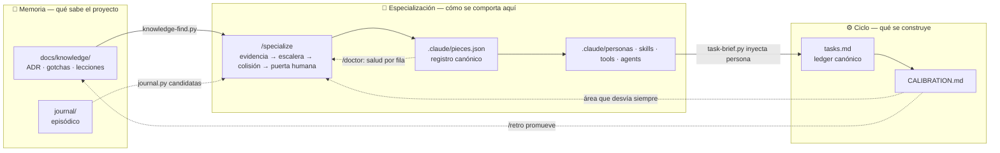

# Especialización por proyecto — el tercer bucle

## El resumen en una frase

**El plugin sabe CÓMO trabajar y no sabe DÓNDE está trabajando.** Los 9 agentes son agnósticos de
dominio por diseño, y eso está bien; lo que falta es la capa que convierte lo que el proyecto ya sabe
en cómo se comportan las piezas al ejecutar. Hoy ese conocimiento llega al momento de escribir
código **en forma de puntero, no de instrucción**, y esa diferencia es todo el hueco.

## 1. El hueco, medido en el propio brief

`task-brief.py` compone el brief del subagente. Dos de sus secciones son las relevantes, y el
problema se ve comparándolas:

| Sección del brief | Qué mete hoy | Presupuesto real | Límite |
|---|---|---|---|
| **Memoria técnica** (sección 11, `memory-retrieval` T-05) | hasta `MEMORIA_LIMIT = 12` aciertos de la **capa 1** de `knowledge-find.py --json`, enrutados por `Tipo` + título de la tarea + iniciativa | `MEMORIA_TOPE_CHARS = 2400` (≤ 600 tokens) | son **líneas compactas** (`ID · estado · área · titular · ruta`, ~25 tokens): el titular y la ruta, **no la doctrina**. El subagente tiene que decidir abrir el fichero. |
| **Persona de dominio** (`subagent-personas`) | el perfil de `agent-kits/shared/personas/<tipo>.md` si la tarea lleva `- **Tipo**:` | 9 líneas por perfil | el catálogo tiene **6 tipos fijos y genéricos** (`frontend` · `backend` · `db` · `devops` · `test` · `docs`) que no saben nada de este proyecto; un tipo fuera del catálogo degrada a subagente genérico |

La conclusión es precisa: **el brief ya tiene un hueco reservado para doctrina aplicable —la persona—
y hoy lo rellena con un perfil genérico.** No hace falta presupuesto de tokens nuevo ni una sección
nueva. Hace falta que lo que entre en ese hueco sea del proyecto y derive de su memoria.

### El caso concreto (este repo)

Tarea `T-07: añadir un hook que escriba la entrada del journal`.

**Hoy:** ninguno de los 6 tipos es «hooks del plugin», así que va a subagente genérico. La sección 11
le entrega, entre otras, dos líneas:

```
GOT-005 · aceptada · consola/windows · la consola de Windows es cp1252 · gotchas/GOT-005-…
GOT-007 · aceptada · testing · la suite solo ve scripts versionados · gotchas/GOT-007-…
```

Son punteros correctos y bien enrutados. Pero el subagente está enfocado en su tarea y una línea que
dice «cp1252» no le grita «vas a meter un emoji y va a explotar». Escribe el hook con `exit 1` en el
camino de error, mete un emoji en la salida y no contempla el silencio sin `python3`. Los tres fallos
están documentados en la memoria desde semanas antes. Los caza la revisión de dos lentes —que según
`LES-009` es **la partida grande del presupuesto**— y vuelve al implementer. Intento 2.

**Con la capa:** `.claude/personas/hooks.md` existe, tiene ~10 líneas destiladas de `ADR-007`,
`GOT-005` y `GOT-007` con sus citas, y entra **entera** en el hueco que ya existe, antes de la primera
línea de código. Misma información, misma casilla del brief, presupuesto equivalente: pero aplicable
sin abrir nada.

## 2. Por qué esto es un bucle y no un conjunto de piezas

El plugin ya tiene **dos bucles cerrados**, y los dos comparten la misma gramática arquitectónica.
La propuesta es el tercero **con esa misma gramática**, que es lo que impide que sea un saco de
añadidos:

| Bucle | Registro canónico | Puerta de entrada | Puerta de cierre | Realimenta a |
|---|---|---|---|---|
| **Ciclo** — qué se construye | `tasks.md` (regla 8 de CONVENTIONS) | `/pm-cycle`, go/no-go | `/retro` (`retro-gate.py`) | la estimación, vía `CALIBRATION.md` |
| **Memoria** — qué sabe el proyecto | `docs/knowledge/README.md`, única puerta de entrada (regla 10) | umbral de `knowledge-write.md` | contrato de promoción (2 promotores) | la ejecución, vía `knowledge-find.py` → `task-brief.py` |
| **Especialización** — cómo se comporta el sistema **aquí** | **`.claude/pieces.json`** | escalera + puerta de colisión + confirmación humana | retirada de pieza muerta (`/doctor` la marca, `/specialize` la retira) | la ejecución, vía personas y skills de proyecto |

Cada bucle tiene: un registro canónico con **test de biyección** (el patrón de
`tests/test_knowledge_index.py` para ficheros ↔ filas), un documento que es su **única puerta de
entrada** (`docs/SPECIALIZATION.md`, hermano de `INTEROP.md` y `observability.md`, con espejo en
`docs/en/`), y las dos puertas. Ninguna pieza de esta propuesta queda suelta: todas cuelgan del
registro.

### El invariante de dirección (lo que impide duplicar)

```
Memoria  ──lee──▶  Especialización  ──alimenta──▶  Ciclo  ──/retro──▶  Memoria
```

**`/specialize` lee `docs/knowledge/` y NUNCA escribe en él.** Consume ADR, gotchas, lecciones y las
candidatas del journal; produce piezas. La promoción a doctrina sigue siendo exclusiva de `/retro` y
del contrato de promoción de `adversarial-review`. Un solo sentido, sin retorno: por eso no hay
solape con el bucle de memoria, y por eso `docs/agents/ROLES.md` puede escribirlo en una línea, como
exige `ADR-011`.

### El diagrama (sección nueva de `docs/FLOWS.md`)



## 3. El ciclo de vida en siete estadios (cuatro ya tienen dueño)

| Estadio | Qué es | Dueño | ¿Nuevo? |
|---|---|---|---|
| 1 · **Evidencia** | de dónde nace la pieza | `project-scan.py` | nuevo, **compositor**: `deps-inventory.py` (manifiestos y gestor de paquetes) + `code-health.py` (hotspots) + `coverage-gate.py` (stack de test) + `knowledge-find.py --json` (áreas de memoria). No escribe escáner propio. |
| 2 · **Decisión** | qué forma toma | escalera + `role-collision.py` | nuevo |
| 3 · **Nacimiento** | se escribe, con eval y fila en el registro | `/specialize <área>` | nuevo |
| 4 · **Ejecución** | se usa de verdad | **`task-brief.py`** (personas) y el indexado nativo de Claude Code (skills y agentes de proyecto) | existente |
| 5 · **Salud** | sigue siendo válida mecánicamente | **`/doctor`** (`doctor.py`, sección nueva) | existente + sección |
| 6 · **Deriva** | sigue siendo cierta respecto a lo que el proyecto sabe | `/specialize` sin argumentos | nuevo, mismo dueño |
| 7 · **Muerte o promoción** | se retira, o su contenido asciende a doctrina | `/specialize` retira · **`/retro`** promueve | existente |

Lo nuevo es **un comando y dos scripts** colgados de un registro. Eso es la propuesta entera.

## 4. La escalera de decisión y la puerta de colisión

Es el Paso 0 de `plugin-dev` aplicado al proyecto consumidor, con un escalón nuevo por abajo y otro
por arriba:

| Si el candidato… | Entonces es… | Coste | Va a |
|---|---|---|---|
| **duplica una pieza instalada** | **nada** — se rechaza nombrando la pieza que ya lo cubre | 0 | — |
| es conocimiento de dominio que mejora **cómo se ejecuta** una tarea | **persona de proyecto** | ~10 líneas | `.claude/personas/<tipo>.md` |
| es un cálculo o veredicto repetible | **tool** = script determinista con tests y exit code | pequeño | `.claude/tools/<x>.py` |
| es una capacidad que invocan 2+ agentes | **skill de proyecto** | medio | `.claude/skills/<x>/SKILL.md` |
| **decide y escribe un artefacto propio que hoy nadie posee** | **agente de proyecto** | alto | `.claude/agents/<x>.md`, con override explícito del usuario |

**La puerta de colisión (`role-collision.py`) es la pieza que salva `ADR-011`.** Los generadores
públicos de agentes producen sistemáticamente `test-writer`, `code-reviewer`, `security-auditor` y
`doc-writer`: los cuatro **ya existen aquí** (`unit-tests`/`tdd`, `reviewer`/`adversarial-review`,
`nemesis`/`cybersecurity`, `documenter`). Generarlos no añadiría capacidad: rompería «un rol, un
dueño» y haría que el modelo eligiera mal. El script generaliza la heurística que `lint_plugin.py` ya
aplica al plugin (dos piezas con el mismo disparador literal entrecomillado → aviso), comparando el
candidato contra los 9 agentes, 17 skills y 12 comandos instalados **y contra lo ya generado**.

**Regla dura de evidencia:** cada candidato cita `fichero:línea` o el ID de una entrada de memoria, o
no se propone. Es el diferencial frente a «pregúntale al modelo qué agentes le irían bien a este
proyecto».

## 5. Qué se construye — tres fases, y la regla que las ordena

> **Ninguna fase entrega un estadio cuyo estadio siguiente no exista todavía.**

| Fase | Estadios | Qué entrega, utilizable por sí solo |
|---|---|---|
| **F1 · Sustrato** | 4 | Contrato de la carpeta: resolución en cascada `.claude/personas/<tipo>.md` → catálogo del plugin → genérico con aviso (hoy `--personas-dir` es **un solo directorio** con default al del plugin), tipos **extensibles** más allá de los 6, `docs/SPECIALIZATION.md` (+ espejo EN), filas en `ROLES.md`. Una persona escrita a mano ya funciona: no hace falta generador. |
| **F2 · Nacimiento** | 1 · 2 · 3 · 5 | `/specialize <área>`, `project-scan.py`, `role-collision.py`, registro `.claude/pieces.json` (+ `-state.json`), evals generadas por pieza, y **la sección de `/doctor` que lo audita**. La auditoría mecánica va DENTRO de esta fase: no se entrega la capacidad de generar sin la de comprobar. |
| **F3 · Vida** | 6 · 7 | `/specialize` sin argumentos (deriva semántica desde memoria, journal y `code-health --baseline`), retirada de piezas muertas, y el campo **«Cuándo aplica»** en la plantilla de `knowledge-write.md` — hoy no existe (la plantilla lleva `area`/`estado`/`fuente` y ninguna condición de activación), y es el dato sobre el que la deriva enruta. |

Dos consecuencias de fasarlo por estadios y no por tamaño:

- **F1 define el sustrato que F2 rellena.** Las piezas escritas a mano son ciudadanas de primera: el
  registro anota lo *generado*, y `/doctor` reporta lo escrito a mano como «no gestionada», que es un
  estado válido y no un error.
- **F2 no puede degenerar en el cementerio de piezas muertas** que este repo ya midió en un toolkit
  externo (3 de sus 11 skills funcionalmente muertas por falta de frontmatter), porque lleva su
  propia auditoría dentro. F3 añade el juicio semántico, no la capacidad de comprobar.

**Tope de 5 piezas generadas por defecto.** No es una precaución vaga: es aritmética del presupuesto
medido de `skill-index.py` (≤ 45 líneas / ≤ 3.500 caracteres inyectados en cada arranque).

## 6. Qué NO se construye, y por qué

| Descartado | Motivo |
|---|---|
| Comando `/learn` (idea 4 de `ideas-externas`) | duplicaría la promoción de `/retro` y `journal.py candidatas`. Su parte buena —confirmación humana antes de guardar— se queda como **puerta de `/specialize`**. |
| Comando de auditoría aparte (`/piece-drift`) | se parte por naturaleza: lo mecánico a `/doctor` (ya es solo lectura, ya lee `.claude/`, ya emite ✅/⚠️/❌ + arreglo, ya tiene `test_doctor.py`), lo semántico a un modo de `/specialize`. |
| Agentes «expertos de dominio» dentro del plugin | el plugin se mantiene agnóstico; el dominio vive en el `.claude/` del consumidor. |
| `skills/learned/` como carpeta y mecanismo aparte (idea 2) | es el **escalón «skill»** de la escalera, no un mecanismo paralelo. |
| Generar agentes por defecto | `ADR-011` + presupuesto de índice: escalón de último recurso con override explícito. |
| Proponer servidores MCP | es configuración, no pieza. En Claude Code no hay primitiva de herramienta definida por el usuario: una «tool» aquí es un script determinista con tests que una pieza invoca, que es justamente el patrón del repo. |
| Tocar el contenido de las 6 personas del plugin | siguen siendo el fallback del último escalón de la cascada. |
| Exportar piezas de proyecto a Codex/OpenCode en v1 | `export-interop.py` traduce piezas de **plugin**; las de proyecto son Claude-Code-only, con la degradación documentada en `docs/INTEROP.md`. |

## 7. El choque con `plugin-dev` (tarea explícita, no hallazgo de linter)

`plugin-dev` promete hoy en su `description`, literalmente: *«crea un agente/skill/comando nuevo»* y
*«añade una skill al plugin»*. **El primer disparador es exactamente el de `/specialize`.** Sin
tocarlo quedan dos meta-generadores compitiendo por la misma frase. F2 debe incluir como tarea:

1. Reescribir la `description` de `plugin-dev` para que sus disparadores digan **«de ESTE plugin»**.
2. Negativos cruzados en las evals: «crea un agente para el plugin» como **negativo** de
   `evals/cases/command-specialize.json`, y el recíproco en el caso de `plugin-dev`.
3. Fila «qué NO hace» en ambas piezas apuntándose mutuamente.

## 8. Riesgos y límites honestos

| Riesgo / límite | Mitigación o realidad |
|---|---|
| **Duplicar roles** | la puerta de colisión. Sin ella, no vale construir esto. |
| **Colisión de árboles**: el plugin puede estar desplegado *como* el `.claude/` del proyecto | `GOT-003` es literalmente este caso («un generador que escribe dentro del árbol que él mismo espeja necesita nombres reservados y comprobar que lo que borra es suyo»): manifiesto con nombre reservado y rehusar tocar lo que no está en él. |
| **Privilegios**: una pieza generada declara `tools` | mínimos siempre; `Bash`/`Write` solo con confirmación; un hook de guardia (deny) nunca generado sin opt-in explícito (`ADR-007`). |
| **Inflación de meta-trabajo** | tope de 5 piezas + escalera que empuja al escalón más barato. La doctrina del repo es anti-burocracia: el umbral debe ser tan explícito como el de los ADR en `knowledge-write.md`. |
| **Vale poco en un proyecto sin historia** | el valor **crece con la memoria acumulada**. Con `docs/knowledge/` vacío el escaneo detecta el stack y poco más. En este repo (13 ADR, 8 gotchas, 15 lecciones) es donde más rinde; en un proyecto de la semana pasada, casi nada. |
| **No hace al modelo más listo** | cambia *qué tiene delante* al escribir código. No acelera el ciclo: reduce retrabajo. |
| **No sustituye a `CLAUDE.md`** | `CLAUDE.md` es global y siempre cargado; una persona es pequeña y dirigida a un tipo de tarea. La persona existe precisamente para **no** engordar `CLAUDE.md` (regla token-diet). |

## 9. Cómo se mide si ha funcionado

La propuesta trae su forma de medirse, con datos que el repo ya recoge:

| Señal | Dónde ya está |
|---|---|
| Intentos del bucle reviewer→implementer por iniciativa | traza «Revisión de dos lentes — intento N» en `tasks.md` |
| Desviación real vs estimado por área | `docs/roadmap/CALIBRATION.md` |
| Gaps repetidos entre iniciativas | causas de los `retro.md` |
| Entradas de memoria que ninguna pieza aplica | el recuento que `ideas-externas` midió antes de v1.18.0 (17 de 31 sin citar); **hay que re-medirlo**: `memory-retrieval` cambió el panorama al hacerlas buscables e inyectarlas como punteros |

**Criterio de retirada:** si tras dos o tres iniciativas los intentos de revisión no bajan y siguen
apareciendo los mismos gaps, la capa no aporta y se retira. Eso también es parte del diseño.

## 10. Checklist de cierre (qué significa «hecho» aquí)

Por pieza: doc en `docs/` + fila en `docs/README.md` · fila en `docs/agents/ROLES.md` con DECIDE /
ESCRIBE / LEE · sección en `docs/FLOWS.md` (+ espejo `docs/en/`) · regla 9 de `CONVENTIONS.md` para
`pieces.json` y `pieces-state.json` + nota en la regla 3 sobre pieza-de-plugin vs pieza-de-proyecto ·
evals con ≥ 2 positivos y 1 negativo, con los cruzados de la sección 7 · `lint_plugin.py` con 0
errores · suites de `tests/` en verde (`test_task_brief.py` para la cascada, `test_project_scan.py`,
`test_role_collision.py`, `test_doctor.py`) · `export-interop.py` regenerado y `--check` en verde ·
entradas en los DOS CHANGELOG vía `changelog-sync` · `/setup` ofrece `/specialize` al terminar ·
`retro.md` y fila en `CALIBRATION.md` (`retro-gate.py`).

**Reutilización que ya está disponible y no hay que construir:** `lint_plugin.py` y `evals/check.py`
**ya aceptan `--root`**, así que la validación de las piezas generadas en el árbol del consumidor no
necesita un linter nuevo — el criterio de «pieza válida» sigue teniendo una sola fuente.

## 11. Lo que este análisis NO trae

No hay plan, ni tareas, ni presupuesto, ni fechas. El paso mecánico siguiente es `/pm-cycle` sobre
esta carpeta: `analyst` convierte esto en `spec.md` con criterios de aceptación verificables, y
`evaluator` la presupuesta con `CALIBRATION.md` y emite el go/no-go. Por comparación de tamaño (no es
una estimación): `memory-retrieval` fueron 21 tareas; esto se ve más pequeño, con F1 y F3 cortas.

## Procedencia

Tres pasadas de análisis conversacional con el usuario el 2026-09-09, sobre el árbol de `master` en
`8e9dec7`. Encuadre inicial: «un comando que genere agentes privados especializados para el proyecto,
y otro que analice los agentes creados y proponga mejoras según la documentación, ADR, gotchas y
lecciones», ampliado por el usuario a «también skills, o incluso tools», y luego a «que quede bien
estructurado, y no sea un conjunto de piezas sueltas, sino un único ecosistema».

Dos rectificaciones del propio análisis, dejadas a la vista porque explican el diseño:

1. **De dos comandos a uno.** La primera versión proponía `/specialize` + `/piece-drift` calcando el
   par `/pm-cycle` + `/spec-drift`. Era duplicación: la mitad mecánica de la auditoría ya tiene dueño
   (`/doctor`) y la semántica comparte dueño con la generación.
2. **De «fases por tamaño» a «fases por estadio».** La línea de `/doctor` no es una fase aparte: es
   la puerta de cierre del nacimiento, y va en F2.

Absorbe tres de las ocho ideas de
[`2026-09-04-ideas-externas/analysis.md`](../2026-09-04-ideas-externas/analysis.md) — la 2
(`skills/learned/`, la memoria destilada como pieza activable), la 3 (el campo «cuándo aplica») y la 4
(`/learn` con confirmación humana). Sus otras cinco ideas siguen vivas en esa carpeta y no tienen
relación con esto.
