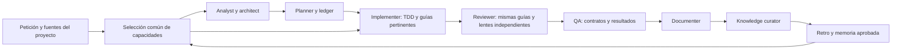

# Diseño — capacidades bajo demanda dentro del ciclo

Se comparan tres opciones: instalar una segunda cadena; importar piezas
como catálogo plano; absorber capacidades seleccionadas en nuestros roles y
consolidar la selección. Se elige la tercera por la decisión delegada del usuario.
Las otras dos añaden dueños, configuración y carga sin resolver sus solapes.

El registro es dato del bundle; el selector lee metadatos acotados del proyecto,
no importa su código ni ejecuta sus scripts. Un resultado es selección/procedencia,
no un veredicto de QA ni habilitación de herramientas. El cuerpo de cada capacidad
se lee bajo demanda. Los roles apuntan a un fragmento común del workflow.

Las guías de stack absorben las tres piezas iniciales. API-contract, TDD, QA,
revisión y Knowledge Gate mantienen sus métodos y artefactos; las guías agregan
criterio de dominio. El catálogo se audita por utilidad, solapes y validación real.
La evaluación de resultados se distingue del checker estático de activación.

La capa estructural de código, si el piloto justifica su uso, aporta fuentes y
relaciones como contexto. No es un backend publicador de approved ni migra journal.
Toda capacidad con servicios/modelos sigue siendo opcional y configurada por el
consumidor; los hooks no adquieren red ni nuevas decisiones.

Este diseño no implementa generación de personas/piezas de project-specialization
F2. Selección del catálogo del plugin y nacimiento de piezas de proyecto son
operaciones distintas; se documenta su relación sin crear otro registro de piezas.
